# Architecture

The backend's system map: what exists, how it composes, and the boundaries deliberately
drawn around it. Rules agents must follow live in `CODE-RULES.md`; technology choices in
`TECH-STACK.md`; the full design rationale in `docs/history/BACKEND-REDESIGN.md`.

---

## System map

A modular monolith of **vertical slices** on one product Cloudflare Worker, with pragmatic
hexagonal edges (ports only where implementations genuinely vary). Durable Objects carry
per-conversation realtime, in-process flow execution, and job dispatch. One Postgres is the
sole durable truth; Redis is ephemeral coordination; R2 holds only ciphertext.

```mermaid
flowchart LR
  Client["Web / Mobile (React, Capacitor)"]
  Worker["Product Worker (Hono, slices)"]
  DO["ConversationRoom DO (realtime + flow executor)"]
  Jobs["JobDispatcher DO (jobs table)"]
  PG[("Neon Postgres")]
  R2["R2 (ciphertext blobs)"]
  Redis["Upstash Redis (ephemeral)"]
  Prov["OpenRouter (via AI SDK)"]
  Cron["Cron (pollers + retention + auditors)"]

  Client --> Worker
  Worker --> PG & Redis & R2 & DO
  Worker -. wake .-> Jobs
  DO --> Prov & PG & R2 & Redis
  Jobs --> PG & Prov
  Cron --> PG & R2
  DO -. WS realtime .-> Client
```

**Slices** (a slice's `index.ts` barrel is its only public surface): `identity` (OPAQUE
auth, sessions, TOTP/step-up, recovery, link-guest principal, account deletion) ·
`conversations` (conversations, epochs, members, forks, shares) · `chat` (the turn:
messages, content, orchestration, trial, Smart Model) · `billing` (wallets, double-entry
ledger, usage, payments, budgets, Helcim) · `models` (catalog, capability registry,
inference via `ModelProvider`) · `media` (R2 GC, epoch-gated presign, transforms) ·
`notifications` (email, push, device tokens) · `newsletter` (mailing list: subscribers,
double opt-in consent, issues, batch dispatch, Resend webhooks) · `account` (search,
instructions, preferences) · `workflows` (the engine, node registry, definitions, builder) ·
`admin` (the operations registry + Customer-360 reads; owns only `admin_audit` — see
§Admin plane).
Cross-slice writes go only through published barrel APIs; the orchestrating slice owns the
transaction. Ownership is **single-writer-per-table**.

**Ports** (infra edges only): `ModelProvider`, `Storage`, `PaymentProvider`, `EmailSender`,
`RealtimeBroadcast`, `Telemetry`, `TransformCompute` (impl #1 = in-process server adapter).
`Db`/`Cache`/`Crypto` are deliberately unwrapped — anemic ports would discard Drizzle/Zod
inference.

## The four operation patterns

Every write is exactly one of these; there is no fifth.

- **A — single DB transaction.** The default. No external calls inside.
- **B — one external call + one DB update**, replayed via `Idempotency-Key`.
- **C — transactional job.** A `jobs` row inserted in the caller's transaction, executed by
  the alarm-clocked dispatcher (below).
- **D — pre-claim then reconcile.** Card charges only: durable `payments` pre-claim before
  the charge, finalized by webhook, verified by a delayed `payment.verify.v1` job.

## The jobs system

The only delivery mechanism for must-happen async work. The job row is the record, the
dead-letter store, and the audit trail; there is no queue, no DLQ, no sweep.

- **Enqueue** = `INSERT` inside the domain transaction (atomic with its trigger); a lossy
  post-commit `wake()` nudges the dispatcher.
- **Dispatcher** = one Durable Object per shard (`default`, `bulk`), stateless except its
  alarm. Each pass: re-arm first (`now+30s`), dead-letter exhausted rows at claim time,
  claim a batch (`FOR UPDATE SKIP LOCKED`, priority order, lease-expired `running` rows
  reclaimable), execute, then re-arm to `min(next nextAttemptAt, idle decay)`. Idle decay
  60s→30m applies only when no work is pending or scheduled; any `wake()` resets it.
- **Handlers** are registered with payload schema, lease, failure caps, and a mandatory
  idempotency class (`txn` — effect + terminal transition in one transaction; `natural`;
  `providerKey`; `byEventId`). Outcomes: `ok / fail / yield / dead`. `yield` checkpoints
  without consuming retries. Heartbeat-touch and checkpoint writes pass the same
  `claims`/`claimedBy` fence as completion — zombies cannot keep leases alive or corrupt
  live claims.
- **Timing:** enqueue→first attempt ~10–50 ms; retries at exact backoff (`failures⁴s ±10%`,
  cap 1 h); crash recovery = lease + ≤30 s. `succeeded` rows prune at 7 days; `dead` rows
  persist until explicitly redriven or discarded by audited admin action (the `admin_audit`
  row is the permanent record); discarded rows prune on retention — an unresolved dead row
  is never auto-deleted.
- **Liveness:** a 15-minute read-only auditor pages on stuck jobs and `wake()`s both shards
  (the one concession to a documented platform alarm-wedge bug).

Launch job types: `payment.verify.v1`, `media.reclaimUser.v1`, `newsletter.dispatch.v1`.

## Money & settlement

- **Single-settlement rule:** nothing commits mid-run. One fenced settlement
  transaction writes content + every charge + double-entry ledger legs +
  the idempotency-key flip, atomically. A run killed at any earlier moment leaves an
  expiring Redis hold and nothing else: saved ⟺ billed, by construction. Lock order:
  content → wallet → period budget rows → conversations row → key row. No external or
  Redis calls inside, ever.
- **Concurrency model — READ COMMITTED + row locks, no retry:** settlement runs at
  Postgres-default READ COMMITTED with **no** 40001 serialization-failure retry.
  Correctness under contention rests entirely on the `FOR UPDATE` wallet-row lock
  (concurrent same-wallet settlements serialize — the second blocks, then reads the
  first's committed balance, so there is no lost update) plus the
  `DEFERRABLE INITIALLY DEFERRED` zero-sum ledger trigger, which fires at COMMIT. No
  optimistic-retry loop, no higher isolation level, so a raw 40001 never surfaces to the
  caller. Pinned by a concurrent-settlement integration test.
- **The run referee is the idempotency-key row** (there is no run table). First arrival
  claims by unique insert; the conversation DO performs the run-claim and heartbeat-touches
  the lease (~90 s), so a deploy-killed run is retryable in seconds. Retries are serialized
  and client-driven: `succeeded` replays, fresh `claimed` attaches to the live stream,
  expired lease or `failed` permits exactly one re-execution at a time. Reused key with a
  different body ⇒ 409 (canonical-JSON hash).
- **Ledger:** double-entry — signed legs per `transactionId` summing to zero across user
  wallets and house accounts (`revenue`, `payments-in`, `promo`); conservation is a
  write-time constraint. Running balances exist only on user-wallet legs. The settlement
  transaction also re-reads the `conversations` row `FOR SHARE` and asserts `currentEpoch`
  equals the wrap target — serializing persist against key rotation.
- **Admission** (the only balance gate — settlement charges unguarded; negative balances
  stand): one atomic Redis Lua script checks balance snapshot − Σholds ≥ estimate,
  period-keyed budgets, and the per-wallet concurrent-run cap, then places a TTL hold.
  Estimates price the declared ceiling (max fan-out width × max steps × max iterations).
  Snapshot write-through CASes on ledger sequence. Redis down ⇒ paid admission fails
  closed; there is no degraded mode. Mid-run, the cost circuit kills any run whose
  observed-usage accrual exceeds `hold × K` (K = 5), evaluated at step/branch/node
  boundaries; exposure bound = `hold × K + (concurrent width) × max step cost` —
  under bounded-concurrency streaming, up to the fan-out width's worth of provider
  calls can be in flight when the circuit trips, and an in-flight call's cost cannot be
  un-spent (the `hold` already scales with the declared fan-out width).
- **Cost-circuit trip is no-bill, asymmetric with the deadline stop.** When the cost
  circuit trips, the run routes through the failed path and settlement writes **nothing**
  — the already-incurred provider spend (up to ~`hold × K + (concurrent width) × max
  step cost`) is deliberately absorbed as platform loss. This is asymmetric with the
  **deadline stop**, which settles its billable partial. Because a trip should not
  silently cost the platform, it raises **exactly one Sentry event** (fingerprint
  `workflow_cost_circuit_tripped`) carrying the DO-minted `runId` and the absorbed
  nano-USD; routine domain failures never signal Sentry.
- **Authoritative inline cost:** OpenRouter returns the charged `usage.cost` inline for
  **text** (`providerMetadata.openrouter.usage.cost`) and **video**
  (`providerMetadata.openrouter.cost`); settlement charges it directly (`isEstimated=false`).
  **Image** rides OpenRouter's dedicated images API, which returns no inline cost, so it is
  charged at its **deterministic** catalog estimate — exact by construction, `isEstimated=true`
  with no reconcile. A missing text/video cost (pathological) falls back to the admission
  estimate flagged `isEstimated` + a Sentry alert for a human to resolve. The client shows the
  final cost at `done`. A monthly auditor reconciles OpenRouter account usage against
  Σ `usage_records` per modality.
- **Disputes:** a Helcim chargeback/reversal posts a `byEventId` clawback pair and
  auto-locks the account (`users.lockedAt`) with session revocation — defensive, immediate,
  reversible. Inquiries/retrievals only notify.

## The workflow engine

Everything AI is a **workflow**: a Zod-validated JSON DAG over a closed, versioned node
registry (`modelCall`, `transform`, `fanOut`, `fanIn`, `branch`, `loop`, `subWorkflow`),
interpreted **in memory inside the conversation DO**. A chat turn is a one-node definition;
the multi-model turn is a data-driven `fanOut` with optional branches (the reducer settles
the successful subset); Smart Model is a three-node definition.

- **Typed edges** run on the TypeTag algebra — four rules: exact equality with
  `json<schemaName>` (never bare `json`), media subset (modality equal, mimes ⊆),
  `optional<T>`, `list<T>`. `zodFor(tag)` derives every node's runtime schema from its
  declared ports; reducers are tuple-typed `(in: TypeTag[], out: TypeTag)`. Checked at
  build, save, and runtime.
- **The engine owns sequencing** (deadline, key-row claim, settlement ordering); each
  definition declares two typed policy hooks — admission (chat = balance hold; trial =
  quota) and settlement (chat = `saveChatTurn` + `chargeWithinTx(SettlementTx, …)`).
- **Fast-fail, never resumed — all run lengths:** deadline-bounded (text ~5 min, media
  ~15 min); the deadline alarm is run _control_ (stop the stream, settle any billable
  partial). A killed run needs no cleanup; the client's own deadline shows "failed — not
  billed" and auto-resubmits. Values move through the in-memory `ValueStore` (byte-metered
  ≤20 MB assuming a 3× real-memory multiplier; over-budget rejects at validation for large
  video). Mid-flow content never rests anywhere; finals wrap to the epoch key at persist.
- **One run per conversation, hard-blocked** at both layers (typed error server-side,
  disabled composer client-side). Multi-stream within a run (`streamId` + per-stream
  cursors) is the protocol; fan-out width respects the platform's 6-connection cap.

## Streaming & realtime

The conversation DO's hibernatable WebSocket is the sole transport: turn tokens, flow
progress, presence, media events. `POST /chat` initiates the run and returns a handle;
everything after rides the WS. A transport disconnect never cancels — the turn
completes, persists, bills server-side (a DO sustains minutes-long
fetches after the client is gone); reconnects replay per-stream from `Last-Event-ID` out of
a capped memory-only buffer, then resume live. Explicit stop has an HTTP path (a WS-blocked
user can always abort a paid run) and settles the partial — a user cancel bills consumed usage even when nothing was
persisted (the sole carve-out from saved ⟺ billed; only involuntary kills bill nothing). WS
upgrade failures are measured
day one (client beacon + server WAE; no fallback transport is built — re-entry below).
Membership is revalidated at broadcast: a short-TTL Redis cache of authoritative membership
with DB recheck on miss; eviction fires on membership change, rotation, session and link
revocation; Redis down ⇒ delivery pauses beyond a bounded last-known-good window.

## Data model essentials

Nano-USD `bigint` money (`NanoUSD` strings at JSON boundaries); pgEnums for every closed
set; `relations()` everywhere; uuidv7 keys; every FK indexed. Tables: `users` (+`lockedAt`,
`deletionRequestedAt`) · `wallets` (unique per user+type) · `ledger_entries` (double-entry)
· `usage_records` (nullable content FK — `SET NULL` on deletion; insert-time invariant:
billed ⟹ the run persisted content; `runId` groups a run's charges) · `llm_completions` /
`media_generations` · `payments` · `member_budgets` / `conversation_spending`
(period-keyed, UTC; no reset jobs) · `messages` (unique conversation+sequence) ·
`content_items` · `conversations` / `conversation_members` / `conversation_forks` ·
`epochs` / `epoch_members` · `shared_links` (+`revokedAt`/`expiresAt`, enforced lazily at
read) / `shared_messages` (+`createdBy`, +`linkId`) · `newsletter_subscribers` (consent
evidence + confirm/unsubscribe tokens; complaint-sticky suppression) · `newsletter_issues` ·
`newsletter_deliveries` (one row per recipient, kept forever — the duplicate-send referee) ·
`modelCatalog` (one row per model,
cron-refreshed OpenRouter snapshot) · `idempotency_keys` (`kind`,
body-hash, lease, claims fence) · `jobs` · `admin_audit` (append-only) · device tokens,
instructions, preferences, verification tokens. Deletion is hard (privacy promise);
financial rows are pseudonymized via `SET NULL` (Art. 17(3)(b) retention); R2 ciphertext is
reclaimed by `media.reclaimUser.v1` with orphan GC (min-age ≥ max deadline + margin) as the
crash-debris backstop.

## Models & capabilities

The catalog is auto-discovered from OpenRouter's live metadata (hourly, jittered,
skip-unchanged; `/models` + `/images/models` + `/videos/models` + `/endpoints/zdr`),
persisted as a slim one-row-per-model snapshot. All models — including image/video — are
zero-touch: ParamSpecs, pricing, and ZDR-reachability come from the live APIs. Genuinely
unrepresentable data (an unknown pricing unit or model type) is excluded with an alert, never
a crash. A genuinely new modality is one enum
migration + one dispatch adapter (dispatch keys on SDK call-shape:
language/image/video/embedding). ZDR is enforced per-request and fail-closed: `zdrReachable`
is membership in the live `/endpoints/zdr` set (endpoint-granular) and `provider.zdr:true` is
sent on every call; unverified models stay hidden. Realtime-bidirectional and computer-use
models break the port itself and are architecturally out until designed.

## Admin plane

An `admin` slice on the product Worker plus a separate static SPA on `admin.hushbox.ai`,
both behind one Cloudflare Access app (exact-match email allowlist + hardware-security-key
MFA, AAGUID-restricted, keys enrolled at a physical ceremony); the Worker re-verifies the
Access JWT on every `admin`-classed route (jose + remote JWKS, fail-closed). There is no
separate admin Worker and no service-binding RPC. **The Single Auth Path Law:**
hardware-key MFA through Cloudflare Access is the only production authentication path —
no service tokens, no API keys, no bearer secrets, no non-interactive path, and the GUI
is the only production admin surface; `CODE-RULES.md` carries its in-code enforcement.
Every capability is a **registered
operation** — defined once with a typed input schema, it becomes a UI form and
an API endpoint hitting the same engine, which composes published slice barrels inside
one settlement transaction and writes the append-only `admin_audit` row (actions and
sensitive reads) in that same transaction. **The Reversibility Iron Law:** every admin
mutation has a registered inverse; no irreversible admin operation exists (no admin card
refunds, no admin account deletion — deletion stays user-initiated). Safety is
preview → execute → undo: preview is the same execution rolled back, undo is the inverse
op run through the same engine; execution is instant — there are no delay tiers.
Guardrails (caps, target limits, rate limits) are op metadata; reads are audited and
volume-capped. Break-glass is a physical ladder (pre-enrolled backup key → Cloudflare
dashboard → offline Neon/R2 credentials + runbook), never a code path or deploy flag —
nothing in the repo can mint admin access. Full design: `docs/plans/ADMIN-PLANE.md`.

## Observability

Workers Logs (structured, allowlisted fields) · Analytics Engine for metrics (SQL API only;
every metric has a named watcher — a 15-minute auditor polls it) · Sentry for unexpected
errors only (backend only; `errorCode` in fingerprints; scrubbed at the Telemetry port,
cause-chains included; console patched at the entry point) · native OTel tracing
(verify-at-implementation; redaction processor mandatory). Error taxonomy: expected domain
failures are `Result` values → `{code}` responses + metrics; exceptions are defects →
Sentry; invariant breaks are auditor pages; routine drift goes to a daily digest, never a
page.

---

## Deliberate limits

Decisions **not** to do things. Reversing one is an architecture decision, not a cleanup.

- **Vendor lock-in is deepened and isolated** (DO programming model is the deepest
  coupling), traded for operational simplicity; each piece sits behind a port.
- **Zero-trust ends at the API boundary** — same-process internal calls are trusted; no
  internal mTLS.
- **Postgres is a mitigated SPOF** — Neon HA + encrypted cross-vendor backups; no DIY
  multi-region.
- **Auditability is structured logs** (product side) — no hash-chained audit table until
  compliance demands one; the admin plane has its own append-only table.
- **Best-effort vs critical is a hard split** — push/email/telemetry may degrade; money,
  auth, persistence fail fast and never degrade.
- **Fast-fail applies to every run length** including long media: a deploy can kill a
  15-minute generation; the user retries; provider spend on killed runs is accepted and
  observable (generation ids stream to WAE).
- **One run per conversation** — no queueing, no concurrent lanes.
- **No client-side Sentry** — browser capture sits too close to plaintext; frontend bugs
  are debugged from reports.
- **No backup mechanisms** — one mechanism per task, made recoverable (leases, TTLs, lazy
  checks); auditors detect, humans redrive. A second delivery path is a design smell.
- **No degraded admission mode** — Redis down means paid runs refuse, loudly.
- **Cost-circuit trips are absorbed, not billed** — a mid-run kill on the `hold × K`
  circuit settles nothing; the provider spend already incurred is platform loss by
  design (the deadline stop, by contrast, settles its partial). The trip is surfaced to
  a human via a single Sentry event, never billed to the user.
- **The welcome-credit re-register loop is accepted** — hard deletion forbids grant dedup;
  the global trial/welcome budget bounds it.
- **In-isolate circuit breakers don't exist** — retry + timeout only; breaker state would
  be in-memory state.

## Excluded services & re-entry conditions

Consult before proposing any of these; the conditions are the decision.

- **Cloudflare Workflows** — durable resume is exactly what fast-fail makes unwanted.
  Returns for flows that must survive deploys, multi-day sleeps,
  human-in-the-loop waits, or runs exceeding DO memory. Plugs in behind the
  `ValueStore`/`WorkflowRunner` seam and **reintroduces a run table**.
- **Cloudflare Queues** — returns only if the dispatcher's ceiling is reached after
  shard-by-type and claim-then-fan-out scaling. Two standing asymmetries: a queue send is
  never atomic with a Postgres commit; an ack is never atomic with a `txn`-class effect.
- **Hyperdrive** — no PG18, caching isn't read-your-writes safe, and pooling doesn't
  bind at our connection volumes yet. Returns when it supports our Postgres major AND
  sustained p95 DB connect+query overhead per turn exceeds 150 ms for a week AND the
  DO+vitest path is proven. Query caching stays off (not read-your-writes safe). It does support interactive
  transactions; the blockers are concrete, not capability myths.
- **Non-WS transport fallback** — client polling of message-fetch until terminal (cheap:
  turns complete server-side) when >0.5% of session starts fail WS upgrade over 7 days
  (beacon + WAE).
- **Concurrent runs per conversation** — when product feedback demands chat-during-media;
  multi-stream already ships, so re-entry is admission ordering + a shared memory budget.
- **R2 mid-flow intermediates** — with the heavy-compute tier (container handoff);
  the K_inst staged design is recorded in the archived plan.
- **Manifest-based GC** — when bucket list-and-check gets slow.
- **DO Facets** (beta) — watch item for dispatcher sharding.
- **Fly.io** — a second compute vendor for a deferred feature; Cloudflare
  Containers/Sandbox is the preference when heavy compute lands.
- **Axiom** — Workers Logs covers it natively.
- **Effect-TS** — team fit and migration cost; would discard Drizzle/Zod inference.

**Still deferred:** audio (deferred by choice — OpenRouter has speech + transcription
models, ZDR-reachable), heavy server-side compute (prefer Cloudflare Containers/Sandbox), the
capability planner (workflow level 2), a product-side audit table, API versioning,
GDPR/CCPA legal specifics. **Verify at implementation:** the Zero-Trust 50-user free tier;
the DO-finalize vitest path; native OTel tracing maturity (Sentry tracing is the fallback).
