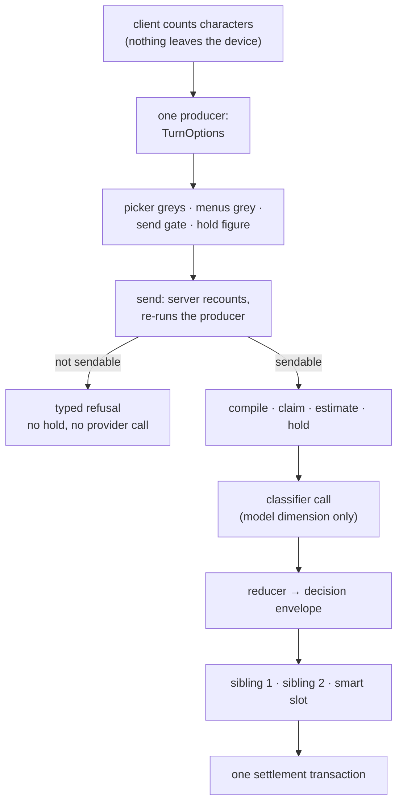

# Billing System

How money works in HushBox: tiers, affordability, reservations, reasoning effort,
Smart Model, multi-model turns, group funding, fees, and the charge lifecycle. This
document is the lossless statement of billing principles and mechanics — the single
home for billing semantics. Architectural mechanisms (the settlement transaction's
internals, jobs, Durable Object topology) live in `docs/ARCHITECTURE.md`.

Read **Math & Terms** first. Every later section composes those terms and defines no
arithmetic of its own.

---

## Math & Terms

One definition per term, one formula per quantity. A term used anywhere in this
document means exactly what it means here.

### Units and rates

| Term                                       | Definition                                                                                                                                                                                          |
| ------------------------------------------ | --------------------------------------------------------------------------------------------------------------------------------------------------------------------------------------------------- |
| `NanoUSD`                                  | Money. A `bigint` of 10⁻⁹ USD. 1¢ = 10,000,000. Serialized as a decimal string at JSON boundaries; never `Number()`-coerced.                                                                        |
| **provider rate**                          | What a provider charges. Never retained.                                                                                                                                                            |
| **billable rate**                          | Provider rate with the platform fee baked in. The only rate that exists in storage or in any calculation.                                                                                           |
| `inputRate(m)`, `outputRate(m)`            | Billable nano-USD per input / output token for model `m`.                                                                                                                                           |
| `storageRatePerChar`, `storageRatePerByte` | Billable-final storage rates (`STORAGE_COST_PER_CHARACTER_NANO` = 300n per character, `MEDIA_STORAGE_COST_PER_BYTE_NANO` = 18n per byte). Never fee-bearing (the rate _is_ the charge).             |
| `outputCharsPerToken(tier)`                | Tier output ratio, used to convert an output-token count into the characters that will be stored (see **Affordability 9**).                                                                         |
| `fixedCosts`                               | The turn's cost terms that do not scale with output tokens: input tokens at the input rate, `inputStorage`, `classifierReserve` when a classifier runs, and any `additive` dimension's requirement. |
| `variableRate(m)`                          | The per-output-token cost of model `m`: `outputRate(m) + storageRatePerToken(tier)` when the turn persists, `outputRate(m)` when it does not.                                                       |
| `storageRatePerToken(tier)`                | `outputCharsPerToken(tier) × storageRatePerChar` — output storage expressed per token, so one formula prices a token's provider cost and its retention together.                                    |
| **markup**                                 | 15% (`TOTAL_FEE_RATE`), applied at exactly two seams — see **Fee Structure**.                                                                                                                       |

**A decision that gates pricing may consume only bounds, never prices.** The payer decision and
the price are mutually dependent — a ceiling is bounded by the payer's funding, and
§Funding Decision Matrix priority 1 compares the estimate — so resolving them by iteration has no
guaranteed fixed point. The resolution is asymmetry: the payer is decided on `minTurnCost` at the
candidate payer's tier, and if group headroom cannot cover even that, the group can **never** pay,
so a signed-in member falls through. One pass, no circularity, because the result never feeds the
input. `eligible(m)` already follows the same rule by grading on a reachable corner rather than an
unreachable zero.

### Funding

| Term               | Formula                                                                                                                |
| ------------------ | ---------------------------------------------------------------------------------------------------------------------- |
| `balance`          | Ledger balance of the payer's purchased wallet. May be negative.                                                       |
| `allowance`        | Remaining free daily allowance (day-keyed).                                                                            |
| `cushion`          | Paid tier only: the permitted negative excursion (`MAX_ALLOWED_NEGATIVE_BALANCE_CENTS`).                               |
| `effectiveBalance` | paid: `balance + cushion` · free: `allowance` · trial/guest: a fixed per-message ceiling.                              |
| `holds`            | Σ of the payer's unexpired admission holds.                                                                            |
| **`spendable`**    | `effectiveBalance − holds`. **Pure money, one number per payer.** It contains no token quantity and no per-model term. |

`spendable` is a property of the _payer_, not of the sender — see **Group Funding 1**.

**Two funding inputs, two option sets.** One producer, called once, evaluates one core
twice to answer two different questions:

| Set              | Funding input      | Prompt basis      | Question                                          |
| ---------------- | ------------------ | ----------------- | ------------------------------------------------- |
| **`affordable`** | `effectiveBalance` | empty             | What can this payer call **at all** — hold-blind. |
| **`admissible`** | `spendable`        | the actual prompt | What can **start right now** — hold-aware.        |

**The two sets differ in two inputs, not one.** `affordable` is evaluated against an
empty prompt basis as well as the hold-blind funding number, because it answers a
question about the model and the payer's money and must not move while the user types
(see **Affordability §Scope**). `admissible` is evaluated against the prompt actually
composed. The producer applies both substitutions itself — no caller chooses a basis for
the `affordable` set, so a prompt-dependent `affordable` is unobtainable.

Both funding numbers are derivable from what the wire already serves:
`GET /billing/spendable` returns `spendableNanoUsd` and `heldNanoUsd`, so
`effectiveBalance = spendable + holds`. No additional field and no second request exist
for this.

### The prompt basis

Affordability consumes **counts, never content**.

| Term                  | Formula                                                                   |
| --------------------- | ------------------------------------------------------------------------- |
| `promptChars`         | System prompt + custom instructions + history + new input, in characters. |
| `charsPerToken(tier)` | Tier input ratio (see **Affordability 8**).                               |
| `inputTokens`         | `ceil(promptChars / charsPerToken(tier))`                                 |
| `inputStorage`        | `promptChars × storageRatePerChar`, counted **once per turn**.            |

The client holds the entire history, so it computes `promptChars` locally and identically
to the send path. No content and no keystroke-scale request is required to answer any
affordability question.

### Model bounds

| Term                    | Formula                                                                                                                                                                                                                                                                                                         |
| ----------------------- | --------------------------------------------------------------------------------------------------------------------------------------------------------------------------------------------------------------------------------------------------------------------------------------------------------------- |
| `contextLength(m)`      | Catalog context window.                                                                                                                                                                                                                                                                                         |
| `providerCap(m)`        | Catalog max output tokens, ingested from the provider. Absent ⇒ `contextLength(m)`.                                                                                                                                                                                                                             |
| `contextHeadroom(m)`    | `contextLength(m) − inputTokens`                                                                                                                                                                                                                                                                                |
| `budgetBuys(m)`         | The largest token count whose cost fits the funding input: `floor((funding − fixedCosts) / variableRate(m))`. `funding` is `effectiveBalance` for the `affordable` set and `spendable` for the `admissible` set, so `ceiling(m)` — and therefore every derived option list and hold — is computed once per set. |
| `B(m, e)`               | Reasoning budget for model `m` at effort `e`, clamped to the model's limits with a 1024-token protocol floor.                                                                                                                                                                                                   |
| `maxB(m)`               | `max` of `B(m, e)` over the levels `m` offers.                                                                                                                                                                                                                                                                  |
| **`ceiling(m)`**        | `min( providerCap(m), contextHeadroom(m), budgetBuys(m) )`                                                                                                                                                                                                                                                      |
| `H(m, e)`               | Answer headroom: `ceiling(m) − B(m, e)`                                                                                                                                                                                                                                                                         |
| `MINIMUM_OUTPUT_TOKENS` | The minimum viable answer: 1000 tokens. One constant, platform-wide.                                                                                                                                                                                                                                            |

**The ceiling is capability ∧ affordability, and nothing else.** No product-chosen answer
length exists: a user who can pay for a model's full output capability gets it.

```
                     ┌──────────────── ceiling(m) ────────────────┐
 output tokens   0 ───┤        B(m, e)         │      H(m, e)      ├─── the wire cap
                     └────────────────────────┴───────────────────┘
                        reasoning budget          answer headroom

 ceiling(m) = min( providerCap(m) , contextHeadroom(m) , budgetBuys(m) )
                   ↑ what the model    ↑ what the prompt   ↑ what the money
                     can emit            leaves free         can buy
```

Reasoning tokens **are** output tokens: they are billed at the output rate and drawn
from the same pool as the answer. The ceiling bounds both together.

### Predicates

| Term             | Definition                                                                                                                                                                                                          |
| ---------------- | ------------------------------------------------------------------------------------------------------------------------------------------------------------------------------------------------------------------- |
| `feasible(m, e)` | `B(m, e) + MINIMUM_OUTPUT_TOKENS ≤ ceiling(m)` — the effort leaves room for a minimum answer.                                                                                                                       |
| `e_min(m)`       | The cheapest effort `m` can actually run: `Min` when `m` can disable reasoning, otherwise its lowest offered level (a mandatory-reasoning model's cheapest option is not free).                                     |
| `eligible(m)`    | `ceiling(m) ≥ B(m, e_min(m)) + MINIMUM_OUTPUT_TOKENS`. Graded on the resolved cheapest corner, never on an unreachable zero.                                                                                        |
| `outlier(m)`     | `maxCallCost(m) > OUTLIER_COST_MULTIPLE × median(maxCallCost)` over the **priceable catalog pool** — every model with a usable rate and cap for this prompt, _not_ the eligible pool. `OUTLIER_COST_MULTIPLE` = 20. |

### Cost

| Term                | Formula                                                                                                                                                                                                                                                                                                                                                     |
| ------------------- | ----------------------------------------------------------------------------------------------------------------------------------------------------------------------------------------------------------------------------------------------------------------------------------------------------------------------------------------------------------- |
| `cost(m, tokens)`   | `inputTokens × inputRate(m) + tokens × variableRate(m)` — storage rides `variableRate`, so a non-persisting turn carries no storage term. Trial never persists.                                                                                                                                                                                             |
| `maxCallCost(m)`    | `cost(m, min(providerCap(m), contextHeadroom(m)))` — the most a call on `m` could ever cost for this prompt. Money-only, balance-independent, and independent of the payer.                                                                                                                                                                                 |
| `minTurnCost`       | `Σᵢ (inputTokens × inputRate(mᵢ) + MINIMUM_OUTPUT_TOKENS × variableRate(mᵢ))` at a **candidate payer's** tier — the least this turn could possibly cost if that payer paid. The payer decision consumes this, never a full estimate.                                                                                                                        |
| `trialTurnCost`     | Priced with **no storage term at all** — §Trial Usage's "trial never persists" is unconditional, so the per-message cap buys strictly more than a storage-inclusive reading allowed. There is exactly **one** premium/trial classifier, in the money module; a second copy carrying its own price percentile and recency window is a defect, not a variant. |
| `classifierReserve` | Worst-case cost of the classifier's own provider call. **Provider leg only** — the classifier's prompt and output are never persisted, so no storage is reserved or charged for it. The engine is the cheapest priceable model, which is a sound rule only because **Catalog Admission** puts a floor under "cheapest".                                     |

### Sharing one budget across siblings

A multi-model turn's siblings draw on **one** funding number, so each sibling's ceiling
cannot be solved independently — the sum would over-commit. One shared token count is
solved against the **summed** rates, and each sibling then applies its own physical bounds:

```
T           = largest token count with  Σᵢ cost(mᵢ, T)  ≤  funding − fixedCosts
ceiling(mᵢ) = min( providerCap(mᵢ), contextHeadroom(mᵢ), T )
```

`T` is the money-derived term and is shared; the physical bounds stay per-model. That is
the whole reconciliation between "summed across siblings" and "each sibling gets its own
ceiling" — both are true, and `T` is what joins them.

Three properties follow:

- **It is exactly bounded.** `ceiling(mᵢ) ≤ T` and cost is monotone in tokens, so
  `Σᵢ cost(mᵢ, ceiling(mᵢ)) ≤ Σᵢ cost(mᵢ, T) ≤ funding`. When a physical cap binds, the
  hold comes out **smaller** than the bound — less over-holding, never more.
- **Equal token ceilings are the point.** A multi-model turn exists so answers can be
  compared. Money-proportional allocation would return a long answer from the cheap model
  and a short one from the expensive one, which is worse for comparison; an equal ceiling is
  the fair basis.
- **No sibling constrains another's context.** `contextHeadroom` and `providerCap` are
  per-model, so a small-context sibling does not cap a large-context one.

A single-model turn is the degenerate case: one sibling, so `ceiling = min(providerCap,
contextHeadroom, budgetBuys)` exactly as in **Model bounds**.

### The hold

The general form, for any workflow:

```
hold = Σ over nodes ( fixed items + ceiling × variableRate )
                    × declared fan-out width × max steps × max iterations
     + inputStorage                                   ← once per run
```

A chat turn is the specialisation where fan-out width, steps and iterations are all 1:

```
hold =  Σ over pinned siblings  cost(mᵢ, ceiling(mᵢ))
      + max over candidates     cost(m, ceiling(m))      ← smart slot: MAX, never Σ
      + classifierReserve                                ← iff a classifier will run
      + inputStorage                                     ← once per turn
```

`MAX` is correct for the smart slot because exactly one candidate answers. `Σ` is correct
across siblings because every sibling answers. When a smart slot is present its `MAX` term
enters the `T` solve above, so the shared ceiling is sized against the worst candidate the
classifier could pick.

### Invariants, as equations

These are the properties that break silently, so they are stated arithmetically and
pinned by executable tests rather than described in prose.

```
reserve ⊇ bill          hold ≥ Σ actual charges,  for every reachable outcome
re-partition            cost(m, ceiling(m))  is identical for every presented option
                        of every open dimension
zero-sum ledger         Σ legs of a transactionId = 0
admissible ⊆ affordable per model and per option, always
presented ⟺ feasible    every option presented is feasible, and every feasible option is
                        presented — over the `admissible` set (scoped by
                        Affordability §The four notions)
```

`admissible ⊆ affordable` holds because **both** inputs that differ between the sets push
the same way: `spendable ≤ effectiveBalance` shrinks `budgetBuys`, and the real prompt
basis is never smaller than the empty one, so it shrinks `contextHeadroom` and raises
`fixedCosts`. Every ceiling in the admissible set is therefore ≤ its affordable-set
counterpart, and feasibility is monotone in the ceiling. It is what guarantees the send
gate can never permit something the picker greyed.

The **re-partition invariant** is the one that makes a runtime choice safe under a hold
placed before that choice is known: an open dimension may redistribute an
already-priced ceiling, never enlarge it. It is why `ceiling` is priced from `maxB(m)` —
a constant of the model, not of the chosen option — and why effort has no marginal money
cost.

---

## User Tiers

| Tier      | Model Access | Persistence      | Funding                                             |
| --------- | ------------ | ---------------- | --------------------------------------------------- |
| **Trial** | Basic only   | None (ephemeral) | Absorbed — message count + per-message + daily caps |
| **Guest** | Basic only   | Via shared link  | Group budget only, never own funds                  |
| **Free**  | Basic only   | Full             | Welcome credit + daily allowance                    |
| **Paid**  | All models   | Full             | Prepaid credits loaded via card                     |

**Tier derivation** (`getUserTier` in `packages/shared/src/affordability/tiers.ts`):

- Unauthenticated → **trial** (or **guest** when arriving through a shared link)
- Authenticated with balance > 0 → **paid**; balance = 0 → **free**
- Premium model access is paid-only

---

## Catalog Admission

Before a model can be classified or sold, it must earn a place in the catalog. Admission
rules are applied at ingestion and produce a counted exclusion reason, never a silent drop.

**Why a price floor exists: profit.** The platform fee is a percentage, so a provider rate
low enough makes the absolute margin meaningless while every fixed cost of serving the turn
— request handling, storage accounting, the settlement transaction, the ledger legs — stays
exactly the same. At the floor, 15% of $0.0002 per 1K combined tokens is **$0.00003 per 1K**:
three hundredths of a cent of margin on a thousand-token exchange. Below it the transaction
does not pay for itself. The floor is therefore a **margin floor**, which is also why it
tests the **pre-fee** rate — the fee _is_ the margin, so the raw rate is the thing that
decides whether a percentage of it is worth having.

1. **Zero-priced models are excluded unconditionally.** Combined prompt + completion rate of
   zero earns exactly nothing, so no exemption applies and this check runs first.
2. **Models below the price floor are excluded.** `MIN_PRICE_PER_1K_TOKENS_NANO` = **200_000n** (i.e. $0.0002) per
   1,000 tokens, **combined** prompt + completion, tested against the **raw pre-fee**
   provider rate (equivalently 200 nano-USD per token combined, pre-fee).
3. **Models older than two years are excluded.** An ageing catalog entry is a maintenance and
   quality liability, not a commercial one.
4. **Exclusion is a soft delete, not a skip.** Ingestion only writes, so a rule added later
   leaves already-admitted rows sellable — which defeats the rule for every model already present,
   and equally hides a model that has **vanished from OpenRouter**. So a row that becomes
   inadmissible is **marked, never deleted**: `model_catalog.excludedReason` (a pgEnum over the
   same closed reason set the operator summary counts), `excludedAt`, and `lastSeenAt`. Exposure
   filters on `excludedReason IS NULL AND adminDisabledAt IS NULL`.

   **The two columns are separate authorities and must stay separate.** `excludedReason` is
   **derived** — the hourly refresh recomputes it, so a model whose price later clears the floor
   returns with no human action. `adminDisabledAt` is **asserted** by a person. Sharing one column
   would force the refresh either to overwrite a human's decision or to trap a model out
   permanently; neither is acceptable.

   Rows are marked, not created: several exclusions exist _because_ the descriptor is unbuildable
   (an unknown pricing unit, an unclassifiable modality), so there are no values to write. Every
   reason is nonetheless reachable on the column, since any of them can newly apply to a model
   that already has a row.

5. **The top context percentile earns an exemption.** A model in the top 5% of context length
   (`TOP_CONTEXT_PERCENTILE` = 0.95, measured over the ZDR-filtered pool) bypasses the price
   floor and the age cutoff — exceptional capability buys its way in. It never bypasses rule 1:
   a free model is excluded however large its context window.
6. **These rules apply to text models only.** Image, video and audio are priced per unit
   rather than per token, so a per-token floor has no meaning for them and none is applied.
7. **Every exclusion is counted and reported.** Each rule produces its own reason, so the
   hourly refresh summary reports the causes separately rather than collapsing them. An
   excluded cheap model is an expected outcome, not a defect, so it is counted without an
   alert — unlike the fail-closed reasons (unrepresentable pricing unit, unclassifiable
   modality, missing release date), which warn.

**This section is load-bearing beyond the catalog.** The classifier engine is selected as the
cheapest priceable model; without rules 1 and 2 that selection resolves to a free model, and
the classifier reserve collapses to zero. Removing or weakening a rule here changes which
model every `auto` turn depends on. Do not treat it as arbitrary filtering.

## Model Classification

Admitted models are **Basic** or **Premium** (`packages/shared/src/affordability/premium.ts`):

- **Premium**: combined prompt+completion price ≥ the 75th-percentile threshold
  (`PREMIUM_PRICE_PERCENTILE`), OR released within the recency window
  (`PREMIUM_RECENCY_MS`, ~6 months)
- **Basic**: everything else

Classification is computed when models are processed from the catalog, not stored.

---

## Affordability & Reservation

The verdict-and-sizing system: whether a send may start and at what ceiling.

### The four notions

Conflating these is the source of contradictory greying. They are distinct questions with
distinct consumers.

| #   | Notion                       | Question                                                                                                                          | Funding input      | Consumer                                     | Nature                                                                            |
| --- | ---------------------------- | --------------------------------------------------------------------------------------------------------------------------------- | ------------------ | -------------------------------------------- | --------------------------------------------------------------------------------- |
| 1   | **Model floor**              | Can this payer call this model at all — cheapest configuration, minimum answer, **zero-length prompt**?                           | `effectiveBalance` | model picker, option menus (greying)         | Necessary, not sufficient. Prompt-independent, so rows do not churn while typing. |
| 2   | **Selection verdict**        | Given this exact selection and this actual prompt, can the turn send **right now**?                                               | `spendable`        | send button, queue drain, regenerate         | Whole-turn. Membership is not separable — the budget is shared.                   |
| 3   | **Smart-slot candidate set** | Given the pinned siblings' committed cost and this prompt, which candidates may fill the smart slot, and up to what ceiling each? | `spendable`        | the classifier's option set **and** the hold | The set `presented ⟺ feasible` governs.                                           |
| 4   | **Solo candidate set**       | Notion 3 with zero pinned siblings.                                                                                               | `spendable`        | —                                            | The largest; what "the affordable models" informally means.                       |

`3 ⊆ 4 ⊆ {models passing 1}`, and **notion 3 shrinks monotonically as pinned siblings are
added** — pinning an expensive sibling can empty it.

**The floor is hold-blind; the verdict is hold-aware.** Notion 1 is a property of the
model and the payer's money: it asks whether this model is ever callable, so it takes
`effectiveBalance` and produces the `affordable` set. Notions 2–4 ask what can start at
this instant, so they take `spendable` and produce the `admissible` set. A hold is a
transient reservation, not poverty, and the two sets keep those causes apart.

Three consequences, all deliberate:

- **Greying reflects money; the send gate reflects money and holds.** A payer whose funds
  are merely held sees a normal picker and a blocked send. A payer who is genuinely out of
  funds sees the picker grey. See **Notices & Refusals 7**.
- **The picker is stable against hold churn.** `effectiveBalance` moves only when money
  moves — a settlement or a payment — while `spendable` moves on every run start and
  finish. Rows therefore do not flicker as the payer's own turns come and go.
- **The classifier is presented the `admissible` set, never `affordable`.** The hold comes
  out of `spendable` and must cover the worst option the classifier can pick. Presenting
  the affordable set would let it choose an option the hold does not cover — a
  `reserve ⊇ bill` violation rather than a cosmetic one. This is the one place where using
  the wrong set is a money defect, and it is pinned by test.

**Scope of `presented ⟺ feasible`.** It binds notions 3 and 4 (the classifier-facing
sets) and the option lists of notion 2 — that is, the **admissible** set. It deliberately
does **not** bind notion 1: making the picker prompt-dependent would re-grey rows as the
user types and hide models a shorter prompt affords, and making it hold-dependent would
repaint the whole catalog as unaffordable for a state that resolves in seconds. The floor
does react to **discrete** selections — the sibling set, pinned dimensions, modality —
because those are deliberate acts, not keystrokes. This is why the `affordable` set is
evaluated against an empty prompt basis rather than the composed one.

### Principles

1. **One verdict, one producer.** Client and server compute affordability through the
   same shared implementation, and **every surface renders one produced value rather than
   computing its own**. Divergence-prone inputs are served as numbers, never re-derived:
   `GET /billing/spendable` returns `{spendableNanoUsd, heldNanoUsd}` for the **payer**
   and fails closed (503) when Redis is down — matching admission, which refuses paid
   runs without Redis; the conversation budgets endpoint serves hold-aware remaining.
   Holds are read by a Lua fragment shared with the admission script — the hold
   format/expiry rule has exactly one implementation. Freshness rides existing WS frames
   (`run-started`, `run-finished`, reconnect catch-up) and window focus; there are zero
   per-keystroke API calls.
2. **One entry point, evaluated twice.** `getTurnOptions` is called **once**, with the
   composed prompt basis, and internally evaluates the same pure core over each
   `(funding, basis)` pair — `(effectiveBalance, empty)` for `affordable` and
   `(spendable, the composed basis)` for `admissible` — returning the pair together. That
   is what makes "they cannot disagree" true: not two coordinated calls, one evaluation of
   one implementation. The empty basis is supplied by the producer, never by a caller, so
   no surface can obtain a prompt-dependent `affordable` set or a hold-blind send gate.
3. **Client advisory, server authoritative.** The client computes per keystroke from
   served numbers and its own character counts. The server recomputes at send from its
   own fresh funding numbers and from the counts it can verify in what it received, and
   that recomputation is what the hold is taken against and what the classifier is
   presented. A client-supplied count is never the final basis for a charge — settlement
   bills observed usage.
4. **Staleness contract.** Served numbers are point-in-time snapshots. Bounded, accepted
   divergence: a hold placed from a conversation the client has no socket to stays
   invisible until the next fetch, at most the hold's TTL; admission gates on a
   short-TTL Redis balance snapshot, so preview-vs-gate skew is bounded by that TTL; two
   sends racing for the same funds are decided solely by the atomic admission script.
   `GET /billing/balance` remains ledger truth for payment-confirmation polling and
   display only — it is not an affordability input.
5. **Identical inputs.** Preview and send measure the identical prompt — system prompt +
   custom instructions + history + new input — through the same construction code path
   used to send, counted by the same function. Client money math is nano-USD `bigint`
   end-to-end; cents and dollars exist only at display formatting.
6. **The minimum-viable-answer floor is THE minimum.** A model is callable iff fixed
   costs plus a minimum answer at the model's cheapest **resolved** configuration is
   affordable. Below the floor the model greys in the picker (tooltip, never hidden) and
   the server refuses. Above it, low balance only shrinks the ceiling — a low-balance
   user is never blocked from a model they can afford within the ceiling.
7. **Worst-case reservation, triply bounded.** `ceiling(m) = min(providerCap(m),
contextHeadroom(m), budgetBuys(m))`. Never reserve beyond what the model can
   physically emit, what the prompt leaves free, or what the payer can pay.
8. **Cushion is spendable-side.** Paid: +$0.50 spendable everywhere
   (`MAX_ALLOWED_NEGATIVE_BALANCE_CENTS` — the balance may go $0.50 negative). Free: daily
   allowance only. Trial/guest: fixed $0.01 effective balance, quota gates, no holds.
9. **Tier ratios, and the assumption they carry.** Input estimation: paid 1 token per 4 characters, all other tiers 1
   per 2. Output-storage estimation is inverted (paid 2, others 4) so the tier that
   over-reserves input also over-reserves output storage. Always round against the user
   (ceil).

   **These ratios are an assumption, and it is load-bearing on the input leg.** Output is
   wire-capped, so an output miss cannot exceed the ceiling; input is not, so if real
   tokenization is denser than the ratio the input charge can exceed the amount reserved for
   it. Two things bound that: the output ceiling dominates the hold, so an input overshoot is
   absorbed inside a reservation sized for a far larger term; and the cost circuit caps total
   run exposure regardless. The assumption is stated here so that a future change to a ratio
   is understood as a change to `reserve ⊇ bill`, not a display tweak.

10. **Reservation ⊇ bill.** Every billable component is priced in the reservation through
    the same shared folding; estimates only over-reserve (cache reads priced at full input
    rate, reasoning folded into output, worst-case web-search reservation).
11. **Estimated cost drives decisions and notices.** It is surfaced to the user only
    where a generation is priced per unit — media shows an estimate before generating.
    Text turns display final cost at completion, never a pre-send estimate.

**Reservation mechanics.** The hold formula is stated once, in **Math & Terms §The hold**;
this paragraph names the line items it folds and nothing more. An estimate is a manifest of line items in two classes:
provider items (input tokens, output tokens, media generation, classifier tokens —
billable rates) and storage items (input characters, output characters, media bytes —
pass-through, never fee-bearing; dropped on non-persisting turns). Per-node worst case =
fixed items + `ceiling × variableRate`; a node's reservation = per-node worst case ×
declared fan-out width × max steps × max iterations; the run's hold = Σ nodes +
`inputStorage` once. Web search reserves worst case: max tool calls (10) × per-call rate
($0.005) × model count. Media: image reserves its deterministic per-unit price
(a per-token bound is meaningless for per-unit pricing, so no token target applies) (billed exactly as
estimated, `isEstimated`, no reconcile); video per-second × resolution; storage via fixed
byte estimates. Inline provider cost is billing truth for text and video; a missing or
implausible (sanity-multiple) inline cost falls back to the billable catalog estimate,
flagged `isEstimated` plus one Sentry alert. Charges are idempotent per
`${runId}:${nodeKey}`. A zero-value hold is a defect, rejected at estimation.

**Where the DAG lives.** The shared money layer applies multipliers; it never computes
them. Fan-out width, step counts and iteration counts are derived from the workflow
definition by the engine and passed in as opaque integers. Nothing in the money layer
inspects nodes or edges, and nothing in it reads a clock, a database, or a random source.

**Admission invariants.** Admission is the only balance gate; one atomic Redis script
checks the concurrent-run cap (5 per wallet), `spendable ≥ estimate`, and every budget
scope, then writes the hold (TTL = run deadline + margin). Settlement is unguarded —
negative balances are legal states. Saved ⟺ billed: content and every charge commit in one
settlement transaction; an involuntary kill bills nothing; an explicit user stop settles
the billable partial (the sole saved ⟺ billed carve-out); a cost-circuit trip (observed
accrual > hold × 5) bills nothing — absorbed platform loss, one Sentry event. Redis down ⇒
paid admission refuses; no degraded mode.

---

## The Dimension Framework

Everything about a turn that varies and affects cost is a **dimension**. Model choice,
reasoning effort, web search, media resolution, media duration, and everything added
later are the same kind of object, priced by one mechanism.

### Pinned or open

**Every dimension is either pinned or open, and which one depends only on whether the
user fixed it.**

| dimension                   | pinned                   | open                                                  |
| --------------------------- | ------------------------ | ----------------------------------------------------- |
| model                       | specific models selected | Smart Model slot                                      |
| effort                      | a level chosen           | Auto                                                  |
| web search                  | toggled                  | _reserved for a future "decide if this needs search"_ |
| media resolution / duration | chosen                   | _reserved_                                            |

A **pinned** dimension contributes a fixed requirement that shrinks the budget before
anything is presented. An **open** dimension contributes an option set the classifier
picks from, and the hold covers the worst option in that set. The framework treats both
identically; effort already moves between the two modes, which is the proof the duality
works.

Consequence worth stating plainly: because a pinned dimension reduces the budget, pinning
one **must** re-grey the option sets that depend on it. Toggling search changes which
models are affordable.

### Cost classes and resources

Each dimension declares the single resource it consumes and how its requirement combines.

| Resource           | Meaning                                                    |
| ------------------ | ---------------------------------------------------------- |
| `money`            | Nano-USD out of `spendable`.                               |
| `completionTokens` | Tokens out of `ceiling(m)`.                                |
| `none`             | Consumes neither — a free dimension (aspect ratio is one). |

A resource names a requirement's **units**, which is why a rate needs its own: `moneyPerToken`
carries nano-USD **per token** and is **not** a hold amount. **No multiplication converts it into
one** — `nanoUsdPerToken × ceiling ≠ cost(m, ceiling)`, because the input leg is prompt-sized, not
ceiling-sized. A consumer needing money prices `cost(m, ceiling(m))` per candidate through the
estimator and takes `MAX` over an open dimension, `Σ` over pinned siblings. The rate's only
legitimate use is as a **unit**; treat any expression multiplying it by a token count as a defect.

**The model dimension's cost class is `partition`**, and its resource is `moneyPerToken`. It
redistributes an already-priced ceiling rather than enlarging it, exactly as reasoning effort
does — which is what the re-partition invariant asserts.

| Cost class       | Meaning                                                    | Example                       |
| ---------------- | ---------------------------------------------------------- | ----------------------------- |
| `partition`      | Redistributes an already-priced pool. Zero marginal money. | reasoning effort              |
| `additive`       | Adds a fixed requirement.                                  | web search                    |
| `multiplicative` | Scales another declared bound.                             | agentic depth, media duration |
| `free`           | No requirement in any resource.                            | aspect ratio                  |

**Resource disjointness is not a safety property.** Money buys tokens, so a money-consuming
dimension changes what token-consuming dimensions can afford. The framework therefore does
not assume dimensions compose independently: the feasible set is **computed exactly** over
the active option space, and any per-dimension summary presented to a user or a classifier
is a _compression_ of that set whose losslessness is asserted by test, never by argument.

**`multiplicative` dimensions deliver at the held ceiling.** Because the hold precedes an
open dimension's resolution, a multiplicative dimension's worst option shrinks the
delivered ceiling even when the cheapest option is chosen. Such a dimension declares this
property so the consequence is visible rather than discovered.

### Ordering, enumerability, and what that permits

| Property     | Meaning                                    | Consequence                                                                                                                                                                                                                               |
| ------------ | ------------------------------------------ | ----------------------------------------------------------------------------------------------------------------------------------------------------------------------------------------------------------------------------------------- |
| `ordered`    | Options have a monotone requirement order. | The feasible set is a **downward-closed prefix**, so a single ceiling ("up to X") losslessly represents it. Unordered dimensions present a list.                                                                                          |
| `enumerable` | The option set is finite.                  | Only enumerable dimensions may be **open**. A continuous dimension (a duration slider) can be pinned but never handed to a classifier, because a closed set of distinct options cannot be presented. Quantizing it makes it classifiable. |

The prefix property is not an assumption: reasoning budgets are non-decreasing along the
ladder and clamping is monotone, so if a level fits, every lower level fits. Gaps are
impossible. This is why a ceiling is the right shape for an ordered dimension and why it
cannot represent an invalid set — an option _list_ could contain a hole, and a ceiling
cannot.

### Derived, never declared

A dimension author declares what the dimension _is_. Everything a dimension could get
wrong about money is computed from that declaration.

| Declared                                                 | Derived                                          |
| -------------------------------------------------------- | ------------------------------------------------ |
| option set per model (from the catalog's parameter spec) | the prompt section and its option lines          |
| the resource consumed                                    | the reserve contribution                         |
| the per-option requirement                               | the answer parser                                |
| the wire fragment an option becomes                      | the failure fallback (cheapest presented option) |
| ordering, enumerability, cost class                      | whether a classifier call is bought at all       |
| one sentence describing the axis                         | the greying reason for every unavailable option  |

Two rules make this hold:

- **Resolution is a choice from a closed set, never a callback.** A model that does not
  offer the requested option resolves by the declared rule (see **Reasoning Effort 4**).
  A free-form resolver is how an upward resolution enters against a downward-only rule.
- **A classifier is bought iff an open dimension has ≥ 2 _distinct resolved_
  requirements.** Distinctness is measured on the resolved requirement, not the label, so
  two labels that clamp to the same budget are one option and buy nothing.

---

## Reasoning Effort & the Classifier

1. **Vocabulary — ids and labels are different things.** The canonical option **ids** are
   `lite < low < medium < high < max`, positionally normalized per model by one
   normalization authority. The user-facing **labels** are Lite, Low, **Mid**, High, Max,
   plus **Min = reasoning off** (sent when the model supports disabling). `medium` and Mid
   are the same rung; ids appear on the wire and in storage, labels appear everywhere a
   human or the classifier reads an option. One mapping, used by every surface. There is no
   separate "None" concept.
2. **Ladder assignment.** Per-level reasoning-budget targets are founder-tunable data
   (lite 2048 / low 4096 / medium 12288 / high 32768 / max 65536 tokens), clamped to the
   model's cap with a 1024-token protocol floor. A model's native effort vocabulary
   maps positionally onto the canonical ladder by count: 1→[high], 2→[low, high],
   3→[low, medium, high], 4→[low, medium, high, max], ≥5→strongest five. Budget-native
   models (no enumerated efforts) offer the full ladder as clamped token tiers; a
   mandatory-reasoning model with one level offers **exactly one rung** — no choice to
   present, but a priceable one, so `e_min(m)` is that rung and never an unreachable zero. One function is the sole
   normalization authority for menu, server validation, and classifier options alike.
3. **Sizing.** Wire `maxTokens` = `B(m, e) + H(m, e)`, bounded per **Affordability 7**. A
   level is enabled iff `feasible(m, e)` and it is affordable — the _same_ predicate the
   server admits on, so a menu can never enable a level the server refuses.
   Disabled levels grey with a reason — never hidden — for every tier including trial.
4. **One effort per turn.** The user or the classifier picks a single effort.
   Multi-model option set = the **union** of all selected models' offered levels (+ Min
   if any model can disable). Per-model resolution: a model lacking the chosen level falls
   to its nearest offered level, **only downward**; a mandatory-reasoning model whose
   whole ladder sits above the chosen level runs at its lowest offered level (the one
   upward exception — downward is impossible). **Exactly one resolver implements this
   rule**, for menus, server validation, and classifier output alike.

   **What "as asked" means, precisely.** The turn's chosen level is never swapped for a
   different level: the turn runs at the level asked for, or it refuses. Per-model
   resolution is not a substitution of the _choice_ — it is the declared mapping from one
   turn-level choice onto each model's own ladder, and it is the reason a union menu is
   offerable at all. Because that mapping can make a sibling run below the label the user
   picked, **the resolved level is recorded per generation and surfaced on the answer**
   (see 10) — a resolution the user cannot see would be a substitution in everything but
   name.

5. **Auto is a classified dimension.** Auto is always selectable. With ≥ 2 distinct
   resolved choices one classifier call chooses; with exactly 1, the choice is
   deterministic — no call, no reserve. No static effort-preference order exists anywhere:
   every auto resolution is classifier-driven or the deterministic single-choice pick — on
   single-model, multi-model, web-search, media and trial turns alike. If no classifier can
   be built, the send fails with a typed error — never a silent static fallback; explicit
   levels remain usable.
6. **One classifier call per turn.** All open dimensions ride one call on the cheapest
   priceable text model, sharing one truncated context (4,000-character cap). The
   worst-case cost is ≈ 0.1¢, which is why trial turns support it inside the 1¢ per-message
   cap. The classifier is presented
   **exactly** the options the user saw, in the user's own labels — including Min, Lite and
   Max — with one labelled line per dimension so adding a dimension cannot break the
   parser. The classifier itself carries no tools; the chosen answer model carries web
   search when active. Its own tokens are never streamed to the client — a classifier that
   is an ordinary model call would otherwise emit into the user's conversation, so streaming
   is withheld from any node whose output is consumed rather than displayed.
7. **Reserve ⟺ classify.** The classifier reserve is held whenever a classifier **may** run,
   determined by **candidate-pool size** — one predicate shared by estimator and executor. It is
   pool size rather than the presented set because a presented-set predicate **has no fixed
   point**: the reserve itself shrinks what is presentable, so dropping it re-buys it. The
   executor may skip the call when the presented set collapses to one option; the unspent reserve
   is simply never charged, so `reserve ⊇ bill` is untouched and "one option ⇒ no call" is an
   efficiency preference rather than a correctness rule. The reserve covers the
   provider call only: the classifier's prompt and output are never persisted, so no
   storage is reserved or charged for it.
8. **The classifier cannot fail into an infeasible state.** Its options are feasible by
   construction, so there is no repair search. An answer that names something outside the
   presented set resolves to the **declared cheapest presented option**, and an answer that
   exceeds a printed ceiling clamps to that ceiling — which cannot fail, because options
   with no feasible configuration were excluded before presentation.
9. **The resolved level is persisted and displayed.** Each generation records the effort it
   actually ran at, alongside the reasoning tokens it consumed. The pair is what makes the
   record meaningful: the level is what was asked of the model, the token count is what the
   model did with it, and together they expose a model ignoring its budget. The level is
   surfaced as a badge beside the model name on the answer, using the same component as the
   Smart Model badge. A model that cannot reason, or a call sent with no reasoning wire,
   records no level and shows no badge; an explicit **Min** records `off` and shows a Min
   badge, because "the user chose no reasoning" and "reasoning does not apply" are different
   facts.
10. **Ruled edge cases.** (a) Chosen effort below a model's entire ladder, reasoning
    disableable → Min. (b) Below the ladder, reasoning mandatory → the model's lowest
    offered rung. (c) Exactly one distinct resolved choice → deterministic pick: no
    classifier call, no reserve, auto still selectable. (d) No priceable classifier engine →
    typed error; explicit levels remain usable. (e) A persisted auto preference never clamps
    away — auto is valid for every model. (f) A Smart-Model-resolved model lacking the turn's
    effort → the same downgrade rule as (a)/(b).

### How the decision reaches the answer

The classifier is an **ordinary model call**, not a special node type. Its answer joins the
turn's prompt through a registered reducer that parses, clamps, and applies the declared
fallback in one pure function, producing a typed **decision envelope**. Every consumer —
each sibling answer call, and the Smart Model slot — reads that envelope through its
ordinary single input port and applies the decision to itself through the one shared
wire-derivation function.

Three properties follow, and they are the reason for this shape:

- **The definition that is priced is the definition that executes.** Nothing is recompiled
  after the classifier answers; the envelope is data flowing through a static graph.
- **The failure path is typed, not caught.** The classifier call is optional; its absence
  is an absent value the reducer handles by declaration.
- **The model dimension stays where pricing can express it.** A max over alternatives is
  only expressible by a node holding the candidate set, so the Smart Model slot remains the
  carrier for the model dimension and consumes the envelope rather than making its own call.

The classifier's charge has no content of its own. It is anchored onto the turn's first
**persisted** content — a turn-level charge with no anchor is silently absorbed by the platform,
which would make the reserve a lie.

**The run-level prompt storage fee is NOT that precedent, and the difference is load-bearing.** That
fee is not anchored at all: it is folded onto the charge at index 0, on the reasoning that the first
charge is always a succeeded generation. Introducing a turn-level node breaks that reasoning in two
places at once, and both must be closed by whichever change introduces it:

- the turn-level charge becomes index 0, so the prompt storage fee attaches to a charge that has no
  anchor and is therefore dropped — the fee vanishes silently;
- an all-siblings-failed turn stops having zero charges, so a detector that reads "no charges" as
  "everything failed" no longer fires, and settlement can commit having persisted nothing and billed
  nothing while reporting success.

**Streaming is withheld by the graph, not by a flag.** A node whose output is consumed rather than
displayed emits nothing, and that set is already computable from the compiled definition — so the
disposition is derived, never declared. A declared per-node stream flag would be a second authority
for a fact the graph already fixes, free to contradict it.

### Mechanisms rejected, and why

Recorded because each is a reasonable-looking idea that fails on a specific, non-obvious
ground. Reaching for one of these again means the reason changed, not that it was overlooked.

- **One classifier call per sibling.** Costs N× the reserve, which changes _who is allowed to
  send_, and a turn-level dimension such as web search is not answerable per sibling at all.
- **Classifying in the HTTP route, before the run.** The route runs before the run is claimed,
  so it re-spends on every retry the run would have replayed or attached to; and settlement
  bills only charges the interpreter collected, so that spend is structurally unbillable.
- **Resolving inside the run, then recompiling the definition.** Admission would price one
  definition while a different one executes, breaking estimate ⟺ executed identity. Honest
  only with a second money assertion, which is a new invariant rather than a reuse.
- **Pre-baking one graph variant per option combination behind a router node.** The variant
  count is the _product_ of every dimension's option count against the node budget, so it
  fails the expandability requirement combinatorially — and the router's predicate needs the
  classifier's answer anyway, so a classify step is still required.
- **A composite node emitting N answers.** Requires run outputs to stop being keyed by node
  identity, and that key is the joint on which persist grouping, display anchoring and the
  debit foreign key all hang.
- **The classifier as its own run.** Spends provider money in a run that persists nothing, and
  the cross-run handoff of the decision is a durable handoff by another name.
- **A per-sibling classifier sharing a run-scoped memo.** Check-then-act on shared run state.
- **Carrying the decision on run-scoped context instead of an edge.** Level ordering and
  concurrency are derived from edges, so nothing would order the classifier before the
  siblings, and the channel would be invisible to type checking and to skip propagation.
- **A dedicated classifier node with a second, reserved input port.** Relaxes a live
  compile-layer invariant — value nodes declare exactly one input — with no precedent, to buy a
  capability the existing single port already provides through a typed envelope. Multi-input
  nodes do exist, but they declare their arity through the reducer registry, positionally;
  that is the mechanism to reuse if one is ever needed.

---

## Smart Model

1. **Pool pricing.** Candidates are ordered by a total order on turn cost with an
   identifier tiebreak, so the pool and the classifier's option order are reproducible from
   the catalog and the prompt size alone — never from database row order. The cheapest
   priceable model is the classifier engine. Fixed reserve =
   `classifierReserve + inputStorage`.
2. **Per-candidate ceilings.** Each candidate's ceiling is solved against the same
   per-model math as a direct pick, from the budget remaining after the fixed reserve and
   after any pinned siblings' committed cost. Candidates survive iff `eligible(m)`.
3. **High-cost outliers are excluded from the pool.** `outlier(m)` removes a candidate
   from the classifier-selectable set. It does **not** remove the model from the product:
   explicit selection remains fully available.

   The justification is structural, not aesthetic. The hold is a `MAX` over the pool, so a
   single extreme candidate does not merely cost more _if chosen_ — its presence sets the
   hold for **every** turn the pool appears in, consuming the payer's spendable, collapsing
   concurrency, and shrinking every other candidate's ceiling. It is not a free option; it
   is an option that taxes the other candidates. Excluding it enlarges what everyone else
   can do, and the model stays one deliberate click away at the cost of only the turn that
   uses it.

   The median is taken over the **priceable catalog pool**, not the eligible pool. That
   keeps the test balance-independent: were the median taken over the eligible set, a
   low-balance payer would compute a different median and therefore a different exclusion
   set, and the pool would stop being reproducible from the catalog.

   The test is a **ratio to that median** (`OUTLIER_COST_MULTIPLE` = 20), not a quota, so
   it fires only when a tail genuinely exists and never trims a tight distribution. It
   measures `maxCallCost` — the
   most a call could cost — because that is precisely the quantity the hold maximizes. This
   catches both an expensive-per-token model and an enormous-capacity model, deliberately:
   both inflate the hold by the same mechanism.

4. **The hold is MAX, never Σ**, over surviving candidates — exactly one candidate answers,
   so the hold is ≤ spendable by construction.
5. **The biconditional threshold.** A balance-independent minimum (classifier reserve +
   cheapest candidate floor) below which admission returns empty — one shared function, so
   client refusal ⇔ server refusal, pinned by a balance-sweep parity test.
6. **The picker entry greys when the candidate set would be empty**, so a send whose smart
   slot has no candidate is not constructible. Should one arrive anyway, the server answers
   with a typed refusal before any hold or provider call.
7. Trial Smart Model substitutes the fixed per-message ceiling for a wallet and runs the
   same math, classifier included.
8. **Equivalence.** Smart Model composes as a multi-model sibling; its resolved model is
   sized exactly as a direct pick minus the classifier cost from the available budget
   (pinned by an invariant test).

---

## Multi-Model Turns

1. A multi-model turn (≤ 5 models, `MAX_SELECTED_MODELS`) is **N direct picks sharing one prompt**: N
   sibling calls, each priced, reserved, billed, and persisted per its own model under one
   `runId`. `inputStorage` counts once — attributed to the first successful charge,
   mirroring the estimate side. Smart Model is composable as one sibling among regular
   models.
2. **One formula, and one distinction inside it.** Affordability and reservation use the
   authoritative per-model math summed across siblings — the same implementation client and
   server. The shared token count `T` of **§Sharing one budget across siblings** is a **solve
   variable**, not a charge basis: it is the quantity solved for, while the priced basis is
   always `Σᵢ cost(mᵢ, ceiling(mᵢ))` with each ceiling clamped by its own physical bounds.
   Reserving `T × Σrates` is not permitted — it is the summed-rate approximation this clause
   exists to forbid, and it over-reserves besides.
3. **Per-model ceilings.** Each sibling's wire cap is its own `B(m, e) + H(m, e)` against
   its own context and output bounds. A tight-context sibling must not constrain a
   large-context sibling's ceiling.
4. Partial success bills the successful subset; all-siblings-fail bills nothing and
   persists nothing; an explicit user stop settles the partial.
5. Group/member/conversation scopes gate the single summed ceiling atomically at admission.
6. All ≤ 5 siblings execute concurrently under the platform's 6-connection level cap; each
   successful sibling persists as its own assistant message under one parent (the last
   becomes the fork tip).

---

## Data Structures

The shapes are chosen so that illegal states cannot be represented. Where a type cannot
carry a property, the named executable pin carries it instead.

**Identifiers are branded, not bare strings.** `ModelId` is a branded string type, and this is
load-bearing rather than stylistic: §Where the Code Lives forbids a **bare `string`** parameter on any
export of the money layer, so an identifier typed as plain `string` would either fail that rule or
force an allowlist entry into it. A reader defining `ModelId` as `type ModelId = string` breaks the
wall by accident — the same class of prose-guarded dependency the presented-set family came from.

### What the payer's situation is

```ts
/** Money only. One value per payer, cacheable, invalidated by run frames and focus. */
type FundingSnapshot = {
  readonly spendableNanoUsd: NanoUSD;
  readonly heldNanoUsd: NanoUSD;
  readonly tier: Tier;
  readonly payer: 'self' | 'owner';
};

/**
 * Counts only. This type is why no content can cross into the money layer.
 * Components, never a total plus its parts — `promptChars` is derived, so a
 * history count larger than the whole prompt is unrepresentable.
 */
type PromptBasis = {
  readonly systemChars: number;
  readonly instructionChars: number;
  readonly historyChars: number;
  readonly inputChars: number;
  readonly attachmentBytes: number;
};
// promptChars = systemChars + instructionChars + historyChars + inputChars
```

### What the user has fixed

```ts
/** At least one answer source is required, so an empty turn is unrepresentable. */
type Selection = {
  readonly answerSources:
    | { readonly models: NonEmpty<ModelId>; readonly smartSlot: boolean }
    | { readonly models: readonly ModelId[]; readonly smartSlot: true };
  readonly modality: Modality;
  readonly pinned: Readonly<Partial<Record<DimensionId, OptionId>>>;
};
```

### What the one producer returns

One producer, called once, yields both sets. Nothing else in the system may construct
either of them.

```ts
/** The pair every surface reads. Produced together so they cannot disagree. */
type TurnOptions = {
  /** From (effectiveBalance, empty basis). Drives ALL greying. Hold-blind, keystroke-stable. */
  readonly affordable: OptionSet;
  /** From (spendable, the composed basis). Drives the send gate and the classifier's options. */
  readonly admissible: OptionSet;
  /**
   * The hold this turn would place. It lives on the pair, not on an OptionSet,
   * because a hold is only ever taken against `spendable` — so an
   * "affordable-side hold" is a value with no meaning and is not representable.
   * Present only when `admissible.sendable`.
   */
  readonly holdNanoUsd: NanoUSD | undefined;
};

/**
 * A discriminated union. `sendable: true` carries the runnable entries as a
 * NonEmpty of its own, so "sendable with nothing runnable" is unrepresentable.
 * `all` and `turnDimensions` sit on BOTH arms: an unsendable set must still
 * render every row greyed with its reason, because greying what a payer cannot
 * afford is the point — hiding it is not.
 */
type OptionSet =
  | {
      readonly sendable: false;
      readonly refusal: RefusalCode;
      readonly all: readonly ModelEntry[];
      readonly turnDimensions: readonly DimensionAvailability[];
    }
  | {
      readonly sendable: true;
      readonly runnable: NonEmpty<ModelEntry>; // availability.available === true
      readonly all: readonly ModelEntry[]; // every entry, marked, for rendering
      readonly turnDimensions: readonly DimensionAvailability[];
    };

/**
 * `ceilingTokens` on a row of a turn with UNRESOLVED slots is a BEST CASE: the
 * ceiling this model receives if every unresolved slot resolves to its cheapest
 * admissible option. The hold, by contrast, is priced on the WORST arrangement.
 *
 * That asymmetry is deliberate and is what makes both monotone. A conservative
 * presented ceiling is provably NOT monotone — an unclamped arrangement totals
 * `funding − ((funding − fixedCosts) mod Σrate)`, so which candidate is
 * "costliest" flips on a remainder, and a richer payer would see a SMALLER
 * ceiling, breaking `admissible ⊆ affordable` and §Affordability 6. An
 * over-presented ceiling is safe because the send gate is a separate monotone
 * predicate: it degrades to a shorter answer, never to a refusal.
 */

/** Availability always carries its reason, so a surface cannot grey silently. */
type Availability =
  | { readonly available: true }
  | { readonly available: false; readonly reason: RefusalCode };

/**
 * TWO KINDS OF ROW, and the difference is load-bearing.
 *
 * A `candidate` row is graded on the arrangement it would create and is
 * decision-bearing: its rungs are what an effort control may read.
 *
 * A `pinned` row carries an own-fit DIAGNOSIS — "is this the sibling blocking
 * the turn?" — and no rungs at all, because a pinned row is not an arrangement
 * the classifier can pick. It has no `dimensions` field, so consuming a
 * diagnosis as a decision is a compile error rather than a documented mistake.
 * Narrow on `kind`; never re-derive the kind from `Selection`.
 */
type ModelEntry = PinnedModelEntry | CandidateModelEntry;

type PinnedModelEntry = {
  readonly kind: 'pinned';
  readonly modelId: ModelId;
  readonly availability: Availability;
  readonly ceilingTokens: number;
};

type CandidateModelEntry = {
  readonly kind: 'candidate';
  readonly modelId: ModelId;
  readonly availability: Availability;
  readonly ceilingTokens: number;
  /**
   * Per-dimension options for THIS model, each graded on the arrangement it
   * would create. Feasible individually; cross-dimension combinations are not
   * claimed.
   */
  readonly dimensions: readonly DimensionAvailability[];
};

type DimensionAvailability = {
  readonly dimensionId: DimensionId;
  /** Never filtered. An unavailable option is present and marked, never absent. */
  readonly options: NonEmpty<{
    readonly optionId: OptionId;
    readonly label: UserFacingLabel;
    readonly availability: Availability;
  }>;
};
```

**The pair derives the reason.** A selection outside `affordable` is a money problem; a
selection inside `affordable` but outside `admissible` is a hold problem. The cause is not
a flag anyone sets — it is which set the selection fell out of, so the greying and its
explanation cannot drift apart.

Three deliberate properties: `runnable` is non-empty when `sendable`, so the empty-set case
lives in the other arm of the union; options are **marked, never filtered**, so hiding an
affordable option requires deleting a field rather than forgetting a branch; and every
unavailable option carries a typed reason, so greying and its explanation cannot drift
apart.

### What a dimension declares

```ts
type DimensionSpec = {
  readonly id: DimensionId;

  /** The option domain, from the catalog's own parameter spec: values, range, default. */
  readonly param: ParamSpec;

  readonly resource: 'money' | 'moneyPerToken' | 'completionTokens' | 'none';
  readonly costClass: 'partition' | 'additive' | 'multiplicative' | 'free';

  readonly ordered: boolean; // ordered ⇒ a ceiling represents the feasible set
  readonly enumerable: boolean; // enumerable ⇒ may be open (classifier-selectable)

  /** What this model offers, derived from its catalog row — never hand-written. */
  readonly support: (model: PriceableModel) => DimensionSupport;

  /** The requirement of one option, in `resource` units. */
  readonly requirement: (model: PriceableModel, option: OptionId) => bigint | number;

  /** The provider fragment an option becomes. The only place a param name appears. */
  readonly wire: (model: PriceableModel, option: OptionId) => ProviderParams;

  /** A closed choice, never a callback. */
  readonly resolution: 'nearestBelow' | 'lowestOfferedWhenMandatory';

  /** One sentence naming the axis. Option lines are generated from labels. */
  readonly promptDescription: string;

  /** False when the hold's worst option shrinks the delivered ceiling. */
  readonly deliversAtHoldCeiling: boolean;
};

/** The narrow projection the money layer consumes. It never sees a full catalog row. */
type PriceableModel = {
  readonly modelId: ModelId;
  readonly inputRateNanoUsd: NanoUSD;
  readonly outputRateNanoUsd: NanoUSD;
  readonly contextLength: number;
  readonly providerCap: number | undefined;
  readonly reasoning: ModelReasoning | undefined; // the catalog's own type
  readonly releasedAtMs: number; // premium recency; graded against CatalogSnapshot.nowMs, never a clock
};
```

`PriceableModel` is load-bearing: because the money layer consumes a projection rather than
the catalog descriptor, a new catalog field or a new modality cannot reshape its inputs, and
it is testable against hand-built fixtures with no catalog knowledge.

---

## Turn Stories

Two turns, identical selection, differing only in whether effort is pinned. The selection is
deliberately the hardest shape the system supports: two pinned models plus a Smart Model
slot, all sharing one prompt.

### Story 1 — Smart Model on a multi-model turn, effort pinned

A user selects two specific models and Smart Model, chooses **High**, and types.



1. **While typing.** The client counts system prompt + instructions + history + input, and
   asks the one producer for `TurnOptions`. Because effort is pinned, the effort dimension
   collapses to a single option and **deactivates**: no prompt section, no answer line, and
   it does not count toward "an open dimension exists". Only the model dimension is open.
2. **Per-candidate feasibility.** High resolves per model on the way in — a model lacking
   High falls to its nearest lower rung; a mandatory-reasoning model whose ladder sits
   entirely above High runs at its lowest rung. A candidate survives iff both resources fit:
   money for all three siblings plus the classifier reserve, and `B + MINIMUM_OUTPUT_TOKENS`
   inside every sibling's ceiling.
3. **The pinned siblings are a hard gate.** They are not chooseable, so if either cannot fit
   High's budget plus a minimum answer, High is unavailable for the whole turn. An explicit
   pick refuses rather than substituting, so the user sees High greyed with its reason — and
   a send anyway is a typed refusal at admission, before any provider spend.
4. **Presentation.** The candidate list carries no effort labels, because effort is pinned.
   Every candidate shown is affordable; every affordable candidate is shown, minus high-cost
   outliers, which are excluded because their presence would shrink every other candidate's
   ceiling.
5. **The hold.** One shared token count `T` is solved so that the summed cost of all three
   siblings — the two pinned models plus the worst surviving candidate — fits the funding after
   fixed costs. Each sibling's ceiling is then `min(its own providerCap, its own
contextHeadroom, T)`, so the small-context sibling does not cap the others. The hold is the
   classifier reserve plus each sibling's cost at its own ceiling plus `inputStorage` once,
   placed before the graph walks.
6. **Execution.** The run claims its key, the hold lands, then the classifier call runs with
   the closed candidate list. Its tokens are withheld from the client's stream. Its answer
   becomes a decision envelope; an unparseable answer becomes the declared cheapest presented
   candidate. The Smart Model slot consumes the envelope instead of classifying, binds its
   model, and all three siblings stream in parallel, each with its own `B + H`.
7. **Settlement.** One transaction: three generations, three charges, and the classifier's
   charge anchored onto the first persisted sibling. Each generation records the effort it
   resolved to beside the reasoning tokens it consumed, and each answer displays that level as
   a badge — so a sibling that fell to a lower rung says so instead of appearing to have run
   at High.

### Story 2 — the same turn on Auto effort

Both dimensions are open, so the classifier decides which model fills the slot **and** which
effort every sibling runs.

1. **Prune the ladder against the pinned siblings first.** Any effort where a pinned sibling
   cannot fit `B + MINIMUM_OUTPUT_TOKENS` inside its ceiling is gone turn-wide, regardless of
   the smart slot — the pinned models are not chooseable, so they cap the whole turn.
2. **Compute each candidate's effort ceiling** — its highest feasible level after per-model
   resolution, capped by the tightest pinned sibling. Candidates whose ladder has no feasible
   level drop out entirely; a model that cannot run _any_ effort cannot answer.
3. **Presentation is a list plus a ceiling, not a rectangle.** The union of feasible efforts is
   shown, and each candidate is annotated with its own ceiling. Presenting a rectangle — the
   efforts every candidate supports, crossed with the candidates supporting them — would hide
   a large fraction of what the payer can actually afford. The annotated form presents the
   feasible set **exactly**, at a prompt cost that grows with the candidate count rather than
   the product of dimensions:

   ```
   model-a  — up to High
   model-b  — up to Max
   model-c  — up to Mid
   ```

   Because an ordered dimension's feasible set is a downward-closed prefix, a ceiling is a
   lossless representation: every level at or below the printed one is feasible, and there are
   no gaps to encode.

4. **The hold** has the same shape as Story 1 — one `T` solve against summed rates, then
   per-model ceilings. Effort is a `partition` dimension, so it has no
   marginal money cost — the ceiling is priced once from `maxB(m)`, and every effort option
   only redistributes it between thinking and answering. The model side drives the hold.
5. **One classifier call, one labelled line per dimension.** The effort line lists the real
   user-visible labels, including Min, Lite and Max. Labels that clamp to the same budget count
   as one option, so a turn whose "choices" are indistinguishable buys no classifier call.
6. **No repair, by construction.** Both returned values are feasible. An effort above a printed
   ceiling clamps to that ceiling, which cannot fail because candidates with no feasible effort
   were already excluded. A model outside the list resolves to the cheapest presented pair.
7. **Apply, stream, and disclose.** The chosen effort is the turn's single effort, resolved per model, so
   each of the three siblings gets its own budget and its own headroom. Three streams, one
   settlement, three generations plus the anchored classifier charge. Each generation records
   the level it resolved to and displays it as a badge — which matters more here than in Story
   1, because the user never named a level at all: the badge is the only place the classifier's
   choice becomes visible.
8. **The menu stays honest.** An effort is enabled iff at least one candidate can honour it,
   and pinning that effort culls the candidate set to those that can. Those two rules compose to
   exact coverage; enabling only what _every_ candidate honours would silently reintroduce the
   coverage loss the annotated list removes.

---

## Funding Decision Matrix

When a message is sent, the shared funding decision
(`packages/shared/src/affordability/billing/funding-decision.ts`, wrapped for the client by
`affordability/billing/client-billing.ts`) decides who pays, in priority order:

| Priority | Condition                                                                                                                                                        | Outcome                                                                                                                                      |
| :------: | ---------------------------------------------------------------------------------------------------------------------------------------------------------------- | -------------------------------------------------------------------------------------------------------------------------------------------- |
|    1     | Group conversation with headroom remaining (min of member allowance, conversation allowance, owner balance ≥ 0) **and** the turn's estimate within that headroom | **Conversation owner pays**, premium allowed. Headroom insufficient ⇒ signed-in members fall through to personal billing; guests are refused |
|    2     | Premium model, user without premium access                                                                                                                       | Denied — premium requires the paid tier                                                                                                      |
|    3     | Paid user with sufficient spendable funds (cushion applies)                                                                                                      | **User's purchased balance**; insufficient ⇒ denied                                                                                          |
|    4     | Free user, basic model, sufficient daily allowance                                                                                                               | **Free daily allowance**; insufficient ⇒ denied                                                                                              |
|    5     | Link guest with no group budget                                                                                                                                  | Denied — guests never pay from their own funds                                                                                               |
|    6     | Trial, estimated cost within the per-message cap                                                                                                                 | **Absorbed** (no charge); over the cap ⇒ denied                                                                                              |

Priority 1 compares the **estimate** against headroom, not merely headroom against zero: a
positive remaining balance that cannot cover this turn is not fundable, and must present as
unfundable before the user commits a prompt.

---

## Group Funding

1. **Owner-funded means owner-priced.** An owner-funded turn is estimated, reserved, and
   billed exactly as if the owner sent it — the payer's tier drives every input (ratios,
   cushion, premium) on client and server alike, and the served spendable number is the
   **payer's**, not the sender's. The sender's own tier applies only when the sender pays.
2. **One fall-through decision.** Headroom covers the estimate → owner pays; it does not →
   signed-in members fall through to personal funds; guests are always refused (no wallet,
   ever — a typed error code with shared copy).
3. **Sender and payer are first-class on every billed row** — `usage_records` records both,
   independently queryable.
4. **Membership lifecycle owns budget rows**: removing a member removes its budget row; owner
   deletion cascades conversations and budgets.
5. Owner state (tier, balance) is read fresh per turn; negative owner balance = zero headroom.
6. **Ruled edge cases.** (a) Pre-send exhaustion → members fall through to personal funds,
   guests refused. (b) Exhaustion discovered only at admission (race) → hard refusal, no
   in-admission re-resolve; the client's retry re-resolves. (c) A budget edit below accrued
   spend is validated and rejected at the edit. (d) Member removal deletes the member's budget
   row; owner deletion cascades. (e) Negative owner balance → zero headroom (clamped, not an
   error). (f) Owner tier and balance are read fresh per turn — never cached across turns.

---

## Balance Consumption

- Charges land on the payer's **purchased wallet**; each user also has a **free wallet**
  (always balance 0) through which the daily allowance is accounted — a charge against it
  writes a day-keyed allowance-spending row.
- The free allowance applies to **basic models only**, is day-keyed (unique on user+day, UTC),
  and never offsets a negative purchased balance. There are no midnight reset jobs — a new day
  is simply a new row.
- Member budgets and conversation spending are **lifetime cumulative** rows, unique per member
  and per conversation: budget = a total allowance, remaining = allowance − accrued spend,
  accrual keyed by the **sender**. Budget edits validate against accrued spend. No period
  keying, no reset jobs.

---

## Billing Flow

One flow for every turn — cost is authoritative at settlement:

1. User sends a message; the funding decision picks the funding source (matrix above).
2. **Admission** gates the run and places the hold — mechanics and invariants are stated once
   under **Affordability §Admission invariants** and are not restated here. What matters to
   the flow: nothing has been spent yet, and nothing will commit until step 4.
3. The run streams. OpenRouter returns the charged `usage.cost` inline for text and video;
   **the ModelProvider port converts it to billable — the only markup application on the money
   path**; image is priced by its deterministic billable catalog estimate.
4. **Settlement**: the single settlement transaction persists the content and calls
   `chargeWithinTx` — unguarded (negative balances are legal), charging the already-billable
   amount plus storage, writing the usage record (payer wallet **and sender**) + zero-sum
   ledger leg pair (wallet ↔ house `revenue`), advancing the wallet's ledger sequence, and
   upserting the spending rows. Saved ⟺ billed, by construction.
5. The `done` event carries the final cost per model entry; the hold is released (or expires by
   TTL). A run killed before settlement saves nothing and bills nothing; an explicit user stop
   settles and bills the partial.

The operative consequence of `reserve ⊇ bill` (stated as an equation in **Math & Terms**) is a
rule for adding terms: **if settlement can charge for it, admission must reserve for it.** Media
byte-storage and prompt char-storage are held for exactly that reason. A new charge term
without a matching reservation term is the defect this rule exists to catch.

Domain code: `apps/api/src/slices/billing/domain/` (admission, charge, wallets,
budget-resolution, auditors) and `apps/api/src/slices/chat/domain/settlement.ts`.

---

## Notices & Refusals

One vocabulary explains money to the user, and it is derived from the same typed reasons that
drive greying.

1. **Reasons are typed; copy is derived.** Every unavailable option and every blocked send
   carries a machine-readable reason. Human copy is produced from that reason in one place, so
   a condition cannot acquire a second phrasing by being explained on a second surface.
2. **One condition, one wording.** A pre-send notice and a wire refusal describing the same
   condition read the same. Divergent phrasings for one cause are a defect, not a nuance.
3. **Every notice names an action.** "Add credit", "Shorten your message", "Remove a model",
   "Ask the conversation owner for budget", "Wait for the message to finish". A cause without
   an action leaves the user to guess which of several inputs to change. Waiting is an action;
   an absent action is not.
4. **When two constraints bind, precedence is deterministic.** A ceiling is
   `min(providerCap, contextHeadroom, budgetBuys)`, so more than one term routinely binds at
   once and "add credit" and "shorten your message" would both be true. The rule: if the
   funding cannot cover a minimum answer at all, the reason is **money**; if it can, and the
   prompt is what makes the turn infeasible, the reason is **length**. Test the
   minimum-answer floor first. One condition therefore yields one notice, always the same one.
5. **A change of payer requires an affirmative pre-send disclosure.** When group headroom
   cannot cover the turn and a signed-in member falls through to personal funds, the send
   succeeds — so it never enters the refusal vocabulary and would otherwise be silent. The
   member is told before sending that this message will be charged to them, including when
   they were never allocated a budget at all. Switching who pays is not a detail to discover
   from a balance later.
6. **Refusals do not name the binding constraint.** An action is not a constraint disclosure:
   the user is told what they can do, not which internal limit bound. No refusal exposes an
   amount, a token count, or a threshold.
7. **Severity is structural.** Blocking reasons are errors and are not dismissible;
   informational funding notices are dismissible. A notice never blocks a send that the verdict
   permits, and a blocked send always carries a notice.
8. **Every paid action carries the send verdict.** Sending, queueing a message while a run
   streams, draining that queue, and regenerating an answer are all paid actions, and all read
   the same verdict. A surface that can spend money and cannot refuse is a defect.
9. **A hold blocks the send; it never greys the options.** When the payer's funds are
   reserved by a run in flight rather than spent, the send button is disabled with a
   transient reason whose action is **wait for the message to finish**, and no payment
   action — paying would not help, so offering it would be a false path. The notice does not
   name or link the conversation that is generating. The
   model rows, effort levels and dimension toggles stay in their normal state, because the
   payer can afford those options; what they cannot do is start another run this instant.
   The reason is turn-level, so it renders once at the composer rather than once per model.
   Recovery is immediate: the reserved funds return when the run finishes, so the served
   numbers invalidate on run completion regardless of which conversation raised it, and on
   window focus. A blackout that outlives the run it describes is a defect.

   Accepted trade: a payer may select a model and then find the send blocked. That is
   preferred over repainting the catalog as unaffordable, because the composer states the
   block before the picker is opened, the send gate still prevents every wrong spend, and
   the waiting time stays useful — the payer can browse, select, and compose while the run
   completes, exactly as the in-conversation queue already assumes.

---

## Where the Code Lives

**The money layer answers _how much_ and _is it feasible_. The billing slice answers _who is
charged, when, and atomically_.**

The money layer is a bounded module inside the shared package, reachable only through its
barrel: pricing, feasibility, the dimension registry, effort resolution, the funding decision,
and money formatting. It is pure — no database, no cache, no clock, no randomness, no network —
and **content-free**: no export accepts a prompt, a message, or a history array, only counts,
rates and identifiers. **Enforced structurally, not by naming:** no export takes a bare `string`
parameter — branded and refined string types stay legal, because a branded string is a scalar with
a checked shape while a bare `string` is unbounded content. The rule is phrased over what a type
**permits** rather than what it is **named**, because a list of content type names is a sync
contract that a new content type silently escapes. Because affordability is computed on the client as the user types, this
layer necessarily lives in a package: a slice cannot be imported by the web app.

The billing slice owns the tables (`wallets`, `ledger_entries`, `usage_records`,
`allowance_spending`, `member_budgets`, `conversation_spending`, `payments`), the admission
script, and the settlement transaction. It performs no arithmetic on a rate: every number it
writes was produced by the money layer.

### The public surface

Feature code touches six things:

| Export                                                | Purpose                                                                                                                                                                                                                                                                                                                                                                                                                                                                                                                                                                                                                                                                                                                                                                                                                                                                                                                                                                                                 |
| ----------------------------------------------------- | ------------------------------------------------------------------------------------------------------------------------------------------------------------------------------------------------------------------------------------------------------------------------------------------------------------------------------------------------------------------------------------------------------------------------------------------------------------------------------------------------------------------------------------------------------------------------------------------------------------------------------------------------------------------------------------------------------------------------------------------------------------------------------------------------------------------------------------------------------------------------------------------------------------------------------------------------------------------------------------------------------- |
| `getTurnOptions(funding, basis, selection, snapshot)` | The one producer. Called once with the composed basis; returns `TurnOptions` — the `affordable`/`admissible` pair plus the hold. It substitutes the empty basis for `affordable` itself, so the picker's prompt-independent floor needs no second call and no caller-supplied basis. The fourth argument is a `CatalogSnapshot = { models, nowMs }` and is **necessary, not convenient**: the instant rides in the snapshot rather than as a fifth parameter because premium classification is a property of the pool **as of a moment**, and one snapshot feeds both passes — which is what makes it impossible for `affordable` and `admissible` to classify the same model differently. A fifth positional argument would have permitted that divergence. The core still reads no clock; time arrives as data or not at all. `Selection` is identifier-shaped, the smart-slot pool is catalog-minus-pinned, and pushing catalog resolution to callers is the two-callers-resolve-differently hazard. |
| `chooseFrom(options, rawAnswer)`                      | Total. Resolves a classifier answer to a member of the presented set, or the declared fallback.                                                                                                                                                                                                                                                                                                                                                                                                                                                                                                                                                                                                                                                                                                                                                                                                                                                                                                         |
| `wireFor(chosen, model)`                              | The only constructor of provider parameters. Takes the **model, not an id**, and the second argument is structural: one **turn-level** choice fans out to N siblings, and each fragment depends on that model's caps, context length and reasoning metadata. An id would force a second id-resolution site inside the money layer to buy a shorter signature.                                                                                                                                                                                                                                                                                                                                                                                                                                                                                                                                                                                                                                           |
| `renderOptions(options)`                              | The classifier prompt's option section, so presented and prompted cannot diverge.                                                                                                                                                                                                                                                                                                                                                                                                                                                                                                                                                                                                                                                                                                                                                                                                                                                                                                                       |
| `resolveFunding(inputs)`                              | Who pays.                                                                                                                                                                                                                                                                                                                                                                                                                                                                                                                                                                                                                                                                                                                                                                                                                                                                                                                                                                                               |
| `notices(reason)`                                     | Blocking reason → human copy with an action. Takes the **reason alone**, not the decision: copy is a total function of a typed reason, so a new reason cannot ship without copy and copy cannot drift from the condition that produced it.                                                                                                                                                                                                                                                                                                                                                                                                                                                                                                                                                                                                                                                                                                                                                              |

Plus the structural seams: the storage-fee function, tier and **premium classification** (which
lives inside the module — it needs bigint rates, and both its clock and its pool percentile are
inputs, so purity holds), the dimension registry as data, `buildClassifierSystemPrompt` — the one
classifier template, shared because the overhead the reserve prices **is its length** — and money
formatting.

**The two fee applications are NOT barrel seams.** They are permitted at exactly two call sites by
a **path allowlist**, and a barrel export would hand every consumer an allowed-looking route,
making that allowlist decorative. What the module publishes and which files may apply a fee are
different mechanisms; the second is enforced, so do not "fix" the absence of the first.

Deliberately **not** exported: the minimum-answer constant, tier ratios, the reasoning-budget
ladder, rates, manifests, reducers, per-candidate ceiling solvers, clamping. If a consumer needs
one of these, the producer is missing a function — that is the wall's own test.

### What is enforced, not merely intended

- The module is reachable only through its barrel; deep imports do not resolve.
- **No code under `apps/web` outside one named adapter hook** imports a pricing or
  affordability symbol. The rule is written against _code_, not components, because a
  second verdict engine is as easily a hook as a component. A surface's only route to a
  grey is the produced value.
- No branching on a dimension identifier, and no dimension option literal, outside the registry.
- Rate arithmetic is confined to the module. Fee application is confined to the two seams.
- The module imports no database or cache package. Imports **into** the module are
  permitted only from an enumerated allowlist whose membership is itself pinned, so growth
  is a visible edit — "nothing imports into it" would be unimplementable, since the barrel
  is imported by design.

---

## Extending the System

Each of these is a bounded, well-known change. If one of them requires editing more than the
places listed, the seam has decayed and that is the defect to fix.

### Add a dimension

One registry entry: its parameter spec, the resource it consumes, its cost class, whether it is
ordered and enumerable, how a model's support is read from the catalog, the requirement of each
option, the wire fragment it becomes, its resolution rule, and one sentence of prompt copy.
Derived automatically: the reserve contribution, the prompt section, the answer parsing, the
failure fallback, the greying reasons, and whether a classifier call is bought.

A dimension that is not enumerable may be pinned but never opened. A dimension whose resource
is `none` skips affordability entirely.

### Add a resource

A new resource is an **architecture decision**, not a registry entry: it changes what
"feasible" means. Adding one requires a new capacity term, a new bound in the ceiling, and a
runtime fence proving an open dimension cannot spend past the held ceiling in that resource.
The resource set is closed so that this cost lands visibly.

### Add a modality

One enum member, one dispatch adapter keyed on the provider's call shape, and its parameters
registered as dimensions. A modality priced per unit rather than per token needs two things a
token modality gets for free: its own bound in place of the token ceiling (a token bound is
inert against per-image or per-second pricing), and its own reference quantity for
`maxCallCost` — one image, or N seconds at a resolution — since the outlier test compares
"the most a call could cost" and that quantity is not token-shaped.

Catalog admission's price floor is deliberately **not** extended: a per-token floor has no
meaning for per-unit pricing, and inventing a per-unit equivalent would be a new commercial
rule, not a translation of the existing one.

### Add a refusal reason or a notice

One typed reason, one copy entry naming an action. Every surface that renders availability picks
it up without change, because reasons travel with options.

### Add a presentation surface

Render the produced value. A new surface obtains no ability to compute a verdict, so it cannot
disagree with the others; what it must earn is a test that it renders one row per option and
greys exactly the unavailable ones with their reasons attached.

---

## Fee Structure

- **A negative balance is a visible state, not a hidden one.** The paid cushion permits the
  balance to go negative by its amount, so a payer can finish a turn owing money. A top-up
  clears the deficit before it adds spendable funds — a $5 payment against a $0.50 deficit
  leaves $4.50 available — and that is stated at the point of payment rather than discovered
  from a balance that does not match the amount paid.
- **Fees are baked once, at the seam.** The 15% markup exists at exactly two places:
  (1) **catalog ingestion** — normalize applies it to every provider rate before persisting, so
  the catalog stores billable (after-fee) rates only (readers fail fast on unbaked rows);
  (2) **the ModelProvider port** — the provider's inline `usage.cost` converts to billable
  exactly once, before the cost decision. No other code applies, removes, or reasons about fees;
  an arch rule confines markup imports to these seams.
- Rate baking rounds **ceil** (against the user); the port's charge conversion rounds half-even.
  Raw provider cost is not retained anywhere.
- Storage fees are separate, never marked up, and already final at their defining constants.

Fee constants: `packages/shared/src/affordability/constants.ts`; the markup function is `applyMarkup`
in `packages/shared/src/affordability/money.ts` (exact bigint nano-USD).
`packages/shared/src/affordability/pricing.ts` retains only float display helpers for the marketing
fee breakdown.

---

## Storage Fees

Messages are charged a per-character storage fee covering long-term retention. The money-path
rates are single-sourced as exact integer nano-USD in
`packages/shared/src/affordability/estimate/storage-rate.ts` — `STORAGE_COST_PER_CHARACTER_NANO`
(300n per character) and `MEDIA_STORAGE_COST_PER_BYTE_NANO` (18n per byte). Storage is
pass-through: the estimator folds it as
never-fee-bearing line items, and settlement adds the same nano rate to the charge without
markup.

**Text and media are priced differently because they are stored differently.** Text is
Postgres-resident — replicated, backed up, and reachable by query — while media bytes are
object storage. The two rates come from two different monthly costs per gigabyte, which is the
whole of the ~16.7× difference between them:

```
text:   ($0.50/GB-month × 12 × 50 years) ÷ 1e9 chars/GB = $0.0000003/char  = 300 nano
media:  ($0.03/GB-month × 12 × 50 years) ÷ 1e9 bytes/GB = $0.000000018/byte =  18 nano
```

Both derivations land exactly on the shipped nano constants, so the magnitude is auditable
rather than asserted. The retention term is **50 years**, which is what makes the absolute
figures large: a long answer can carry more storage fee than its own inference cost on a cheap
model. That is a deliberate consequence of the retention promise, not a mispricing.

**The nano constants are the source; any float derives from them.** A float expressed as its
own independent computation from the cost model would be a second implementation of the same
quantity, free to drift — which the storage-rate module's own contract forbids. The cost model
above documents _how the rate was chosen_; it is not a live parallel calculation, and display
values are converted from the nano constants.

Content that never rests is never charged storage. The classifier's prompt and output are
mid-flow values, so no storage is reserved or billed for them.

---

## Trial Usage

Trial users (unauthenticated) can chat with limits:

- **Basic models only**, `TRIAL_MESSAGE_LIMIT` messages per day, no persistence
- Per-message cost cap: `MAX_TRIAL_MESSAGE_COST_CENTS` (1¢) — a message estimated above it is
  denied. Trial turns support the effort classifier: its ~0.1¢ worst-case reserve fits inside
  the cap, priced by the same math as paid turns.

Identity and quota tracking (`apps/api/src/slices/chat/domain/trial-quota.ts`,
`apps/api/src/slices/identity/domain/trial-session.ts`):

- The client sends an `x-trial-token` (uuid kept in localStorage), resolved to an ephemeral
  **trial-session principal** — never persisted server-side
- **Dual-identity quota**: a per-session counter and a per-IP counter (SHA-256 IP hash) both
  increment in Redis; the **higher** of the two is compared against the limit, so clearing
  localStorage doesn't reset the quota
- Counters expire at the next UTC midnight; Redis down fails closed
- A **global day-keyed trial spend cap** (`TRIAL_DAILY_SPEND_CAP_NANO_USD`, $50/day) bounds aggregate
  trial provider spend — the Sybil backstop. It is a read-and-compare admission gate over one
  Redis counter fed with actual cost at settlement; there is no reservation (a small burst can
  overshoot, bounded by the per-message cap — deliberate). The single increment that crosses the
  cap fires one Sentry alert. Redis down fails closed
- Trial settlement persists and bills nothing; only the global spend counter is fed

The remaining message count is presented before it binds. A quota that is invisible until the
send fails is a refusal the user could not have anticipated.

---

## New User Bonus

Account creation provisions both wallets and grants a welcome credit (`WELCOME_CREDIT_CENTS` in
`packages/shared/src/affordability/tiers.ts`) to the purchased wallet as a zero-sum promo ledger pair,
idempotency-keyed per user (`provisionWalletsWithinTx` in
`apps/api/src/slices/billing/domain/wallets.ts`). Hard deletion means a re-registered email
receives it again — accepted, bounded by the global trial/welcome budget.

---

## Payments (Helcim)

Card charges are Pattern D (pre-claim then reconcile): a durable `payments` row is written
before the charge, finalized by webhook, and verified by a delayed `payment.verify.v1` job that
can also recover an orphaned capture by searching Helcim by the payment reference. Webhook
signature verification fails closed.

Payment states (`payment_status` enum):
`pending → awaiting_webhook → completed | failed`, plus `expired` for pre-claims the verify job
gives up on.

A chargeback/reversal posts a `byEventId` clawback pair and auto-locks the account with session
revocation (reversible); inquiries/retrievals only notify. Locally, Helcim is mocked; CI's e2e
lane uses the Helcim sandbox.

---

## Configuration Reference

| Configuration               | Location                                                                                                                                                                                                                                                                                                                                                                |
| --------------------------- | ----------------------------------------------------------------------------------------------------------------------------------------------------------------------------------------------------------------------------------------------------------------------------------------------------------------------------------------------------------------------- |
| Money math                  | `packages/shared/src/affordability/money.ts`                                                                                                                                                                                                                                                                                                                            |
| Canonical estimator         | `packages/shared/src/affordability/estimate/`                                                                                                                                                                                                                                                                                                                           |
| Storage costs               | `packages/shared/src/affordability/estimate/storage-rate.ts`, `packages/shared/src/affordability/constants.ts`                                                                                                                                                                                                                                                          |
| Minimum answer floor        | `packages/shared/src/affordability/constants.ts` (`MINIMUM_OUTPUT_TOKENS`)                                                                                                                                                                                                                                                                                              |
| Outlier threshold           | `packages/shared/src/affordability/constants.ts` (`OUTLIER_COST_MULTIPLE` = 20)                                                                                                                                                                                                                                                                                         |
| Fee rate                    | `packages/shared/src/affordability/constants.ts` (`TOTAL_FEE_RATE` = 15%)                                                                                                                                                                                                                                                                                               |
| Cushion                     | `packages/shared/src/affordability/constants.ts` (`MAX_ALLOWED_NEGATIVE_BALANCE_CENTS` = 50)                                                                                                                                                                                                                                                                            |
| Concurrent-run cap          | `apps/api/src/slices/chat/domain/constants.ts` (5 per wallet)                                                                                                                                                                                                                                                                                                           |
| Selected-model cap          | `packages/shared/src/constants.ts` (`MAX_SELECTED_MODELS` = 5 — the NON-money half; deliberately not moved)                                                                                                                                                                                                                                                             |
| Tier logic & constants      | `packages/shared/src/affordability/tiers.ts`                                                                                                                                                                                                                                                                                                                            |
| Funding decision            | `packages/shared/src/affordability/billing/funding-decision.ts` (client wrapper: `affordability/billing/client-billing.ts`)                                                                                                                                                                                                                                             |
| Model classification        | `packages/shared/src/affordability/premium.ts` (moved inside; the old `models/premium-check.ts` had no production consumer)                                                                                                                                                                                                                                             |
| Effort ladder & budgets     | `packages/shared/src/affordability/reasoning-effort.ts`, `packages/shared/src/affordability/estimate/reasoning-plan.ts`                                                                                                                                                                                                                                                 |
| Dimension option domains    | `packages/shared/src/affordability/param-spec.ts` (`ParamSpec` — the closed shape a dimension's options are declared in). **No per-model `ParamSpec` exists for effort** — ingestion seeds only `temperature`/`topP`/`maxOutputTokens`, and reasoning is a behaviour, so the effort vocabulary lives in `reasoning.supportedEfforts`. The ParamSpec route is for media. |
| Catalog admission rules     | catalog ingestion: the price floor, zero-price, age cutoff, and top-context exemption, each with its own counted exclusion reason                                                                                                                                                                                                                                       |
| Resolved effort (persisted) | `packages/db/src/schema/llm-completions.ts` — beside `reasoningTokens`                                                                                                                                                                                                                                                                                                  |
| Welcome credit              | `packages/shared/src/affordability/tiers.ts` (granted in `apps/api/src/slices/billing/domain/wallets.ts`)                                                                                                                                                                                                                                                               |
| Trial limits                | `packages/shared/src/affordability/tiers.ts`, `packages/shared/src/affordability/constants.ts`                                                                                                                                                                                                                                                                          |
| Trial global spend cap      | `apps/api/src/slices/billing/domain/constants.ts`                                                                                                                                                                                                                                                                                                                       |
| Budget scopes               | `apps/api/src/slices/billing/domain/budget-resolution.ts`                                                                                                                                                                                                                                                                                                               |
| Payment schema & states     | `packages/db/src/schema/payments.ts`, `packages/db/src/schema/enums.ts`                                                                                                                                                                                                                                                                                                 |
| Wallets                     | `packages/db/src/schema/wallets.ts`                                                                                                                                                                                                                                                                                                                                     |
| Ledger entries              | `packages/db/src/schema/ledger-entries.ts`                                                                                                                                                                                                                                                                                                                              |
| Allowance spending          | `packages/db/src/schema/allowance-spending.ts`                                                                                                                                                                                                                                                                                                                          |
| Member budgets              | `packages/db/src/schema/member-budgets.ts`                                                                                                                                                                                                                                                                                                                              |
| Conversation spending       | `packages/db/src/schema/conversation-spending.ts`                                                                                                                                                                                                                                                                                                                       |
