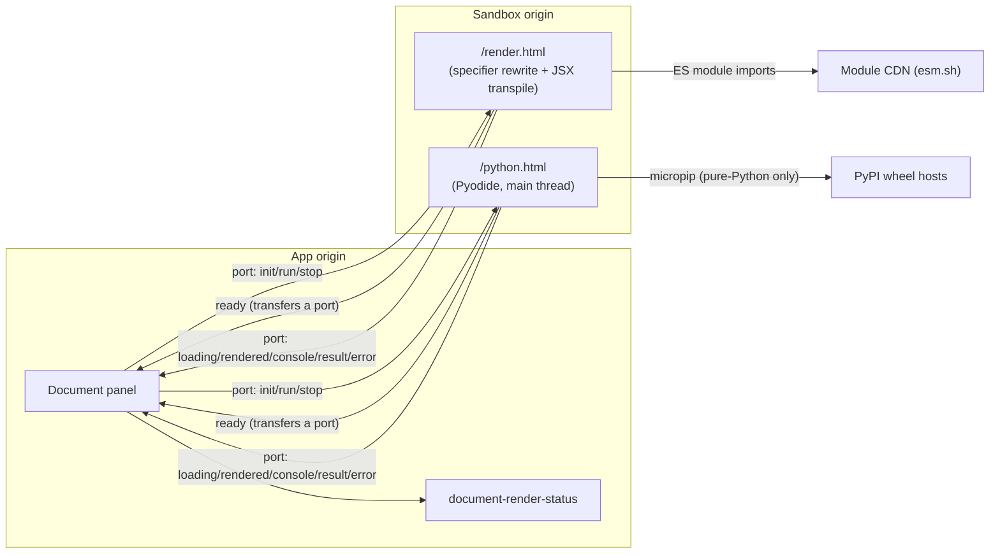

# Documents

Runnable documents: how AI-generated code becomes a live, sandboxed preview in the
document panel. This is the design of record for the sandbox origin, the bridge
protocol, the security model, and both runtimes. Read this before touching the
document panel's rendering, the sandbox origin, or the system prompt's document
guidance.

---

## What a document is

A fenced code block in an assistant message becomes a **document**: a card in the chat
that opens in the document panel. Mermaid documents render diagrams (pre-existing).
**Runnable documents** execute:

| Kind      | Fence tag         | Renders as                                 | Execution               |
| --------- | ----------------- | ------------------------------------------ | ----------------------- |
| `html`    | `html`            | Live page (HTML/CSS/inline JS)             | Auto, on panel open     |
| `js`      | `js`/`javascript` | DOM output of the script                   | Auto, on panel open     |
| `react`   | `jsx`/`tsx`       | Mounted React component                    | Auto, on panel open     |
| `python`  | `python`          | Console output + rich outputs (PNG)        | Explicit **Run** button |
| `mermaid` | `mermaid`         | Diagram (not sandboxed — trusted renderer) | n/a                     |

v1 boundaries (deliberate, founder-ruled): **single-file** documents only; no runtime
network access from document code; Vue and multi-file projects are designed-for
extensions, not features. Documents are the only place LLM-generated code executes.

## Architecture

One renderer codepath on every platform (web, iOS, Android). The design constraint that
forced it: **no service workers** — iOS WKWebView has none, and any mechanism that needs
one (notably Sandpack's bundler) cannot ship on mobile. The pattern below is the same
one Claude and Gemini ship on iOS.

- **Sandbox origin** (`SANDBOX_ORIGIN_URL`): a static, assets-only Cloudflare Worker on
  its own subdomain. It serves the two renderer pages and the pinned Pyodide
  distribution. It has no cookies, no sessions, no API, no server logic — nothing to
  steal. Locally it runs as part of `pnpm dev` on `HB_SANDBOX_PORT`.
- **Web renderer** (`html`/`js`/`react`): the page receives code over the bridge port,
  **rewrites bare npm imports to absolute module-CDN URLs** in the source,
  transpiles JSX in-browser, and renders inside the sandboxed frame. npm resolution and
  bundling happen on the CDN side — arbitrary packages work without a bundler.
- **Python runtime**: the page runs pinned, self-hosted **Pyodide on the sandbox
  iframe's main thread** — not a worker. (A module worker, which Pyodide requires,
  cannot be spawned from the opaque-origin sandbox iframe; keeping the strong sandbox
  forces main-thread. Security is unaffected — the cross-origin sandbox is the wall, not
  the worker.) Imports resolve against a vendored, pinned wheel closure — numpy,
  matplotlib and their transitive deps — and pure-Python PyPI packages auto-install via
  micropip. Any other compiled package is unreachable: its Emscripten wheel lives on the
  Pyodide CDN, which `connect-src` blocks, and PyPI serves only the useless native
  wheel. Loading is lazy: nothing downloads until the first Run; assets are
  browser-cached afterwards. Because execution is main-thread, a long synchronous run
  blocks the iframe until it yields or is stopped; **Stop is the parent tearing the
  iframe down** (it owns the element and can kill a spinning frame from outside).
- **Module CDN** (`ESM_CDN_URL`): `https://esm.sh` in production. CI and local test
  modes point at a local stub serving a pinned fixture package set — tests never touch
  the live CDN. esm.sh is self-hostable if we ever want zero third-party runtime
  dependencies (Google runs its own mirror for the same purpose).

## Bridge protocol

Typed once as Zod schemas in `@hushbox/shared` (`documents/bridge`); both sides import
the same schemas. The Zod definitions themselves are transport-agnostic — they constrain
message shape and carry no window, origin, or port concept — so the transport below is
free to change without touching them. All messages carry a `requestId`; the panel ignores messages for stale
requests (teardown races).

| Direction      | Message    | Payload                              | Meaning                                      |
| -------------- | ---------- | ------------------------------------ | -------------------------------------------- |
| parent → frame | `init`     | `kind`, `code`, `requestId`          | Load this document                           |
| parent → frame | `run`      | `requestId`                          | Execute (python only)                        |
| parent → frame | `stop`     | `requestId`                          | Kill execution (parent tears down the frame) |
| frame → parent | `ready`    | —                                    | Page booted, safe to `init`                  |
| frame → parent | `loading`  | `requestId`, `phase`                 | Progress (runtime download, install)         |
| frame → parent | `rendered` | `requestId`                          | Visual output is live                        |
| frame → parent | `console`  | `requestId`, `stream`, `text`        | stdout/stderr line                           |
| frame → parent | `result`   | `requestId`, `outputs[{type, data}]` | Rich outputs (`image/png`, `text`)           |
| frame → parent | `error`    | `requestId`, `code`, `message`       | Typed failure (syntax, resolve, runtime)     |

The panel mirrors the lifecycle into `document-render-status` — a stable app-DOM element
(literal HTML `id`) that flips to its rendered state only on bridge `rendered`. It is
load-bearing three ways: screen-reader status, Playwright assertions, and the Maestro
on-device proof (Android devtools hierarchy can see app-origin DOM but not reliably
inside iframes — this element is the programmatic proof that execution really happened).

### Transport: a frame-minted channel

The frame mints a `MessageChannel`, keeps `port1`, and transfers `port2` to its embedder
on the one-shot `ready` broadcast. Every later message, **in both directions**, rides
that port. The frame registers no `window` message listener at all, and the panel never
calls `iframe.contentWindow.postMessage`.

The frame's origin is opaque (`"null"`), which leaves an embedder nothing to target: a
`postMessage` naming the sandbox origin is discarded silently and without an exception,
the literal `'null'` is rejected as a target origin, and `'/'` resolves to the parent's
own origin and is dropped identically. Parent→frame is therefore either a wildcard post
or a port, and the port is the stronger of the two rather than merely the working one:

- **Inbound it is unforgeable.** Untrusted document code shares the frame's realm, so a
  `window` listener as the intake is directly forgeable by it: the document posts
  `init`/`run`/`stop` at its own window and is obeyed. That is demonstrated on both
  runtimes, not theoretical. A port is a capability held only by whoever received the
  transfer, and there is no window listener to post at. Pinned by tests that forge an
  `init` at the frame's window and assert it is ignored.
- **Outbound it is addressed.** Console lines, results, and rendered-document data reach
  the single port holder instead of being broadcast to every listener on the embedding
  page.
- **It dies with the document that received it.** The capability binds to the receiving
  _document_, not to an origin: once a frame self-navigates to a hostile document, a send
  on the captured port delivers nothing, where a wildcard post would hand the payload to
  the document that replaced it.

**One handshake, both runtimes.** It lives once, in `apps/sandbox/src/embedder-channel.ts`;
both bootstraps call it and neither keeps a copy of any step. The parent has a single
implementation of the other side, so two frame copies would have to agree to be correct —
and a divergence (a dropped `start()`, a changed transfer list) is silent, leaving the
page loading forever with nothing thrown. See the `port.start()` asymmetry below for why
no test would catch it.

**First ready wins.** The panel captures the port from the first `ready` of a frame
instance and ignores every later one; the reference clears on teardown so a replacement
frame handshakes normally. Without the rule, document code could mint its own channel,
broadcast a second `ready`, and take delivery of the parent's subsequent `init`/`run`/`stop`
traffic itself.

**`port.start()` is mandatory, and only half of it is testable.** A port registered with
`addEventListener` stays paused until started — the `onmessage` assignment form starts it
implicitly, and the repo's lint rules forbid that form. Both vitest environments supply
Node's `MessagePort`, which starts itself when a listener is attached, so a missing
`start()` is invisible to every unit and integration test here. The frame side is covered
anyway, because its browser tests drive the shipped bundles in real Chromium. **The parent
side is covered by nothing but E2E** — deleting its `start()` leaves the whole suite green.

Wildcard posting survives in exactly these places:

| Site                                          | What it is                                                                                                                                                                                                                                                                                                              |
| --------------------------------------------- | ----------------------------------------------------------------------------------------------------------------------------------------------------------------------------------------------------------------------------------------------------------------------------------------------------------------------- |
| `embedder-channel.ts` — the `ready` broadcast | The handshake. One source site, shipped inside both bundles, sent once per frame instance. It cannot be narrowed: an opaque frame cannot learn its embedder's origin (`capacitor://localhost` on mobile), and `parent` names exactly one window regardless. The payload is a bare type tag; the capability is the port. |
| `embed-harness.ts` — `postToFrameWindow`      | Test infrastructure that exists to be ignored: it forges an `init` at the frame's window so a test can prove intake is port-only. Deleting it deletes the proof.                                                                                                                                                        |

The panel posts at the frame's window not at all — wildcard or otherwise — pinned by a
test that spies on `iframe.contentWindow.postMessage` across a full init→rendered cycle
and asserts zero calls.

## Security model

Containment, not code vetting. Arbitrary code — including arbitrary npm packages — is
assumed hostile; the walls make that acceptable. The browser origin boundary is the
primary wall; everything else narrows what's reachable inside it.

| Layer                 | Setting                                                                                                                                                                                                                                                                                                 | What it prevents                                                                                                                                                                                                                                                                                                                                                                                                                   |
| --------------------- | ------------------------------------------------------------------------------------------------------------------------------------------------------------------------------------------------------------------------------------------------------------------------------------------------------- | ---------------------------------------------------------------------------------------------------------------------------------------------------------------------------------------------------------------------------------------------------------------------------------------------------------------------------------------------------------------------------------------------------------------------------------- |
| Origin isolation      | Execution only on the credential-free sandbox origin                                                                                                                                                                                                                                                    | Reaching app DOM, session, plaintext, device key                                                                                                                                                                                                                                                                                                                                                                                   |
| iframe sandbox        | `sandbox="allow-scripts"` — exactly, nothing more                                                                                                                                                                                                                                                       | Popups, top navigation, modals, same-origin access                                                                                                                                                                                                                                                                                                                                                                                 |
| Sandbox-origin CSP    | `default-src 'none'`; `script-src` self + `'unsafe-inline'` + `'wasm-unsafe-eval'` + blob: + module CDN; connect-src: Python wheel hosts only; frame-src/child-src/worker-src/object-src `'none'`; frame-ancestors: app origins (+ `http://localhost:*` for Android/dev); `X-DNS-Prefetch-Control: off` | Runtime network — fetch/XHR/WS/EventSource/beacon (connect-src); untrusted code spawning a child frame/worker/object to obtain a fresh realm (default-src/frame-src/worker-src `'none'`); DNS-prefetch leaks; third-party embedding. `script-src` deliberately allows `'unsafe-inline'` — the sandbox exists to run the document's own (inline) scripts; containment is origin isolation + this network lockdown, never script-src |
| WebRTC neutralization | The sandbox bootstrap deletes `RTCPeerConnection`/`webkitRTCPeerConnection`/`mozRTCPeerConnection`/`RTCDataChannel` from the frame global before any untrusted code runs                                                                                                                                | WebRTC exfil (STUN/TURN egress) — CSP `webrtc 'block'` is a draft directive Chromium does NOT enforce, so this JS layer is the actual block; the `'none'` CSP prevents recovering the deleted globals via a fresh realm                                                                                                                                                                                                            |
| App-origin CSP        | `frame-src` = sandbox origin — delivered via generated `_headers` on web AND a `<meta http-equiv>` in the app HTML so it also applies inside the bundled Capacitor WebView                                                                                                                              | Any other frame source; a sandboxed document self-navigating its own frame to an off-allowlist host to exfiltrate in the URL (parent `frame-src` governs child navigation — must exist on mobile too, where `_headers` does not reach)                                                                                                                                                                                             |
| Bridge transport      | The frame's only intake is a `MessageChannel` port it mints and transfers on `ready`; no `window` message listener exists in either runtime, and the port endpoint stays closure-scoped inside an IIFE bundle                                                                                           | Document code forging `init`/`run`/`stop` at its own window — it shares the frame's realm, so a window listener would obey it; frame output being broadcast to every listener on the embedding page; a self-navigated frame taking delivery of traffic addressed to the document it replaced                                                                                                                                       |
| Process lifecycle     | Parent tears down the iframe on Stop/teardown; fresh frame per run                                                                                                                                                                                                                                      | Post-stop execution, cross-run state leakage                                                                                                                                                                                                                                                                                                                                                                                       |
| Cookie hygiene        | Sessions are host-only; tested: no credentialed request ever reaches the sandbox origin                                                                                                                                                                                                                 | Subdomain cookie bleed                                                                                                                                                                                                                                                                                                                                                                                                             |

Invariants that must never be weakened (each is pinned by an exact-string or behavioral
test in the security suite — a CSP or sandbox-attr edit fails tests before review):

1. LLM-generated code never evaluates in the app origin — no `eval`, no `new Function`,
   no interpreter, no same-origin `srcdoc` with scripts.
2. The sandbox iframe never gains `allow-same-origin`.
3. Document code gets no network beyond module/wheel loading — across _every_ egress
   channel, not just `connect-src`: fetch/XHR/WS, WebRTC (`webrtc 'block'`),
   DNS-prefetch, form submission, and self-navigation of the frame (governed by the
   app-origin `frame-src`, which must be present on mobile as well as web). Loosening any
   of these is a founder decision, not a task-level fix.
4. The sandbox origin never serves anything requiring credentials.
5. The frame's only intake is the transferred port: neither runtime registers a `window`
   message listener, and no parent→frame `window.postMessage` exists in the product.
   Untrusted document code shares the frame's realm, so a window listener is directly
   forgeable from inside the sandbox.

Accepted residual risks (founder-ruled): a document can render deceptive UI inside its
frame (phishing-shaped; contained, cannot navigate or read anything); module loads can
theoretically encode data in request paths (bounded by CDN allowlist); CPU/memory abuse
degrades to a killed preview.

## Panel UX

- The Rendered/Raw toggle (previously mermaid-only) applies to all runnable kinds.
  **Rendered is the default**; Raw shows the highlighted source. State resets per
  document.
- `html`/`js`/`react` render automatically when the panel opens. `python` shows source +
  **Run**; running streams console lines into an `aria-live` region below the output,
  images render via ``, **Stop** tears the frame down instantly (killing even a
  main-thread-spinning run from outside).
- The panel does not try to predict whether streaming code is finished; it runs the
  code and lets the sandbox report what happened. While a message is still streaming, a
  reported failure is **not shown** — the panel keeps the last successful render, or the
  source view if nothing has rendered yet — and the document is re-run once its content
  settles (debounced, so a streaming message costs a handful of attempts rather than one
  per token). Once the message is no longer streaming, a reported failure surfaces as the
  error card. Predicting completeness by parsing the markdown for an unterminated fence
  was tried and abandoned: it required this code to agree with the renderer's markdown
  dialect, and every disagreement released partial code to the renderer.
- A React document is treated as rendered once its tree stops committing: the frame
  watches for DOM changes and settles on quiescence, bounded by the request deadline, so a
  chained mount sequence (commit, effects, a state update, another commit) counts as part
  of the render rather than as the document running. Work that begins after the tree has
  gone quiet — a `Suspense`/`lazy` child arriving after a module fetch, or a state update
  from a delayed timer — is treated as the live document instead, and a failure there
  leaves an empty preview rather than a wrong error card. React exposes no suspension
  state, so nothing distinguishes "a lazy child is still coming" from "this document is
  idle". The exact boundary is measured, not assumed; the sandbox's own tests are the
  record of where it sits.
- HTML never fails to parse, so an HTML document visibly builds up as it streams rather
  than appearing all at once. Any failure inside an HTML `<script type="module">` is
  missed for the same reason — a module script is deferred, so the frame has already
  settled by the time it runs. Mermaid has no sandbox bridge to observe, so it waits for
  its message to settle instead. Python is exempt from suppression: it runs only when the
  user presses Run, so a failure there was explicitly asked for and is shown immediately,
  streaming or not.
- Failures (syntax error, unresolvable package, runtime crash, worker death) render as
  a readable error card — never a blank frame. First Python run shows download progress
  phases.
- Teardown on document switch and panel close: the iframe unmounts and any worker dies.

## Mobile

Same code, same origin, same bridge — Capacitor WebViews load the sandbox origin like
any browser. Facts a maintainer needs:

- iOS has no WKWebView service workers; this design needs none — that's load-bearing,
  not incidental. Do not introduce a service-worker dependency into any renderer path.
- Pyodide runs on the sandbox-origin iframe's main thread, not in a worker (the opaque
  sandbox cannot spawn Pyodide's required module worker) — which also sidesteps
  worker-creation-under-custom-scheme unknowns entirely.
- The `.wasm → application/wasm` MIME mapping ships inside Capacitor's iOS asset
  handler (fixed in Capacitor 5.1.0); it reaches the built app via `cap sync`.
- iOS memory ceilings for WKWebView are unpublished and reported inconsistently; heavy
  numpy or matplotlib workloads on old devices may be memory-killed. That degrades to a
  failed run.
- The Android Maestro flow asserts `document-render-status` via
  `androidWebViewHierarchy: devtools`. There is no iOS test automation (founder-ruled).

## The model side

`buildTurnSystemPrompt` (shared, single implementation — client price-preview parity
depends on it) advertises: available kinds and fence tags, when to emit a document
(substantial, self-contained, visual/interactive), and the constraints (single file, no
runtime network, npm imports allowed, Python imports auto-install, no `input()`).
Changing document capabilities means changing that prompt text and its pinned tests in
the same change.

## Adding a runtime (extension recipe)

1. Add the kind to `RunnableDocumentKind` and the parser's fence mapping.
2. Add a renderer page (or mode) on the sandbox origin speaking the same bridge schemas
   — the bridge is runtime-agnostic; extend payloads only by amending the shared Zod
   schemas. Handshake through the shared `connectToEmbedder`, never a second copy of it.
3. Extend the sandbox-origin CSP only if the runtime needs new asset hosts; every
   addition needs a security-suite pin and founder sign-off (invariant 3).
4. Add: panel dispatch, system-prompt capability text, security-corpus cases, an E2E
   scenario, and a Maestro assertion if the runtime is mobile-relevant.
5. Self-host and pin runtime assets on the sandbox origin (the Pyodide precedent).

## Rejected designs (do not re-propose without new evidence)

| Design                                | Why rejected                                                                                                                                                                                                                                              |
| ------------------------------------- | --------------------------------------------------------------------------------------------------------------------------------------------------------------------------------------------------------------------------------------------------------- |
| Sandpack (any hosting)                | Bundler hard-requires service workers → structurally dead on iOS                                                                                                                                                                                          |
| StackBlitz WebContainers              | Paid license; app-wide COOP/COEP tax; Capacitor-incompatible                                                                                                                                                                                              |
| react-runner/react-live in app origin | Untrusted code in our realm beside plaintext and keys                                                                                                                                                                                                     |
| Plain same-origin Pyodide worker      | Pyodide's JS bridge reaches app credentials/IndexedDB                                                                                                                                                                                                     |
| Pyodide in a worker (any)             | Module worker unspawnable from the opaque sandbox iframe; keeping the sandbox forces main-thread                                                                                                                                                          |
| Per-platform renderers                | Founder-ruled: no dual implementations                                                                                                                                                                                                                    |
| Open runtime network                  | Exfiltration channel; revisit = founder decision on `connect-src`                                                                                                                                                                                         |
| Parent→frame `window.postMessage`     | The frame's origin is opaque: an explicit target is silently discarded, `'null'` throws, `'/'` resolves to the parent and is dropped. A wildcard delivers, but is forgeable by document code sharing the frame's realm and survives frame self-navigation |
