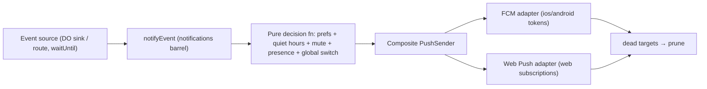

# Notifications

The design of record for HushBox's notification system: push (native + web), the
in-app foreground layer, and every rule that governs what may leave the server. Read
this before touching any notification, push, or service-worker code.

---

## The laws

These are doctrine, not defaults. Changing one is an architecture decision.

1. **Generic payload law.** Every push payload, notification title/body, tag, and
   push-service-visible header is content-free: a fixed per-category string plus a
   conversation deep link. Never sender names, conversation titles, message content, or
   any user-generated text. There is no on-device decryption enrichment and no iOS
   Notification Service Extension — notifications about E2E-encrypted data are generic
   by construction, not by best effort.
2. **Best-effort law.** Notification delivery is the degradable class (like email and
   telemetry, unlike money and persistence). Sends fire at the composition root via
   `waitUntil`, never inside a domain transaction, never as a `jobs` row. A dropped
   notification needs no recovery: the database and the in-app UI are the truth; push
   is a nudge toward them.
3. **Server-evaluated controls.** Whether a user is notified is decided in exactly one
   place: a pure decision function in the notifications slice domain. The client never
   re-implements "should this user be notified." The client's only say is display-point:
   a tab focused **on that conversation** suppresses the system notification, because the
   screen the user is looking at already shows what the notification would say. Any other
   focused page — a different conversation, the blog, settings — still gets it. It decides
   _whether to show_, never _whether to send_ — and a suppressed notification produces no
   in-app substitute (see the activity badge below).
4. **One lifecycle.** All delivery targets — native FCM tokens and web push
   subscriptions — live in `device_tokens`. Registration is an idempotent upsert;
   dead-target detection is reactive on send (FCM `UNREGISTERED`, Web Push 404/410 →
   prune); a retention cron deletes rows stale by `lastSeenAt`. No second cleanup
   mechanism exists.

## Event categories

The closed set. A new category is a schema change plus a decision-function change plus a
settings toggle — all three, always.

| Category        | Fires when                                                                                     | Fired from                                                   |
| --------------- | ---------------------------------------------------------------------------------------------- | ------------------------------------------------------------ |
| `message`       | A message is persisted in a conversation                                                       | ConversationRoom DO terminal sink; chat route (runless send) |
| `runCompletion` | A run completes successfully (never on failure — the client's own deadline UX covers failures) | ConversationRoom DO terminal sink                            |
| `membership`    | User is added to a conversation; fork/share activity involving them                            | conversations routes                                         |

Every event carries a fire-time presence snapshot from its call site; present users are
excluded. There is no live presence query from the notifications slice — the caller's
snapshot is the only presence input (the slice never queries the DO).

## Transports

| Platform                            | Transport                                      | Notes                                                                                                                                                           |
| ----------------------------------- | ---------------------------------------------- | --------------------------------------------------------------------------------------------------------------------------------------------------------------- |
| Android (Capacitor)                 | FCM HTTP v1 from the Worker                    | JWT-signed OAuth via WebCrypto; no `firebase-admin`                                                                                                             |
| iOS (Capacitor)                     | FCM HTTP v1 (Google relays to APNs)            | Requires the APNs→FCM token bridge (`@capacitor-community/fcm`, which coexists with `@capacitor/push-notifications`); the Worker never talks to APNs directly   |
| Web (Chrome/Firefox/desktop Safari) | Web Push (RFC 8291/8188/8292) from the Worker  | In-house sender: aes128gcm payload encryption + VAPID ES256 via `jose`; no third-party push library (every candidate audited was RFC-incorrect or unmaintained) |
| iOS browser                         | Web Push, **installed (Home Screen) PWA only** | Platform ceiling: no iOS browser tab can receive push; the manifest exists chiefly for this                                                                     |

FCM is deliberately the single mobile gateway. Direct APNs from the Worker is feasible
(ES256 p8 JWT) and was rejected to keep one mobile mechanism; it remains the recorded
option if Google must ever leave the iOS metadata path.

**Privacy asymmetry, documented:** Web Push payloads are encrypted end-to-server-to-
browser — the push services (Google/Mozilla/Apple) cannot read them. FCM payloads are
readable by Google by construction. Both carry only generic content (law 1), so the
asymmetry exposes routing metadata, not content. The collapse identity every push service
sees — the Web Push `Topic` header, the FCM `collapse_key`, the APNs collapse id — carries
a derived alias (a truncated HMAC of the conversationId under a server secret), never the
raw id; the `Topic` header is the one that matters most, since the Web Push payload beside
it is encrypted. The Android notification tag is the deliberate exception: it is the
device-local address the client clears a read conversation by, and it carries the raw id,
which the same FCM message's data payload already puts in front of Google regardless.

## The pipeline

The decision function's inputs and their sources:

| Input           | Source                                                         | Semantics                                                                                   |
| --------------- | -------------------------------------------------------------- | ------------------------------------------------------------------------------------------- |
| Global switch   | `notification_preferences.globalEnabled`                       | Off = nothing, ever                                                                         |
| Category toggle | `notification_preferences.{messages,runCompletion,membership}` | Per-category opt-out                                                                        |
| Quiet hours     | `quietHoursStartMinutes/EndMinutes` + `timezone` (IANA)        | Evaluated server-side in the user's zone; suppressed events are **dropped**, never deferred |
| Mute            | `conversation_members.muted` (boolean)                         | Per-conversation, manual on/off — no durations                                              |
| Presence        | Caller's fire-time snapshot                                    | Present users excluded                                                                      |
| Actor           | Event's `actorUserId`                                          | Dropped for `message` and `membership`; a `runCompletion` notifies its requester            |

A user with no `notification_preferences` row gets the defaults (everything on, no quiet
hours) — the row is created lazily on first settings write, never backfilled.

## Data model

| Table                      | Owner slice   | Notification-relevant columns                                                                                                                                                                                                                  |
| -------------------------- | ------------- | ---------------------------------------------------------------------------------------------------------------------------------------------------------------------------------------------------------------------------------------------- |
| `notification_preferences` | notifications | `userId` PK, `globalEnabled`, `messages`, `runCompletion`, `membership`, `quietHoursStartMinutes`, `quietHoursEndMinutes` (both-or-neither), `timezone` (required with quiet hours)                                                            |
| `device_tokens`            | notifications | `platform` (`ios`/`android`/`web`), `token` (FCM token, or the Web Push endpoint for web rows), `p256dh`/`auth` (web rows only, CHECK-enforced), `lastSeenAt` (touched on registration and successful send; retention cron deletes stale rows) |
| `conversation_members`     | conversations | `muted` boolean; `lastReadSeq` (monotonic read cursor, written `GREATEST(current, new)` — naturally idempotent)                                                                                                                                |

## Subscription lifecycle

**Web:** the client subscribes only after an explicit grant (the one-time prompt or the
settings toggle — never on mount), using the VAPID public key from the env registry.
Registration is a typed upsert keyed on the endpoint. On every authenticated app start
the client re-registers fire-and-forget (self-healing = run the one mechanism again).
The service worker handles `pushsubscriptionchange` by re-subscribing and re-registering.
Logout and global-switch-off unsubscribe best-effort; the server-side 404/410 prune is
the recovery for the crash/offline case.

**Native:** Capacitor registration forwards the FCM token (on iOS, the Firebase plugin
bridges the raw APNs token to an FCM token — without that bridge iOS delivery fails,
because FCM rejects raw APNs tokens).

## Dismissal & the foreground layer

- Every push carries a per-conversation collapse identity (FCM `collapse_key`, APNs
  collapse id, Web Push `Topic` — all the derived alias), so a user holds at most one
  pending notification per conversation. The displayed notification is separately tagged
  with the raw conversationId (Android `notification.tag`, SW `showNotification` tag),
  which is how the client finds and clears it.
- `lastReadSeq` is the durable cross-device read cursor, written by an explicit client
  signal when a conversation is viewed.
- Clearing is client-side and lazy: viewing a conversation clears its delivered
  notifications on that device; on app foreground the client fetches read state and
  clears notifications for conversations read elsewhere. **Cross-device dismissal is
  eventual (next foreground), not instant** — remote-clear pushes were rejected because
  iOS throttles silent pushes to the point where the mechanism cannot reliably succeed,
  and a mechanism that cannot succeed breeds banned backup mechanisms.
- The in-app foreground layer is an **activity badge**, deliberately not a durable
  unread count: a client-side store counts events observed on the open conversation's
  socket while the tab/app is unfocused, drives the tab title `(n)` prefix,
  `navigator.setAppBadge` where supported, and an opt-in sound (default off, never the
  sole signal). It resets on focus and starts at zero on a fresh session.
  Server-authoritative unread counts are a recorded future option, not a bug.
  The service worker does not feed this store: the only push it suppresses is one for the
  conversation a focused tab is already showing, which needs no signal of any kind. Every
  other push raises an OS notification, so no event is left without a signal — which is
  why no in-page hand-off from the worker exists.

| Surface             | Mechanism                                           | Support limits                                                                                         |
| ------------------- | --------------------------------------------------- | ------------------------------------------------------------------------------------------------------ |
| System notification | SW `showNotification` / native shade                | iOS web: installed PWA only                                                                            |
| Tab title `(n)`     | Single title-writing effect (the only title writer) | Web only                                                                                               |
| App badge           | `navigator.setAppBadge`                             | No Android browser support; iOS/desktop installed contexts; `setAppBadge(0)` hides the badge on Safari |
| Sound               | Opt-in, plays on in-app arrival                     | Settings toggle is the autoplay-unlocking gesture                                                      |

## Permission UX

The OS permission dialog is **never** requested on mount. The only triggers are:

- The **one-time prompt**: a dismissible inline callout in the app chrome (not a
  modal; `role="status"`; keyboard-reachable). Enable → OS dialog → on grant, subscribe
  - register. Later → dismissed forever on that device (`localStorage` — device-local
    because browser permission itself is per-device). It never renders when permission is
    already granted or denied, when the platform has no push path, or when the global
    notifications setting is off.
- The **settings card** (`/settings` → Notifications): global switch, per-category
  toggles, quiet hours (hour-granularity start/end + auto-detected IANA timezone).
  Turning the global switch on walks the same permission flow; turning it off
  unregisters.

Both platforms share one client facade (`notificationChannel`) with a web adapter
(Notification API + PushManager + SW) and a native adapter (Capacitor) — the permission
state machine exists once.

## Environment

All registry entries with values for every mode; production values are Workers secrets.

| Variable                                 | Purpose                                                                                             |
| ---------------------------------------- | --------------------------------------------------------------------------------------------------- |
| `VAPID_PRIVATE_KEY` / `VAPID_PUBLIC_KEY` | Web Push VAPID keypair (dev/CI use a committed throwaway pair — dev sends only ever reach the mock) |
| `VITE_VAPID_PUBLIC_KEY`                  | The public key, exposed to the browser for `pushManager.subscribe`                                  |
| `VAPID_SUBJECT`                          | VAPID `sub` claim (mailto/https)                                                                    |
| `NOTIFICATION_TAG_SECRET`                | HMAC key for the conversation tag alias                                                             |

## Development & testing

- Dev/CI bind a mock composite sender; captured sends are inspectable at `/dev/push`
  (the push twin of `/dev/emails`).
- The Web Push sender's encryption is pinned byte-exact to the RFC 8291 Appendix A test
  vector (injectable ephemeral key + salt); VAPID JWTs are verified structurally.
- Playwright covers the prompt, settings, and — via Chromium CDP push injection into the
  real service worker — delivery, click, and deep-link. The Android Maestro harness
  covers the prompt and permission-grant flows on the emulator.
- Deliberately untested in CI: the real server → push-service → device hop (it requires
  live Google/Mozilla/Apple infrastructure and real credentials; it is non-hermetic by
  nature). iOS device delivery is verified manually.

## Deliberate limits

- No jobs, queues, or retries for delivery; a missed notification is recovered by the
  UI showing the state, not by redelivery.
- Quiet-hours suppression drops; it never defers or batches.
- Mute is a boolean; duration tiers were considered and rejected.
- No per-device notification management UI; push is all-in-or-out per user.
- No marketing or announcement content ever rides the notification channel; it exists
  for the three event categories only.
- The activity badge is session-local by design (see above).
- Cross-device dismissal is eventual, bounded by next app foreground.
