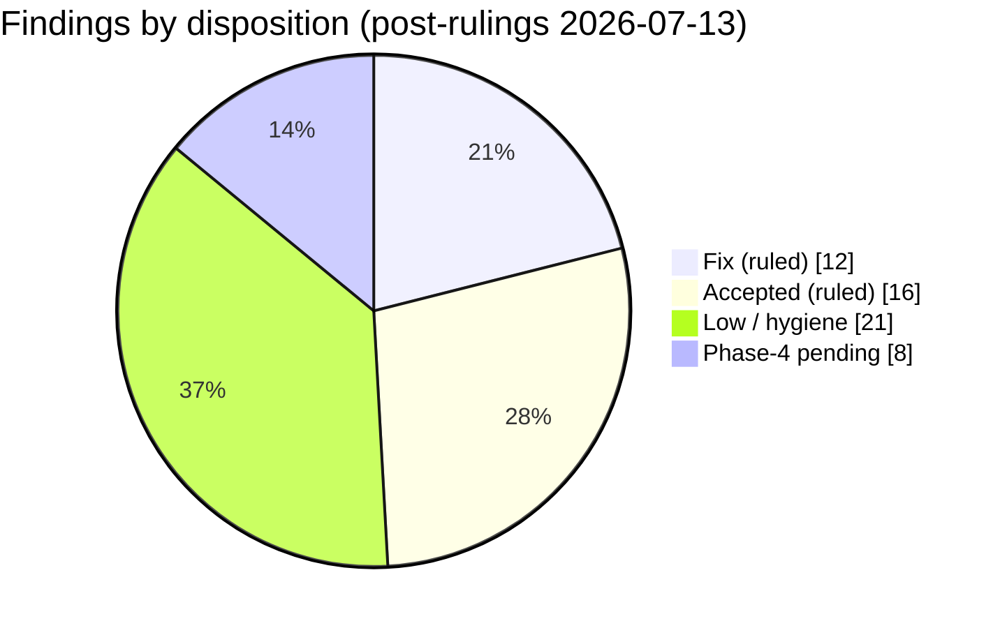
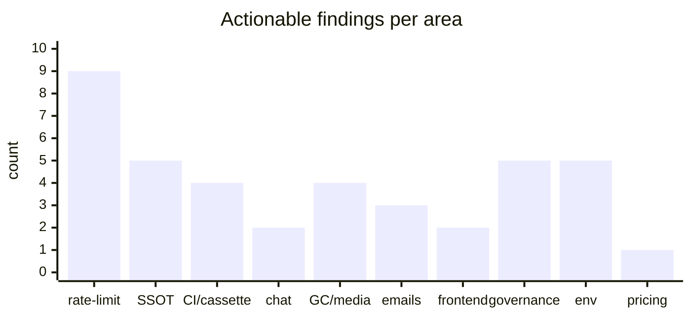
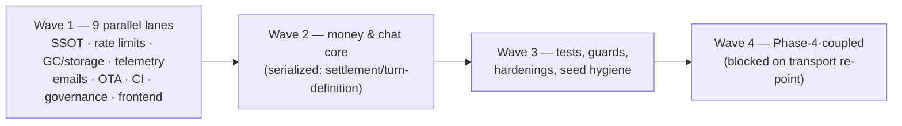

# Full Codebase Audit — Legacy → Rewrite Parity (2026-07-12)

> ## ✅ STATUS (2026-07-15): COMPLETE — all F01–F73 remediated, tree fully green
> Every fix in this document is done and audit-clean; the whole repo is green (typecheck
> 13/13, lint 13/13, arch:check, jscpd, knip, **15,213 tests / 0 failures** across all 8
> suites). **Nothing is committed** — the remediation lives in the working tree, ready to
> commit. Deferred by founder ruling (intentional, not open work): **F32, F33, F37, F61,
> F68**. Reverted (audit was wrong): **F35**. Dropped: **F34**. One out-of-band item
> remains — **AI cassette re-recording** (needs provider credentials; does not affect local
> green). `e2e/` is dark by design and not part of these gates.
> **→ Read "Implementation status — 2026-07-15" in §2b (Master remediation pipeline) for the
> full disposition, the load-bearing decisions, and the follow-up ledger.** The register
> rows and §-by-§ findings below record the original audit as-found; the §2b status section
> is the authoritative current state.

> **Method:** 23 parallel read-only exploration agents swept the entire repo — every legacy
> feature (`apps/api/src/legacy/**`, `legacy_*` files, pre-refactor schema in git history)
> mapped to its new-system home, plus infra, patterns, tooling, and governance. Every claim
> below is **Verified** with a file:line citation unless marked otherwise. The admin plane
> (Phase 5) is explicitly out of scope per instruction. Findings that are documented as
> pending the Phase-4 e2e/real-API re-point are labeled `⏳ Phase-4` and separated from
> genuine regressions.
>
> **Baseline verification (2026-07-13):** a second 7-agent sweep re-verified the entire
> "before" against the **real GitHub remote HEAD** (`fce35f4d`, origin/main, 2026-06-26
> — the deployed legacy monolith; the whole rewrite sits in 18 unpushed commits). The
> local `apps/api/src/legacy` corpus every parity section used as its baseline is a
> **faithful copy** of that remote (325/331 files byte-identical; 6 benign diffs: five
> `Legacy`-prefix type renames + one email tagline), so all parity findings stand. §13
> was rebuilt column-by-column against the remote schema with per-table provenance;
> shared money/token constants were independently re-confirmed **byte-identical**; two
> earlier claims were corrected (remote `member_budgets` was already durable-cumulative;
> the live v0x01 `decompress` gained its 4 MiB bound locally — the designed Defect-8
> fix, see §5).

---

## Table of contents

1. [Executive summary & scorecard](#1-executive-summary--scorecard)
2. [Consolidated findings register (ranked)](#2-consolidated-findings-register)
   — [2b. Master remediation pipeline](#2b-master-remediation-pipeline)
3. [Env-var branching audit](#3-env-var-branching-audit)
4. [Duplication / single-source-of-truth audit](#4-duplication--single-source-of-truth)
5. [Encryption schema parity & crypto segregation](#5-encryption-parity--crypto-segregation)
6. [Model pricing & fee hygiene](#6-model-pricing--fee-hygiene)
7. [Sentry & error-reporting policy](#7-sentry--error-reporting-policy)
8. [Rate limiting regression audit](#8-rate-limiting)
9. [Token estimation parity](#9-token-estimation)
10. [API & browser security (CSRF, CORS, headers…)](#10-api--browser-security)
11. [Cassette system](#11-cassette-system)
12. [CI & real-API coverage (Helcim, OpenRouter, Resend)](#12-ci--real-api-coverage)
13. [DB schema: table-by-table, column-by-column](#13-db-schema-table-by-table)
14. [API surface parity map (every endpoint)](#14-api-surface-parity-map)
15. [Feature parity deep-dives](#15-feature-parity-deep-dives)
    — billing · chat · identity/conversations · media/jobs/cron · emails/push
16. [Test-coverage parity matrix](#16-test-coverage-parity)
17. [Frontend pattern parity](#17-frontend-pattern-parity)
18. [Seed & dev tooling](#18-seed--dev-tooling)
19. [OTA / mobile release surface](#19-ota--mobile-release)
20. [Tooling & ops governance](#20-tooling--ops-governance)
21. [Accepted deltas & Phase-4 pending items](#21-accepted-deltas--phase-4-pending)

---

## 1. Executive summary & scorecard

The rewrite is **feature-faithful to legacy at very high fidelity**. Across ~200 audited
behaviors, constants, and endpoints, the overwhelming majority are retained exactly
(lockout counts, quotas, TTLs, money constants, crypto client/server split, Smart Model
semantics, trial rules, GC/cron tasks, dev routes). Where the new system diverges, it is
usually a **deliberate hardening** (atomic rate-limit reservations, fail-closed webhook
verification, default-deny pipeline, double-entry ledger, AAD-bound envelopes).

The audit found **1 high-severity functional regression** (custom instructions silently
dropped from inference), **a cluster of dropped IP-dimension rate limiters**, **1 money
display bug** (message cost omits the storage fee), and a set of medium-severity hygiene
items (SSOT literals, unwired cassette/coverage gates, GC behavior deltas). Nothing found
threatens the settlement/money invariants — the billing core survived the audit clean.

### Scorecard by area

| # | Area | Verdict | Regressions | Hardenings |
|---|------|---------|-------------|------------|
| 3 | Env-var branching | 🟡 Backend clean; 5 frontend violations | 5 | — |
| 4 | SSOT / duplication | 🟡 2 high + 3 medium violations | 5 | jscpd clean (0.95%) |
| 5 | Crypto parity & segregation | 🟢 Zero primitive leaks; all deltas are hardenings | 0 | 6 |
| 6 | Pricing / fee hygiene | 🟡 Discipline holds; 1 display bug | 1 | init-time guards |
| 7 | Sentry / error policy | 🟢 Policy real & consistent; 3 enforcement gaps | 1 (diagnostics) | Sentry is net-new |
| 8 | Rate limiting | 🔴 6 IP limiters + 2 limiters dropped; 2 drifts | 9 | atomic reservations |
| 9 | Token estimation | 🟢 Exact parity | 0 (4 SSOT dups) | — |
| 10 | API/browser security | 🟢 Parity or hardened everywhere | 2 (rate-limit) | 7 |
| 11 | Cassettes | 🔴 Correct design, **unwired** | ⏳ Phase-4 + 1 real gap | replay-only mode |
| 12 | CI real-API | 🔴 Zero real calls; coverage gate not run | 2 actionable | — |
| 13 | DB schema | 🟢 All money semantics justified | 0 (6 flags) | conservation trigger |
| 14 | Route surface | 🟢 Near-total parity | 2 undocumented dev-route drops | default-deny |
| 15a | Billing | 🟢 Constants exact; core clean | 8 contract changes (all ruled accepted) | webhook fail-closed |
| 15b | Chat | 🟡 One real regression | 1 high (custom instructions) | reasoning/tools superset |
| 15c | Identity/conversations | 🟢 50-row checklist, faithful | (counted in §8) | 6 |
| 15d | Media/jobs/cron | 🟡 GC deltas | 4 | jobs system net-new |
| 15e | Emails/push | 🟢 All templates retained | 3 minor | evidence rows |
| 16 | Test coverage | 🟡 12/14 families covered | sharing gap | — |
| 17 | Frontend patterns | 🟢 Mostly clean | 2 clusters | typed client |
| 18 | Seed/dev tooling | 🟢 Single-sourced now | 0 (scope deltas) | real-pipeline seeding |
| 19 | OTA/mobile | 🟡 Net-new, 4 foot-guns | 1 stale-path risk | — |
| 20 | Governance | 🟡 Gates real; holes inventoried | 5 medium | all rules run in CI |

### Findings by severity

### Where the regressions cluster

---

## 2. Consolidated findings register

Ranked. **Legend:** 🔴 fix, 🟠 fix soon, 🟡 judgment call, ⏳ Phase-4 pending.
**All open questions were ruled on by the founder on 2026-07-13** — rulings are inlined
per row and consolidated here:

### Founder rulings (2026-07-13)

| ID | Ruling |
|----|--------|
| H1 | **Fix now** — thread `customInstructions` through the chat/trial/regenerate body schemas + `RunStartBody` into the model-call request. |
| H2 | **Restore all** — every dropped per-IP limiter at legacy constants, the verify-email token limiter, the share-creation cap, and fix the shared-message read limiter mount. |
| H3 | **Display must equal debit** — bug; add `charge.storageFeeNanoUsd` into `content_items.cost`. |
| M5 | **Restore legacy constants, both** — recovery get-key back to 3/3600; resend-verify back to 1/60s per email. |
| M6 | **Fix delete-failure isolation** (log + continue past individual failures) and **each failed delete must send a Sentry error**; keep the 30-min grace window. |
| M7 | **Enforce MIME validation inside `storage.put`** (`ALLOWED_MEDIA_MIME_TYPES`) so no write path can bypass it. |
| M9 | **Add `statusCode` only** to the scrub allowlist; keep coarse error codes; body/url stay dropped. |
| M13 | Balance shape, removed process/poll endpoints, whole-cent-only top-ups: **accepted**. Renewal-row disappearance: **accepted** (allowance is a rule, not a balance — remove the dead `type=renewal` filter). Billing-mismatch evidence drop: **accepted**. |
| M21 | **Restore the explicit worst-case web-search reservation** term at admission (refuse pre-flight rather than circuit-kill mid-run). |
| M22 | **Accepted** — CORS wildcard removal stands; public reads come from allowlisted origins. |
| M23 | **Restore the unconditional welcome email**; console-adapter drop and the collapsed password-reset subject are accepted. |
| M14 | **Fix now** — repoint `cap-test-update.ts`, `mobile-test.ts`, and the deploy health check off `/api/*`. |
| M15 | **Fix all four**: bundle integrity checksum, `no-store` on `/updates/current`, the version-code radix scheme, and the release re-run collision. |
| M17 | **Accepted** — the ops label-gate + single production reviewer model stands. |
| M18 | **Accepted** — rolldown-vite swap + astro patch stand as tracked decisions; add removal criteria to the patch header. |
| DB | `users.image`/`name` drop, `totp_iv` folded into the bytea, billing-mismatch evidence drop: **all intentional/accepted**. |
| Design | SSE→WS resume contract, audio full removal, allowance-as-counter (no ledger renewal rows): **all accepted**. |

### High

| ID | Finding | Evidence | Section |
|----|---------|----------|---------|
| H1 | 🔴 **Custom instructions never reach inference.** Legacy folded `customInstructions` into the system prompt on every chat/trial path; the new adapter honors the field (`language-adapter.ts:403`) but **no request schema populates it** — not `startTurnBodySchema`/`regenerateTurnBodySchema`/`trialTurnBodySchema` (`slices/chat/routes.ts:82,123,158`) nor `RunStartBody` (`packages/realtime/src/protocol.ts:104-145`). Users' instructions are silently ignored. **Ruled: fix now.** | legacy `routes/chat.ts:504-1028`, `prompt/builder.ts:13` | §15b |
| H2 | 🔴 **Six per-IP auth rate limiters dropped with no replacement**: login 20/900, register 10/3600, recovery-reset 10/3600, recovery-get-key 10/3600, resend-verify 5/60, email-verify 30/3600. The verify-email endpoint now has **no limiter at all**; share-creation lost its 20/60 per-user cap; the standalone shared-message public read is un-throttled (limiter mount `'/conversations/shared/:linkId'` at `app.ts:337` does not match `/conversations/shared/message/:shareId`). **Ruled: restore all.** | legacy `redis-registry.ts:55-140` vs new `identity/domain/keys.ts` | §8, §10 |
| H3 | 🔴 **Displayed message cost omits the storage fee.** The wallet is debited `applyMarkup(base) + storageFeeNanoUsd` (`charge.ts:76`) but `content_items.cost` is written as `applyMarkup(base)` only (`settlement.ts:483`), so every message's shown cost understates the actual debit by its storage fee — since the 2026-07-08 storage-fee restoration. **Ruled: bug — display must equal debit; add the storage fee into `content_items.cost`.** | `slices/chat/domain/settlement.ts:480-483` | §6 |
| H4 | 🔴 **The 95% coverage gate never runs in CI.** CI runs `pnpm test` (`ci.yml:181`), never `test:coverage`; thresholds exist but bind only locally/pre-push. Compounding: the rigorous per-file gate (static `include` + `perFile:true`) exists **only in `apps/api`** — web/ui/shared workspaces can pass coverage on never-imported files. | `ci.yml:181`, `apps/api/vitest.config.ts:83-92` vs `apps/web/vitest.config.ts:6-22` | §12, §20 |

### Medium

| ID | Finding | Evidence | Section |
|----|---------|----------|---------|
| M1 | 🟠 Cassette harness has **zero running consumers** and **no network-block guard**: only the vitest-excluded legacy tree wires `createCassetteFetch`; new adapter tests use tmpdir + scripted fetch, so the CI `.ai-cassettes` cache caches nothing; nothing prevents a forgotten fetch-injection from hitting the network (mitigated only by the fake key → 401). | `cassette/mode.ts`, `scripts/lib/vitest-setup.ts` | §11 |
| M2 | 🟡 `docs/DEVELOPMENT.md:43-46` describes the **target end-state**, not today: the real-API lanes are not yet wired in code (`env.config.ts:156` maps ciVitest to the mock key; `if: false` e2e; verify:evidence steps commented). GitHub secrets are populated — the remaining work is purely the Phase-4 code wiring (env mapping, evidence writer, uncomment steps). Not a blocker; tracked. | `ci.yml:189-192,329-332,492-497` | §12 |
| M3 | 🟠 SSOT: `10_000_000n` nano-per-cent redefined **8×**; forward `centsToNanoUsd`/`dollarsToNanoUsd` hand-rolled in web; two divergent canonical-JSON hashers (idempotency vs cassette); two dollar-string parsers; min-deposit rule expressed independently in web ($5) and api (5e9n). | §4 table | §4 |
| M4 | 🟠 Chars-per-token ratio duplicated as 3 unguarded literals (`TRIAL_CHARS_PER_TOKEN=2`, `CLASSIFIER_CHARS_PER_TOKEN=2`, mock `CHARS_PER_TOKEN=4`) + inline formula re-implementation in `turn-definition.ts:168-171`. Values correct today; silent-drift risk. | `trial-eligibility.ts:47`, `smart-model-candidates.ts:42` | §9 |
| M5 | 🔴 Rate-limit constant drift: recovery get-key cap loosened **3→5**/3600 (`keys.ts:175` vs legacy `redis-registry.ts:110`); resend-verify changed 1/60s → 3/3600. **Ruled: restore legacy constants, both.** | §8 table | §8 |
| M6 | 🟠 GC behavior deltas: orphan grace window **24h → 30min** (`gc.ts:29`); a single failed delete **short-circuits the whole sweep pass** (`gc.ts:145-151` Result chaining) vs legacy log-and-continue; runtime budget + partialCompletion telemetry removed. **Ruled: fix the isolation (log + continue), each failed delete sends a Sentry error; keep the 30-min grace.** | `slices/media/domain/gc.ts` | §15d |
| M7 | 🔴 **MIME validation lost at the storage seam**: legacy rejected disallowed MIME before PUT (`media-pipeline.ts:497`); new `storage-r2.ts:169` validates key shape/size only. **Ruled: enforce `ALLOWED_MEDIA_MIME_TYPES` inside `storage.put` so no write path can bypass it.** | §15d | §15d |
| M8 | 🟠 Sentry enforcement gaps: nothing gates the "single `onError`" invariant (comment-only, `app.ts:300`); nothing enforces that a defect path calls `captureError`; the captureError fingerprint-code namespace is free-form with no registry. | §7 | §7 |
| M9 | 🟠 Observability regression: legacy logged provider-failure `statusCode`/`url`/1KB `bodyPreview` (`legacy/lib/error-diagnostics.ts:76-101`) and ~10 typed stream-error codes; the new scrub drops all of it. **Ruled: add `statusCode` only to the scrub allowlist; body/url stay dropped; coarse codes stand.** | §7 | §7 |
| M10 | 🟠 Frontend error-string violations: 12 OPAQUE raw-fetch sites in `auth.ts` route errors through **`legacyFriendlyErrorMessage`**; ~10 hardcoded error strings in auth/2FA/recovery/settings modals bypass the exhaustive code map. | `apps/web/src/lib/auth.ts:23,52-591` | §17 |
| M11 | 🟠 **Sharing has no integration tests** in the new tree (unit-only: `shares.test.ts`, `link-guest.test.ts`); the e2e sharing specs are dark. Weakest-covered spec family. | §16 matrix | §16 |
| M12 | 🟠 Env-var branching violations (all frontend): truthiness branch on `VITE_E2E` (`main.tsx:18` — `env.isE2E` exists), silent existence branch in `AnnouncementBanner.astro:17`, `?? 'default'` fallbacks in `platform.ts:4`, `api-client.ts:14`, `payment-form.tsx:752`. | §3 table | §3 |
| M13 | ✅ Billing contract changes **all accepted**: balance response shape, removed process/poll endpoints, whole-cent-only top-ups, renewal-row disappearance (allowance is a rule not a balance; the balance endpoint reports `{limit, spent, remaining}`), billing-mismatch evidence drop. One action: **remove the dead `type=renewal` transactions filter.** | §15a R1-R7 | §15a |
| M14 | 🟠 **Stale `/api/*` paths in mobile/CI harnesses** target the legacy convention the new tree doesn't serve: `cap-test-update.ts:31,36`, `mobile-test.ts:358,547,888`, and the **deploy health check `curl .../api/health` (`ci.yml:816`)** — would 404 against the new tree. **Ruled: fix now.** | §19 | §19 |
| M15 | 🟡 OTA: no bundle integrity checksum/signature on `CapacitorUpdater.download` (`live-update.ts:60-63`); `/updates/current` has no cache-control (stale-edge risk); no downgrade guard; release.yml re-runs collide on version-code (`extract-version.ts:21` radix-100 overflow: `1.0.100`==`1.1.0`). **Ruled: fix all four (checksum, no-store, version-code scheme, re-run collision).** | §19 | §19 |
| M16 | 🟡 426 wire code renamed `UPGRADE_REQUIRED`→`VERSION_MISMATCH` (web keys on status 426 so no client break; external consumers matching the string see a changed contract). Empty-string `X-App-Version` now 426s (legacy skipped). Accepted — no external code-string consumers exist. | `middleware/version-check.ts:48-67` | §19 |
| M17 | ✅ Governance model **accepted as-is** (label-gate + single production reviewer + single-owner CODEOWNERS). Optional hygiene stands: scope `ci.yml:12-14` permissions per-job. | §20 | §20 |
| M18 | 🟡 Supply chain: workspace-wide `vite → rolldown-vite@7.3.1` swap (`pnpm-workspace.yaml:20`) + `astro@5.18.2` patch with **no upstream issue link / removal criteria** (violates `patches/README.md:88-92`); security pins need a live `pnpm audit` check. **Ruled: accepted as tracked decisions; add removal criteria to the patch header.** | §20 | §20 |
| M19 | 🟡 gitleaks blanket path allowlist over `scripts/.cache/seed-crypto/*.json` (content is dev-only-derived, safe — but ~79 of 159 files are stale cohort dead weight; delete with legacy cutover). | `.gitleaks.toml:22-24` | §18, §20 |
| M20 | 🟡 6 unjustified `eslint-disable`s (CODE-RULES violation): 4 `only-throw-error` in web dev routes + **2 `react-hooks/exhaustive-deps` in live chat UI** (`chat-welcome.tsx:132`, `prompt-input.tsx:661`). | §20 | §20 |
| M21 | 🔴 Web-search cost is no longer an explicit pre-reservation line (legacy inflated the reservation by `worstCaseSearchCost`). **Ruled: restore the explicit worst-case search term at admission** — refuse pre-flight rather than circuit-kill mid-run. | `stream-pipeline.ts:264,860` vs `turn-definition.ts` | §15b |
| M22 | ✅ `/api/public/*` wildcard CORS removal **accepted** — public reads come from allowlisted origins. | `middleware/cors.ts:20-38` | §10 |
| M23 | 🟠 Email deltas — **Ruled: restore the unconditional welcome email**; the console-adapter drop and the collapsed password-reset subject are accepted. | §15e | §15e |
| M24 | ✅ **Resolved (verified 2026-07-13):** the `data-testid` literal ban IS enforced — `no-restricted-syntax` selectors in `packages/config/eslint.config.js:394-431,517-519` ban literal and leading-literal-template `data-testid` attributes. | `packages/config/eslint.config.js:421,518` | §20 |

### Low / hygiene (abbreviated — full detail in sections)

- 8 near-identical email adapter wrappers (`apps/api/src/adapters/*-email.ts`) repeat compose-and-send boilerplate; two different interfaces both named `AccountLockedEmailPort` (identity vs billing) — easy to mis-wire (§15e).
- Push (FCM) records no service-evidence row, unlike email/R2 (§15e).
- `utcDayKey` logic inlined a second time in `system-prompt.ts:25`; `MIN_PASSWORD_LENGTH` literal ×2 in web; email inline-style boilerplate; pagination trim idiom ×2 (§4).
- DB flags — **all ruled intentional/accepted (2026-07-13)**; the remote-baseline verification additionally showed `totp_iv` and `users.image`/`name` are **pre-baseline history** (they predate the deployed remote — not rewrite decisions). Remaining hygiene: `idempotency_keys.claims` default 1 vs `jobs.claims` default 0 deserves a comment; `service_evidence` grandfathered text PK; the conservation trigger **is committed** as `packages/db/drizzle/0039_ledger-zero-sum-trigger.sql` (verified — local-only vs remote) — ensure test coverage exercises it (§13).
- `model_catalog` single un-versioned table diverges from the *original* design §9 but **is documented** by the 2026-07-04 OpenRouter amendment (slimmed catalog) — justified, no action (§13).
- Health endpoint dropped `timestamp`; roadmap basepath `/roadmap` → `/public/roadmap` (§15d).
- Dev routes dropped without doc note: `DELETE /api/dev/test-data`, `POST /api/dev/expire-session` (§14).
- Delete-account lockout counting window 1h→24h (stricter; the in-code "legacy parity" comment misstates the legacy window — fix comment) (§15c).
- Seed: `DevPersona.conversationCount:150` now vestigial; `screenshots` profile seeds no balances/billing (§18).
- knip root `ignoreDependencies` (8 packages) uncommented; `ads/` workspace fully knip-blind (justified) (§20).
- `verify-env` checks derived flags only, not per-key completeness (§18).
- SSE `Last-Event-ID` → WS replay-buffer resume — **accepted (ruled 2026-07-13)**; memory-only/current-run replay stands (§15b).
- Audio pipeline fully removed rather than flag-gated (was already dark behind `AUDIO_ENABLED=false`) (§15b).
- arch README over-claims ("no raw Drizzle", "ValueStore isolation" are eslint-enforced, not arch rules); `logger-msg-literal` rule enforced-but-undocumented (§20).

---

## 2b. Master remediation pipeline

Every fix in this document, sequenced for maximum safe concurrency. Fix IDs (`F01…F71`)
are stable — each section's bottom table references them. **Rules for every fix:** TDD
(failing test first — for restorations, the test encodes the legacy constant/behavior),
surgical diffs, and the lane's verify command green before merging. Lanes within a wave
touch **disjoint file sets** and can run as parallel worktrees/agents; waves serialize
because later work edits files earlier lanes touch.

### Implementation status — 2026-07-15 (COMPLETE — all F01–F73 remediated; tree fully green)

> **Handoff summary for a new reader.** Every fix in this document is done. The whole repo
> is **green**: `pnpm typecheck` 13/13, `pnpm lint` 13/13, `pnpm arch:check`,
> `pnpm lint:duplication` (jscpd), `pnpm lint:unused` (knip), and all eight test suites —
> **15,213 tests, 0 failures** (shared 2163 · db 416 · crypto 488 · config 227 · realtime
> 360 · ui 1575 · web 5098 · api 4886). **Nothing is committed** — the entire remediation
> lives in the working tree, ready to commit. `e2e/` is dark by design (Phase-4 transport
> re-point pending) and is **not** part of these gates. One founder-side, out-of-band item
> remains (cassette re-recording — see the bottom of this section); it does not affect local
> green.

**How it was executed.** A subagent-orchestrated run (implement → multi-lens audit → clean;
3-lens panels for money/crypto/auth/deletion/uploads). The wave plan in this §2b was the
guide; actual execution telescoped it. Each task was audit-clean before the next dependent
task ran; a final unscoped close pass confirmed the merged tree green.

**Disposition of every fix:**
- **Done & audit-clean — everything except the deferred/reverted/dropped items below.**
  This spans all of Waves 1–4: F01–F31, F36, F38–F60, F62–F67, F69–F73, plus F06/F07/F18/
  F19/F20/F42/F43/F72 (which the earlier 2026-07-14 note had listed as still-open — all now
  done). F41 was done 2026-07-13.
- **Deferred by founder ruling — intentional, NOT open work:**
  - **F32, F33** — CI coverage gate + per-file coverage floor. Turning these on mid-rewrite
    can red-line CI and balloon into repo-wide test-writing; revisit at the Phase-4 close.
  - **F37** — `pnpm audit` + bump stale pins. The audit read is cheap but the lockfile write
    is churn; do it at the commit/close step, not mid-run.
  - **F61** — delete the ~79 stale seed-crypto cache files. **The audit's own §18/M19 scopes
    this to the T4.7 legacy cutover**, and the cache dir is *live-read* by the seed
    (`ensurePersonacrypto`); only ~79 of 159 files are stale, and its gitleaks allowlist must
    stay. Deleting now is wrong — leave for T4.7.
  - **F68** — cassette canonical-JSON hash consolidation. Consolidating changes request-hash
    bytes and silently invalidates already-recorded cassettes (un-re-recordable without
    provider credentials). Left duplicated with a code comment recording why.
- **Reverted — audit premise was wrong: F35.** `LINEAR_API_KEY_READ` is a **live** dependency
  (roadmap `linear-client.ts` → `api.linear.app`; a required CiVitest+Production `env.config`
  secret; also injected by `run-ops-script.yml`), *not* a vestigial injection. Removing it
  breaks `generate:env --mode=ciVitest`. The ci.yml injection was restored; **do not
  re-attempt removal.**
- **Dropped: F34** — `DEVELOPMENT.md` is an end-state doc; all its claims are planned Wave-4
  work, nothing to fix.
- **Discovered & fixed (not an F-item): C1.** The a11y rAF lint only caught the bare-name
  `requestAnimationFrame`; strengthened to also catch the `window.`/`globalThis.` member form
  (which the CODE-RULES doc example names). Scoped to **non-test** files — test files
  legitimately mock `globalThis.requestAnimationFrame`, so the member-form ban lives only in
  the production (`ignores: **/*.test.*`) config block (`packages/config/eslint.config.js`).

**Load-bearing decisions a new person MUST know (beyond the mechanical fix rows):**
- **F52 / H1 — `customInstructions` rides run-scoped ctx, NOT the `WorkflowDefinition`.**
  Founder-ruled 2026-07-15. It threads body → `RunStartBody` (top-level) → `FlowStartRequest`
  → `NodeRunContext` → node executions → language adapter, mirroring how `history` flows. The
  definition/node-params stay **user-content-free** so the definition remains safe-to-log; a
  test asserts the built definition contains no `customInstructions`. Smart Model gets it for
  free (ctx is run-scoped — no `smart-model-turn.ts` change). The web client already sends it
  per-turn (E2EE: the server can't read the stored encrypted setting).
- **Hardcoded ZDR model-ID allowlist DELETED (Vercel-era leftover).** Founder-directed after
  a trace proved it was not used in production. `zdrReachable` derives **entirely** from
  OpenRouter's live `/endpoints/zdr` (`slices/models/domain/gateway-metadata.ts`
  `fetchZdrModelIds` → `normalize.ts` `zdrReachable = zdrModelIds.has(id)` → the fail-closed
  gates `list-descriptors.ts` + `media-generate.ts`; plus the per-request `zdr:true` /
  `data_collection:'deny'` routing block). Deleted: `packages/shared/src/models/zdr.ts`, the
  dead Vercel processor `process-models.ts`, and the broken live-drift watchdog
  `live-catalog-drift.test.ts` (it still pointed at the decommissioned `ai-gateway.vercel.sh`
  URL and was blocked by the F59 network guard). The one live export, `PROVIDER_MAP`, was
  extracted to `packages/shared/src/models/provider-map.ts` (barrel-re-exported, so
  `list-models.ts` was untouched). Two compile-time `satisfies Zdr*ModelId` guards (pinned
  `STRONGEST_*`/`VALUE_*` ids in `constants.ts`; a video-capability record in
  `capabilities.ts`) were dropped — **runtime ZDR is unaffected**; the only loss is a
  build-time cross-check that a pinned "strongest/value" model id is ZDR (now caught at
  runtime by catalog exclusion instead).
- **F73 — the `projects` table was ALREADY dropped** by the committed
  `0037_drop-legacy-tables.sql` (`DROP TABLE "projects" CASCADE`). F73 therefore only removed
  the dead `legacy_projects.ts` stub + legacy-zod entries; **no new migration** (authoring a
  redundant DROP would have caused drift and failed a fresh DB).
- **F71 — request body limit = 40 MiB** (`2 × PER_FLOW_MEDIA_CAP_BYTES`, the 20 MiB in-memory
  ValueStore ceiling). Media inputs ride the body **by reference** (`MediaRef`), not inline,
  so no route needs a near-zone-cap body; a new shared `PAYLOAD_TOO_LARGE` error code returns
  413.
- **F51 — web-search admission reservation = `applyMarkup(MAX_SEARCH_TOOL_CALLS ×
  SEARCH_COST_PER_CALL)` = 57.5 M nano-USD**, added once per web-search node (scaled by
  enclosure fan-out×loop, not maxSteps), matching legacy `worstCaseSearchCost`. Lives in
  `models/domain/estimate-run.ts` (the node-walk), which sees `node.tools`.
- **Model-catalog debt (was "cross-workstream") is RESOLVED.** The earlier concurrent
  model-catalog work had left `normalize.ts` with lint errors (`imagePricing` complexity) and
  a **half-finished** megapixel/missing image-pricing exclusion, plus a `refresh-catalog.test.ts`
  typecheck error. All fixed in the closing green-loop: `imagePricing` was refactored
  (`scanImagePricingEntry` helper) **and** the megapixel/multimodal-priced image exclusion was
  completed (those models are correctly excluded — the pipeline only supports flat Imagen
  pricing); the `ExcludeReason` Record literal was completed. Consequence a new person should
  know: **megapixel/multimodal-priced image models are now excluded from the exposed catalog**
  (intended).

**Notable facts learned (corrections + decisions):**
- **F16 (MIME at `put`):** the PUT body is always ciphertext
  (`contentType: application/octet-stream`), so MIME cannot be validated off `contentType`.
  Implemented as **Option A** — an optional `mediaMimeType` on `PutOptions`, validated
  against `ALLOWED_MEDIA_MIME_TYPES` before any R2 write; unbypassable once the (future)
  media-write path is required to pass it. There is no production `storage.put` caller yet.
- **F26 (bundle integrity):** OTA bundles are **per-platform** (`builds/<platform>/`,
  distinct sha256), so a single checksum would falsely reject 2 of 3 platforms. Implemented
  per-platform bindings `APP_BUNDLE_CHECKSUM_{IOS,ANDROID,ANDROID_DIRECT}` (registered with
  **no** Production `secret()` — a Backend+secret entry makes the env generator emit an
  empty `wrangler secret put` into the pre-build verify step and breaks CD; the value is
  published at deploy by the OTA step), selected by the `X-HushBox-Platform` header; CI
  computes + publishes each sha256 (founder-approved CD change). Fail-open when unset
  (Capgo's model); **no alert fires if production serves no checksum for a mobile
  platform** — a hardening left on the ledger.
- **F15 (GC capture delivery):** the per-delete `captureError` only *delivers* if the
  flush-capable telemetry (`createRequestTelemetry(env, { scheduleFlush: ctx.waitUntil })`)
  is threaded from `scheduled.ts` into `productionMediaGcDeps`; the env-fallback telemetry
  has no `scheduleFlush`, so in the cron isolate the Sentry envelope dies unflushed. Fixed
  by threading it — the isolation logic alone met F15's letter but not M6's intent.
- **F30 (stale hookdeck path):** the real webhook route is **`/billing/webhooks/payment`**
  (billing `basePath`), not `/webhooks/payment`; the stale `ci.yml:439`
  `/api/webhooks/payment` is in the **dark Phase-4 e2e lane** and was left for the e2e
  re-point (repointing blind risks a silent wrong path). The deploy health check
  `/api/health`→`/health` **was** fixed.
- **Rate-limit drift (F09/F11/F12):** beyond the dropped per-IP dimensions, the new tree had
  **drifted** two constants from legacy — resend-verify per-email was `3/3600` (legacy
  `1/60`) and recovery-get-key cap was `5` (legacy `3`); both restored to the verified
  `redis-registry.ts` values.
- **F10 verify-email token limiter:** legacy's `verifyTokenRateLimit` (10/3600) was
  *defined but never wired*, with a code comment that token limiting is ineffective (an
  attacker rotates tokens). Added as **active** per the ruling — noted ineffective by
  design; the real control is the per-IP 30/3600.
- **F03 (dollar parsers):** the two web parsers were byte-identical except on empty-string
  (`parseFloat('')`→NaN vs shared `dollarsToCents('')`→0); the delta is **display-only**
  (submit guards `''` via `moneyToCents`). Consolidated to the bigint-safe impl.
- **E/F23 rename:** killing the `AccountLockedEmailPort` collision required completing the
  rename through the **adapter layer** (file `chargeback-lock-email.ts`, factory
  `createAppChargebackLockEmailPort`, `CHARGEBACK_LOCK_EMAIL_SUBJECT`) — renaming only the
  port type/template left it half-resolved. Identity's own login-lockout
  `AccountLockedEmailPort` is the distinct email and stays.

**Cross-workstream caveat — RESOLVED (2026-07-15).** Earlier in the run the admin-plane and
model-catalog efforts were concurrently editing `apps/api`; that work has settled and its
leftover debt was folded into the final green-loop (the `normalize.ts` lint + half-finished
image-exclusion, the `refresh-catalog.test.ts` typecheck, and the dead-Vercel-URL live-drift
watchdog — see the model-catalog note in the status section above). The
`app-share-read-rate-limit.integration.test.ts` Redis-parallelism flake was **stabilized**
(unique per-run limiter key + `beforeAll` flush + window-pin). The whole-repo close pass has
been run: the merged tree is green.

**Founder-side / out-of-band remaining (NOT code-fixable in-repo):** the base system prompt
now rides every turn, so previously-recorded AI-call **cassettes are stale and need
re-recording** against the real provider (OpenRouter) — this requires credentials no agent
holds. It does **not** affect the current local green (the AI tests that run use the mock
provider; the cassette tests present pass); it is a CI cassette-replay-lane consideration for
whoever records cassettes.

**Follow-up ledger (non-blocking hygiene — no gate fails on any of these):**
- Stale doc-comments still name the deleted `process-models.ts` / `processModels`
  (`schemas/api/models.ts`, `models/fetch.ts`, `pricing.ts`, `smart-model/eligible-models.ts`,
  a couple in `list-models.ts`/web) — a comment sweep.
- A2's a11y rule test doesn't independently assert the `cancelAnimationFrame` variant
  (covered by the shared regex; a probe verified it fires).
- F50: media content-items aren't persisted with a cost today (no live media display≠debit
  bug), but a future media content-item persist path must mirror `+ storageFeeNanoUsd`.
- F52: `routes.ts` `promptCharacterCount` omits `customInstructions`, so the admission
  input-token estimate slightly undercounts when instructions are present (absorbed by the
  `hold × K` circuit; not a money bug).
- F64: identity barrel re-exports `completeRegistration` directly from `domain/registration.ts`
  rather than via `domain/index.ts` (boundary-legal; a consistency nicety).
- The legacy `legacyFriendlyErrorMessage` map lacks the new `PAYLOAD_TOO_LARGE` code (the
  canonical `friendlyErrorMessage` has it; safe fallback) — folds into F48/F49 consolidation.
- Earlier-run carryover: rename `rateLimitCounterSchema` (B); single-source the api-client
  inline schema when the payment-form `@hushbox/shared` mock is fixed (Frontend); regression
  test that production `createTelemetry` forwards `scheduleFlush` (C); fold 3 transitional
  message-map dups + drop the stale `legacyFriendlyErrorMessage` mock stub (F48/F49); rename
  billing's lowercase `accountLockedEmail` dep-key → `chargebackLockEmail` (E);
  `demo/mock-backend/store.ts` inline `utcDayKey`/`centsToNanoUsd` → shared helpers.

### Acceptance criteria — ruled & decision-bearing fixes

The red test for each of these must encode the criterion below (not the implementer's
interpretation). Fixes not listed are mechanical (the fix row is the criterion).

| ID | Acceptance criterion (the failing test asserts…) |
|---|---|
| F50 | A settled message's `content_items.cost` **equals the wallet debit for that charge**: `applyMarkup(base) + storageFeeNanoUsd`. |
| F51 | A web-search turn whose balance covers the model estimate but **not** `worstCaseSearchCost × MAX_SEARCH_TOOL_CALLS` is **refused at admission** (typed error), never admitted-then-circuit-killed. |
| F52 | `customInstructions` supplied on start/regenerate/trial bodies reaches the language adapter's request (assert via mock provider capture); absent field ⇒ prompt unchanged. |
| F09–F12 | Each restored limiter refuses at exactly the legacy constant (login IP 21st/900s refused; register IP 11th/3600s; recovery-reset IP 11th; get-key IP 11th **and** user 4th/3600; resend email 2nd/60s + IP 6th/60s; verify-email token 11th + IP 31st/3600). |
| F13/F14 | 21st share-create/60s per user ⇒ 429-class refusal; unauthenticated `GET /conversations/shared/message/:shareId` is IP-throttled at 30/60s. |
| F15 | A sweep with one failing delete **completes the remaining deletes**, and each failed delete produces one `captureError`; grace window still 1800s. |
| F16 | `storage.put` with a MIME outside `ALLOWED_MEDIA_MIME_TYPES` returns a typed error and writes nothing — regardless of caller. |
| F17 | A provider failure's scrubbed Sentry event carries `statusCode`; body/url/message still absent. |
| F21 | Registration sends the welcome email even when the welcome credit is not granted (re-register case). |
| F53 | `GET /billing/transactions?type=renewal` is schema-rejected (or the filter value no longer exists) — not silently empty. |
| F26 | A downloaded bundle whose sha256 mismatches the `/updates/current` checksum is **not installed**; `notifyAppReady` never fires for it. |
| F28 | `semverToCode('1.0.100') !== semverToCode('1.1.0')`; every new code > every code the old scheme could produce (`≥ 1_000_000` for major ≥ 1). |
| F20 | Lint fixture: `catch { return null }` in a slice fails; `catch (e) { throw e }`, `catch (e) { captureError(...) }`, and `catch { return err(...) }` pass. |
| F49 | Every modal error path renders `friendlyErrorMessage(code)`; a code without a message map entry fails compile. |
| F59 | A test performing an uninjected `fetch('https://example.com')` **throws synchronously in setup**, localhost passes. |
| F72 | Web login-link + dev-emails call sites hit the live routes (200-path integration through the typed client), `unportedEndpoint` ledger is empty. |
| F73 | `SELECT FROM projects` fails (relation gone) post-migration; `packages/db` typechecks with the stub + legacy-zod entries removed; drift gate green. |

### Wave 1 — nine parallel lanes (disjoint files)

**Lane A — Shared money & estimation SSOT.** Verify: `pnpm test:shared && pnpm test:api && pnpm test:web && pnpm typecheck`

| ID | Fix | Files |
|---|---|---|
| F01 | Export `NANO_USD_PER_CENT` from `shared/nano-usd.ts`; replace all 8 private/local definitions with the import | `packages/shared/src/nano-usd.ts:40`; `billing/domain/{payments.ts:24,constants.ts:3}`; `billing/adapters/{payment-helcim.ts:18,payment-mock.ts:16}`; `chat/domain/turn-definition.ts:120`; `web/hooks/billing/use-conversation-budgets.ts:36`; `web/components/billing/payment-form.tsx:62` |
| F02 | Add `centsToNanoUsd`/`dollarsToNanoUsd` to shared; web imports them | `shared/nano-usd.ts`; `use-conversation-budgets.ts:35`; `payment-form.tsx:58-63` |
| F03 | One bigint-safe `dollarsToCents` in shared; both web parsers import | `shared/nano-usd.ts`; `budget-settings-modal.tsx:56-58`; `payment-form.tsx:58-61` |
| F04 | One shared min-deposit constant; web dollars + api nano both derive | `shared/constants.ts`; `web/lib/payment-validation.ts:3`; `billing/domain/payments.ts:21` |
| F05 | Move `utcDayKey` to `shared/utils/date.ts`; kill the inline dup | `billing/domain/period.ts:9`; `shared/prompt/system-prompt.ts:25` |
| F06 | Replace the 3 chars-per-token literals with shared-constant imports | `models/domain/trial-eligibility.ts:47`; `models/domain/smart-model-candidates.ts:42`; `models/adapters/mock-provider.ts:54` |
| F07 | `turn-definition.ts` calls `estimateTokensForTier` + a shared output-inversion helper instead of the inline formula | `chat/domain/turn-definition.ts:167-189`; `shared/budget.ts` |
| F08 | Drop the `?? ''` env fallback on `VITE_HELCIM_JS_TOKEN` (registry-optional; explicit undefined handling) | `web/components/billing/payment-form.tsx:434,752` |
| F66 | Shared `trimPage(rows, limit)` helper for the limit+1 idiom | `conversations/domain/{conversations.ts:233,history.ts:71}` |
| F67 | Single `MIN_PASSWORD_LENGTH` constant | `web/components/auth/{change-password-modal.tsx:20,password-strength.tsx:11}` |
| F68 | Cassette canonical-JSON imports the idempotency module (kill the divergent duplicate) | `models/adapters/cassette/canonical-request.ts:75-154`; `lib/idempotency/canonical-json.ts` |

**Lane B — Rate-limiting restoration (ruled: restore all).** Verify: `pnpm test:api` (identity + conversations suites; per the cross-dir-consumers rule, run the full package)

| ID | Fix | Files |
|---|---|---|
| F09 | Thread client IP into the identity pipeline and restore the six per-IP limiters at legacy constants: login 20/900, register 10/3600, recovery-reset 10/3600, recovery-get-key 10/3600, resend-verify 5/60, email-verify 30/3600 | `identity/domain/keys.ts`, `identity/domain/{login,registration,recovery,email-verification}.ts`, pipeline IP plumbing |
| F10 | Add the verify-email token limiter 10/3600 | `identity/domain/email-verification.ts:37`, `keys.ts` |
| F11 | Tighten recovery get-key cap 5→3/3600 | `identity/domain/keys.ts:175` |
| F12 | Resend-verify back to 1/60s per email | `identity/domain/keys.ts:164-168` |
| F13 | Restore the share-creation per-user cap 20/60 | `conversations/routes.ts:1284`, conversations rate-limit adapter |
| F14 | Fix the shared-message public-read limiter mount (cover `/conversations/shared/message/:shareId`) | `app.ts:337-340` |

**Lane C — Media/GC/storage (ruled).** Verify: `pnpm test:api` (media suites)

| ID | Fix | Files |
|---|---|---|
| F15 | GC per-delete failure isolation: log + continue past individual failures, **Sentry `captureError` per failed delete**; keep 30-min grace | `media/domain/gc.ts:140-155` |
| F16 | Enforce `ALLOWED_MEDIA_MIME_TYPES` inside `storage.put` | `media/adapters/storage-r2.ts:169`, `media/ports/storage.ts` |

**Lane D — Telemetry/Sentry enforcement.** Verify: `pnpm test:api && pnpm arch:check && pnpm lint`

| ID | Fix | Files |
|---|---|---|
| F17 | Add `statusCode` (only) to the scrub allowlist / `SafeLogFields` | `lib/telemetry/{error-scrub.ts,adapters/sentry-scrub.ts,port.ts}` |
| F18 | Central const registry for `captureError` fingerprint codes (exhaustive, typo-proof) | `lib/telemetry/` + the 22 call sites |
| F19 | Arch rule: exactly one `onError` in the app tree (sub-routers may not install one) | `packages/config/arch/rules/`, `app.ts:300` |
| F20 | Catch-swallow rule — **ruled: heuristic vendored lint**: a `catch` in slice/lib code must contain a `throw`, a `captureError` call, or construct a typed error/Result (`err(`/`DomainError`); empty catches banned outright; rare legitimate swallows escape via justified `eslint-disable` | `packages/config/eslint-extensions/` |

**Lane E — Emails & notifications.** Verify: `pnpm test:api` (notifications + identity registration)

| ID | Fix | Files |
|---|---|---|
| F21 | Restore the unconditional welcome email at registration (ruled) | `identity/domain/registration.ts:296-297` |
| F22 | Collapse the 8 near-identical email adapter wrappers into one compose-and-send helper (one sender construction) | `apps/api/src/adapters/*-email.ts` |
| F23 | Rename billing's `AccountLockedEmailPort` → `ChargebackLockEmailPort` (kill the name collision) | `billing/ports/account-defense.ts`, `identity/ports/email.ts:80`, `app.ts:179` |
| F24 | Record a service-evidence row on real FCM push (parity with email/R2) | `notifications/adapters/push-fcm.ts` |
| F25 | `heading()`/`paragraph()` helpers in the template builder (kill inline-style boilerplate) | `notifications/domain/templates/{builder.ts,*.ts}` |

**Lane F — OTA / mobile / release (ruled: fix all).** Verify: `pnpm test:web && pnpm typecheck`; dry-run release workflow

| ID | Fix | Files |
|---|---|---|
| F26 | Bundle integrity — **ruled: Capgo-native sha256 checksum** (CI computes at bundle-publish; `/updates/current` serves it; client passes `checksum` to `CapacitorUpdater.download`; signing deferred) | `web/capacitor/live-update.ts:60-63`, `platform/updates/routes.ts:53-60`, `ci.yml:824-834` |
| F27 | Explicit `no-store` cache-control on `/updates/current` | `platform/updates/routes.ts:53-60` |
| F28 | Version-code scheme — **ruled: radix-1000** (`major*1_000_000 + minor*1_000 + patch`; monotonic vs all historical codes since every old code < 1e6) | `scripts/extract-version.ts:21` |
| F29 | release.yml: bump/tag per run or fail fast with a clear message on re-run collision | `.github/workflows/release.yml:70-80` |
| F30 | Repoint stale `/api/*` paths (ruled: fix now) | `scripts/cap-test-update.ts:31,36`; `scripts/mobile-test.ts:358,547,888`; `ci.yml:816` |
| F31 | Doc note: `APP_VERSION` downgrade-as-rollback is deliberate | `platform/updates/` comment or docs |

**Lane G — CI & coverage.** Verify: a full CI run on a draft PR

| ID | Fix | Files |
|---|---|---|
| F32 | Run the coverage gate in CI (`pnpm test:coverage` or `--coverage` in the test job) | `ci.yml:181` |
| F33 | Per-file coverage (static `include` + `perFile: true`) for web/ui/shared/db/realtime — close the never-imported-file hole | `apps/web/vitest.config.ts`, sibling configs (model: `apps/api/vitest.config.ts:83-92`) |
| ~~F34~~ | **Dropped (ruled 2026-07-13):** docs describe the end-state; every DEVELOPMENT.md real-API claim is planned Wave-4 work, so the doc stands as-is | — |
| F35 | Remove the vestigial Linear key injection from the vitest job | `ci.yml:140-142` |

**Lane H — Governance & supply chain.** Verify: `pnpm lint && pnpm lint:unused && pnpm audit`

| ID | Fix | Files |
|---|---|---|
| F36 | Add upstream issue link + removal criteria to the astro patch header (ruled) | `patches/astro@5.18.2.patch` |
| F37 | Run `pnpm audit` against the security pins; bump any stale pin | `pnpm-workspace.yaml:17-24` |
| F38 | Justify or properly fix the 6 unjustified `eslint-disable`s (fix the two `exhaustive-deps` dep arrays if possible) | `web/routes/dev.*.tsx` ×4; `chat-welcome.tsx:132`; `prompt-input.tsx:661` |
| F39 | Comment the 8 root `ignoreDependencies` in knip | `knip.jsonc:98-107` |
| F40 | Scope `ci.yml` top-level permissions per-job | `ci.yml:12-14` |
| F41 | ✅ **Done 2026-07-13:** arch README attribution fixed (harness rules named; no-raw-Drizzle/ValueStore correctly attributed to the eslint layer — no duplicate arch rules, one mechanism per rule). CODE-RULES half dropped — `logger-msg-literal` was already documented ("`msg` accepts compile-time literals only") | `packages/config/arch/README.md` |
| F42 | Dedicated rule tests for the a11y config-wrapper selectors (``, rAF, inline styles) | `packages/config/eslint-extensions/` |
| F43 | `resolve-pr-scripts` handles multi-PR commits (validate or iterate, never silent `prs[0]`) | `ops/lib/resolve-pr-scripts.ts:157-161` |

**Lane I — Frontend errors & env discipline.** Verify: `pnpm test:web && pnpm lint && pnpm typecheck`

| ID | Fix | Files |
|---|---|---|
| F72 | Wire the 2 stale `unportedEndpoint` sites (backend routes exist: `/billing/login-link`, `/dev/emails`) | web login-link + dev-emails call sites |
| F44 | `main.tsx` uses `env.isE2E` instead of raw `VITE_E2E` truthiness | `web/src/main.tsx:18` |
| F45 | Drop `?? 'web'` on `VITE_PLATFORM` (registry-supplied) | `web/src/capacitor/platform.ts:4` |
| F46 | Drop `?? 'dev-local'` on `VITE_APP_VERSION` | `web/src/lib/api-client.ts:14` |
| F47 | `AnnouncementBanner.astro` fails fast on missing `VITE_API_URL` (match its siblings) | `marketing/src/components/AnnouncementBanner.astro:17` |
| F48 | Migrate the 12 OPAQUE auth flows off `legacyFriendlyErrorMessage` onto the exhaustive map | `web/src/lib/auth.ts:23,52-591`; `leave-conversation.ts:19` |
| F49 | Replace the ~10 hardcoded modal error strings — **ruled: new client-minted codes go in the shared registry** (`ERROR_CODES` + message map, compile-exhaustive like wire codes; one message home per CODE-RULES) | `custom-instructions-modal.tsx:56`; `disable-two-factor-modal.tsx:77`; `change-password-modal.tsx:58`; `recovery-phrase-modal.tsx:46-84`; `two-factor-setup.tsx:125,199`; `packages/shared/src/error-codes.ts` |

### Wave 2 — money & chat core (serialized: these edit files Lane A touched)

Order within wave: F50 → F51 → F52 (all touch `chat/domain`); F53–F55 parallel to that chain.
Verify after each: `pnpm test:api` full (money suites + §19 race batteries), `pnpm arch:check`.

| ID | Fix | Files |
|---|---|---|
| F50 | **H3 (ruled):** `content_items.cost` = `applyMarkup(base) + storageFeeNanoUsd` — display equals debit; fix the comment | `chat/domain/settlement.ts:480-483`; `billing/domain/charge.ts:76` |
| F51 | **M21 (ruled):** explicit worst-case web-search reservation at admission (`worstCaseSearchCost × MAX_SEARCH_TOOL_CALLS` into the estimate ceiling) — refuse pre-flight, not circuit-kill | `chat/domain/turn-definition.ts`; `models/domain/estimate.ts` |
| F52 | **H1 (ruled):** thread `customInstructions` — body schemas → `RunStartBody` → node request → adapter (adapter already honors it) | `chat/routes.ts:82,123,158`; `packages/realtime/src/protocol.ts:104-145`; `workflows/nodes/{model-call,smart-model}-execution.ts` |
| F53 | Remove the dead `type=renewal` transactions filter (ruled) | `billing/domain/usage-analytics.ts:175-183,235`; shared billing schema |
| F54 | Relocate the recovery HKDF dummy-blob derivation into `packages/crypto` (the one keyed derivation outside the one place) | `identity/domain/recovery.ts:81-107`; `packages/crypto/src/` |
| F55 | DB hygiene: comment the `claims` default-1-vs-0 divergence; assert the ledger conservation-trigger migration is committed + covered; fix the delete-lockout "legacy parity" comment (window was 1h, lock 24h) | `db/schema/idempotency-keys.ts:31`; `db/drizzle/` + billing auditors test; `identity/domain/deletion.ts:121`, `keys.ts:201` |

### Wave 3 — tests, guards, hardenings, hygiene (parallel lanes again)

Verify: full `pnpm test && pnpm test:coverage && pnpm lint && pnpm arch:check`.

| ID | Fix | Files |
|---|---|---|
| F56 | Sharing integration tests (shared links, message shares, link-guest access, decline) — close the weakest family | `conversations/**/*.integration.test.ts` (new) |
| F57 | Dedicated regeneration integration coverage | `chat/domain/` (new test file) |
| F58 | Platform/contracts middleware integration tests (version-check, CSRF, security headers on all response classes) | `apps/api/src/middleware/*.integration.test.ts` (new) |
| F59 | Global network-block guard in vitest setup — **ruled: no new dependency**; a ~20-line throwing `globalThis.fetch` stub allowlisting localhost (handles Request objects + relative URLs; workerd-pool project excluded); upgrade to undici MockAgent only if selective mocking is ever needed | `scripts/lib/vitest-setup.ts` |
| F60 | Synthetic `: OPENROUTER PROCESSING` keep-alive comment fixture test at the cassette seam | `models/adapters/cassette/failure-fixtures.ts` + adapter test |
| F61 | Delete the ~79 stale seed-crypto cache files; narrow the gitleaks path allowlist accordingly | `scripts/.cache/seed-crypto/`; `.gitleaks.toml:22-24` |
| F62 | Remove the vestigial `DevPersona.conversationCount` field | `scripts/lib/seed-personas.ts:58` |
| F63 | `verify-env` checks per-key presence per mode, not just derived flags | `scripts/verify-env.ts` |
| F64 | Fix the seed-user barrel-gap import (export `completeRegistration` via the identity barrel) | `platform/dev/seed-user.ts:3-8`; `identity/index.ts` |
| F65 | Doc note recording the two dropped dev routes (`test-data`, `expire-session`) as deliberate | audit doc / dev-routes comment |
| F73 | **Delete the dead `projects` table now (ruled 2026-07-13):** in-chain `DROP TABLE projects` migration; delete `schema/legacy_projects.ts`; prune the projects entries from `legacy-zod` (packages must stay compiling); legacy-corpus references stay untouched (gate-excluded, drift accepted) | `packages/db/drizzle/` (new migration), `schema/legacy_projects.ts`, `legacy-zod/index.ts` |
| F69 | **Hardening beyond parity:** add HSTS header (both trees lacked it — deliberate parity then; peak-quality now) | `middleware/security-headers.ts` |
| F70 | **Hardening:** add a Permissions-Policy header | `middleware/security-headers.ts` |
| F71 | **Hardening:** request body-size limit middleware (Hono `bodyLimit`) | `apps/api/src/middleware/`, `app.ts` |

### Wave 4 — Phase-4-coupled (blocked on the e2e/transport re-point; not startable now)

Cassette harness wired into the adapter tests against `.ai-cassettes` + real OpenRouter
recording (secrets already populated — wiring is the `env.config.ts:156` ciVitest mapping);
OpenRouter evidence writer in the models slice; uncomment every `verify:evidence` step
(`ci.yml:189-192,492-497`); re-enable e2e/mobile/deploy jobs; Helcim `invoiceNumber`
Level-1/2 proofs; frontend trial/chat re-point completion.

---

## 3. Env-var branching audit

**Rule:** never branch on existence/value of an env var; branch only on environment mode
via `createEnvUtilities` (`packages/shared/src/env.ts`) + the `env.config.ts` registry.

**Verdict: backend and packages runtime code are fully clean.** All consumers route through
`createEnvUtilities`; the `=== undefined` throws in factories are documented fail-fast
assertions, not behavior branches. Legacy was also compliant on this rule (50 raw reads,
zero behavior branches). All five violations are frontend:

| File:line | Pattern | Verdict / fix |
|---|---|---|
| `apps/web/src/main.tsx:18` | `if (import.meta.env['VITE_E2E'])` truthiness → DOM flag | **Violation** — use `env.isE2E` from `@/lib/env` |
| `apps/web/src/capacitor/platform.ts:4` | `import.meta.env['VITE_PLATFORM'] ?? 'web'` | **Violation** — registry supplies it in every mode (`env.config.ts:334`); drop the fallback |
| `apps/web/src/lib/api-client.ts:14` | `VITE_APP_VERSION ?? 'dev-local'` | **Violation** — registry-backed (`env.config.ts:343`) |
| `apps/web/src/components/billing/payment-form.tsx:752` | `jsToken ?? ''` on `VITE_HELCIM_JS_TOKEN` | **Violation (minor)** — var is `.optional()` in registry; feeds a hidden input |
| `apps/marketing/src/components/AnnouncementBanner.astro:17` | silent existence check on `VITE_API_URL` → banner no-ops | **Violation** — siblings (`welcome.astro`, `use-roadmap-query.ts`) throw fail-fast on the same var |

Acceptable-with-reason (not violations): `NODE_ENV === undefined` fail-fast throws in
factories; `EnvContext` composition seams (`apps/web/src/lib/env.ts:12-18`,
`smoke/harness.ts:56`); build-time config (drizzle, vite/astro ports); test-infra
`DATABASE_URL` throws (~92 integration tests); the env generator/verifier scripts
themselves; `playwright.config.ts` `!!process.env['CI']` (tooling layer).

### §3 fixes

| ID | Fix | Files |
|---|---|---|
| F44 | `env.isE2E` instead of raw `VITE_E2E` truthiness | `web/src/main.tsx:18` |
| F45 | Drop `?? 'web'` fallback on `VITE_PLATFORM` | `web/src/capacitor/platform.ts:4` |
| F46 | Drop `?? 'dev-local'` fallback on `VITE_APP_VERSION` | `web/src/lib/api-client.ts:14` |
| F08 | Drop `?? ''` fallback on `VITE_HELCIM_JS_TOKEN` | `web/components/billing/payment-form.tsx:752` |
| F47 | Fail fast on missing `VITE_API_URL` in the marketing banner | `AnnouncementBanner.astro:17` |

---

## 4. Duplication / single-source-of-truth

jscpd (`pnpm lint:duplication`) runs clean — 163 exact clones / **0.95%**, nearly all
route boilerplate and test setup. jscpd is a floor: every violation below is a *semantic*
duplicate it cannot see.

| Logic | Locations | Sev | Single home |
|---|---|---|---|
| `10_000_000n` nano-per-cent constant, **8 definitions** | `shared/nano-usd.ts:40` (private!), `billing/domain/payments.ts:24`, `billing/domain/constants.ts:3`, `payment-helcim.ts:18`, `payment-mock.ts:16`, `chat/domain/turn-definition.ts:120`, `web/hooks/billing/use-conversation-budgets.ts:36`, `web/components/billing/payment-form.tsx:62` | **High** | export `NANO_USD_PER_CENT` from `shared/nano-usd.ts` |
| Forward cents/dollars→NanoUSD conversion (shared has only reverse) | `use-conversation-budgets.ts:35-36`, `payment-form.tsx:58-63` | **High** | add `centsToNanoUsd`/`dollarsToNanoUsd` to shared |
| Canonical-JSON + SHA-256, two impls with **divergent edge semantics** (idempotency rejects non-finite/cyclic; cassette silently allows) | `lib/idempotency/canonical-json.ts:11-67` vs `models/adapters/cassette/canonical-request.ts:75-154` | Med | cassette imports the idempotency module (or hoist to shared) |
| Dollar-string→cents parsing, two methods (`parseFloat` vs bigint split) | `budget-settings-modal.tsx:56-58` vs `payment-form.tsx:58-61` | Med | one bigint-safe `dollarsToCents` in shared |
| Min-deposit rule expressed twice (`5` dollars vs `5_000_000_000n`) | `web/lib/payment-validation.ts:3` vs `billing/domain/payments.ts:21` | Med | one shared constant, both derive |
| UTC-day key `toISOString().slice(0,10)` re-inlined | `billing/domain/period.ts:9` (home) vs `shared/prompt/system-prompt.ts:25` | Low | move `utcDayKey` to `shared/utils/date.ts` |
| `MIN_PASSWORD_LENGTH = 8` ×2 in web | `change-password-modal.tsx:20`, `password-strength.tsx:11` | Low | one constant |
| Email inline-style boilerplate across all templates | `notifications/domain/templates/*` | Low | `heading()`/`paragraph()` helpers in `builder.ts` |
| `limit+1 → hasMore → slice` pagination idiom ×2 | `conversations.ts:233-236`, `history.ts:71-72` | Low | `trimPage()` helper |
| Chars-per-token literals + inline estimate formula (see §9) | 4 sites | Med | shared constants + `estimateTokensForTier` |

**Verified clean:** error responses (all through `createErrorResponse`), Redis keys (all
through the typed `defineKey` registry — no ad-hoc key strings), fee/markup math, estimate
math (web imports shared), HTML escaping (one `escapeHtml`), backoff formulas (3 distinct
domains, each one home), cursor encode/decode, crypto hashing (all in `packages/crypto`),
NanoUSD zod schema/serialization.

### §4 fixes

| ID | Fix | Files |
|---|---|---|
| F01 | Export + adopt `NANO_USD_PER_CENT` (8 sites) | shared/billing/chat/web (see pipeline) |
| F02 | Shared `centsToNanoUsd`/`dollarsToNanoUsd` | `shared/nano-usd.ts` + 2 web sites |
| F03 | Shared bigint-safe `dollarsToCents` | 2 web parsers |
| F04 | One min-deposit constant | shared + web + api |
| F05 | `utcDayKey` to shared; kill inline dup | `period.ts:9`, `system-prompt.ts:25` |
| F68 | Cassette imports the idempotency canonical-JSON | `cassette/canonical-request.ts` |
| F66 | Shared `trimPage()` pagination helper | `conversations.ts:233`, `history.ts:71` |
| F67 | Single `MIN_PASSWORD_LENGTH` constant | 2 web components |
| F25 | Email template style helpers (cross-ref §15e) | `templates/builder.ts` |

---

## 5. Encryption parity & crypto segregation

### Where "the place" is

**`packages/crypto/src/`** — all E2EE primitives (`@noble/ciphers|curves|hashes`,
`hash-wasm`, `@scure/bip39`, `fflate`, XChaCha, x25519, hkdf, argon2) are imported
**only** inside this package. Repo-wide grep of `apps/web`, non-legacy `apps/api`,
`packages/realtime|db|shared`: **zero leaks**. Every consumer imports the `@hushbox/crypto`
barrel.

Non-E2EE WebCrypto outside the package (standard-library use, not duplication): SHA-256
digests for idempotency/rate-limit/token hashing; `crypto.randomUUID`; FCM ES256 JWT
signing. **One flag:** `slices/identity/domain/recovery.ts:83-90` performs an HKDF-SHA256
derivation (the enumeration-safe dummy recovery blob) via WebCrypto **outside the crypto
package** — the single keyed-derivation living outside the one place. Defensive and
shape-checked against the package, but a candidate to relocate.

### Legacy vs new scheme — is it "the exact same"?

**No — deliberately.** The crypto package carries **two live blob schemes** keyed by a
version byte (`index.ts:73-75`): legacy **v0x01** (used by the web client + legacy API)
and new **v0x02** (used by the new slices; rejects v0x01 as `UnknownBlobVersionError`,
never a silent fallback). Every difference is a hardening, not drift:

| Mechanism | Legacy v0x01 | New v0x02 | Verdict |
|---|---|---|---|
| ECIES wrap | X25519→HKDF→XChaCha; fixed info `'ecies-xchacha20-v1'`; **zero nonce**; no AAD | same KEM; **mandatory domain-separation label** (`'hushbox/wrap:'+label`, `wrap.ts:23,36`); random 24-byte nonce; version-byte AAD; low-order-point typed error | HARDENED |
| Message envelope | `symmetric.ts` — **no AAD**; splice/relocation undetectable | AAD = version‖conversationId‖messageId‖contentItemId‖position‖epochNumber‖senderId‖**wrappedContentKey**, length-prefixed injective (`envelope.ts:42-53`, `format.ts:30-39`) | **MAJOR HARDENING** |
| Compression | compress-then-encrypt, 1-byte flag; ⚠ **on the deployed remote (`fce35f4d`) `decompress()` was an UNBOUNDED `inflateSync`** | same design + `boundedInflate` 4 MiB abort cap (`bounded-inflate.ts`) applied to the **live v0x01 path** by the rewrite | **HARDENED (live-behavior change)** — the designed Defect-8 zip-bomb fix; the one exception to "legacy scheme preserved exactly" (verified vs remote 2026-07-13). Legacy error-class names recreated in `crypto-errors.ts`, so v0x01 throw contracts are otherwise unchanged; `epoch.ts` was rewritten with its old ECIES body moved verbatim to `epoch-lifecycle.ts`, exports preserved |
| Epoch rotation & chain | member wraps via unlabeled ECIES; chain link `ecies(newPub, oldPriv)` | labeled wraps; chain selection by `epochNumber` with typed `EpochNotInChainError` (never garbage plaintext) | HARDENED |
| Epoch confirmation | **`sha256(epochPrivateKey)`** — public oracle, cross-conversation replayable | HKDF keyed, bound to convId+epochNumber (`epoch.ts:21-43`); both compared constant-time | **MAJOR HARDENING** |
| Media | single symmetric blob, no AAD, no size cap | STREAM chunked: fresh nonce/chunk, AAD = contentId‖chunkIndex‖isLast, 20 MiB cap (`chunked.ts`) | HARDENED |
| Password change | rewrap **only** the password-wrapped account key to the new OPAQUE export key; recovery wrap, epoch keys, content untouched (`account.ts:49-55`) | same (legacy-scheme module; server reference in `recovery.ts:56`) | SAME |
| Recovery phrase | BIP39 12-word → argon2id(64MiB,3,p4) → HKDF `'recovery-wrap-v1'` → ECIES; server enumeration-safe timing-safe dummy | same | SAME |
| Shares/links | link: secret→derived keypair→ECIES-wrap epoch key; message-share: secret→HKDF `'share-wrap-v1'`→symmetric wrap; secret rides URL fragment | same (legacy-scheme modules) | SAME |

**Client vs server responsibilities: unchanged.** Client encrypts prompts, wraps content
keys, decrypts everything, holds private keys. Server encrypts AI outputs to the epoch
**public** key and discards the content key; server **never decrypts** (no decrypt calls
exist in non-test API code, both trees). Plaintext exposure is inference-transient only.

**Watch item:** account/share/link crypto has **not been ported to v0x02** — it remains on
the unlabeled, AAD-less legacy construction even where the new primitives exist. Fine
while the web client runs v0x01; note for the eventual client migration.

### §5 fixes

| ID | Fix | Files |
|---|---|---|
| F54 | Relocate the recovery HKDF dummy-blob derivation into `packages/crypto` (only keyed derivation outside the one place) | `identity/domain/recovery.ts:81-107` → `packages/crypto/src/` |

*(Watch item, no fix scheduled: account/share/link crypto stays on v0x01 until the client migrates.)*

---

## 6. Model pricing & fee hygiene

**Question:** legacy baked the 15% fee into the pricing structure once; did the new system
keep the fees-applied-in-exactly-one-place discipline?

**Answer: the discipline holds, via a different mechanism.** Legacy: bake `applyFees` into
every catalog price at construction; consume after-fee everywhere; fee the raw gateway
cost once at settlement. New: catalog stores **base (pre-markup) nano-USD**; a single
`applyMarkup` (bigint, banker's-rounded, `money.ts:89`) is applied once-per-amount at each
consumption site — settlement (`charge.ts:76`, the only place money moves), display mirror
(`settlement.ts:483`), admission estimate + run ceiling (`estimate.ts:243,275`), output
budget (`turn-definition.ts:155`), Smart-Model affordability. Estimates and settlement
mark up **the same base with the same function**, so they agree by construction. No path
double-applies markup; no wallet is ever debited pre-fee. The rate is single-defined with
a module-init cross-assertion between the float display rate (`TOTAL_FEE_RATE=0.15`,
`shared/constants.ts:43-59`) and the settlement constant (`MARKUP_BASIS_POINTS=1500n`,
`money.ts:22-33`).

**Storage fee (2026-07-08 restoration):** computed once per charge (`settlement.ts:899-912`),
carried on `storageFeeNanoUsd`, added **additively and never marked up** (`charge.ts:76`,
guarded constants `money.ts:46-63`). Frontend consumes fee-inclusive prices and never
re-applies (`pricing.ts` documents the contract; marketing pie chart iterates the
single-source `FEE_CATEGORIES`). Trial's 1¢ cap deliberately compares **base** provider
cost — a policy threshold, not a charge; correct.

**Findings:** H3 — **ruled a bug (2026-07-13)**: the displayed cost must equal the debit;
add `charge.storageFeeNanoUsd` into `content_items.cost` — plus the minor
two-representation duplication (float + basis points) held together by the init guard.

### §6 fixes

| ID | Fix | Files |
|---|---|---|
| F50 | **H3 (ruled):** `content_items.cost` includes the storage fee — display equals debit; fix the comment | `settlement.ts:480-483`, `charge.ts:76` |

---

## 7. Sentry & error-reporting policy

### The policy (as implemented, verified)

| Lane | Mechanism | Sentry? |
|---|---|---|
| Expected domain failure | `Result<_, DomainError>` (closed 8-code set, `lib/errors/domain-error.ts`) → `{code}` wire body (`createErrorResponse`, no message field ever) | **Never** — only `error.code` crosses into telemetry (`domain-error-fields.ts:9-11`) |
| Defect / uncaught exception | keeps throwing → process-edge catch-alls: HTTP `app.ts:342-346` (single `.onError` → `captureError` + `INTERNAL` 500), cron/jobs (`lib/jobs/cron.ts:34`, `dispatcher-bindings.ts:48`, `scheduled.ts:141`, `pass.ts:184-196`) | **Always** |
| Invariant break (auditors) | structured `error` log **and** code-tagged `captureError` → pages | **Always (page)** |
| Routine drift / lifecycle | `warn` log only (e.g. snapshot drift `billing-auditor-entries.ts:96-100`, catalog deprecation) | Deliberately not |

**Are codes and Sentry a pair?** Not always, and the boundary is consistent: *alerts*
pair a structured log with a `captureError` carrying a synthetic content-free Error
(documented rule at `trial.ts:157-160`: "only `captureError` feeds Sentry"); *routine
drift* logs without capturing. The 22 non-adapter `captureError` sites classify cleanly
into defect (7), alert (11), invariant-page (4). Capture codes are a **separate namespace**
from wire `ERROR_CODES` (fingerprint tags like `job_dead_letter`, `workflow_node_defect`).

**Friendly messages:** compile-exhaustive — `ERROR_MESSAGES` is
`satisfies Record<ErrorCode, string>` (`error-codes.ts:167`); all **63** codes have
messages, no orphans (count re-verified 2026-07-13 — an earlier agent's "71" was off). Scrubbing is defense-in-depth and fail-closed: allowlist-rebuild `beforeSend`
(`sentry-scrub.ts:96-114`), cause-chain scrub at the port (`error-scrub.ts:12-34`,
messages dropped wholesale), `sendDefaultPii:false`, zero breadcrumbs, lint backstops
(`no-sensitive-log-argument`, `logger-msg-literal`).

**What enforces that a Sentry error is thrown?** Nothing static — enforcement is purely
structural (the catch-alls own every uncaught path). Gaps → M8: no arch rule asserts
exactly one `onError`; a swallowing `try/catch` is invisible; the capture-code namespace
is unmanaged. **Legacy comparison:** legacy had **no Sentry at all** (console-only
`onError`); the new system is a strict observability upgrade *except* for M9 (provider
statusCode/url/bodyPreview diagnostics and ~10 stream-error codes dropped by the
allowlist scrub — intentional privacy tightening, real debugging-signal loss).

### §7 fixes

| ID | Fix | Files |
|---|---|---|
| F17 | **M9 (ruled):** `statusCode` into the scrub allowlist | `lib/telemetry/{error-scrub,adapters/sentry-scrub,port}.ts` |
| F18 | Central registry for captureError fingerprint codes | `lib/telemetry/` + 22 call sites |
| F19 | Arch rule: exactly one `onError` | `packages/config/arch/rules/` |
| F20 | Rule: no silent catch-swallow — ruled: heuristic vendored lint (throw / captureError / typed Result, empty catches banned) | `packages/config/eslint-extensions/` |

---

## 8. Rate limiting

New architecture: typed registry entries via `defineRateLimitKey` (`lib/redis/define-key.ts`),
enforced by edge middleware (`rateLimitByUser` atomic / `rateLimitByIp|Caller` advisory)
or in-domain `reserveAttempt`. **The two-class rule is now actually satisfied** — every
secret-guessing surface uses atomic increment-before-verify cleared on success; **legacy
violated its own rule** (advisory read-modify-write everywhere), so each advisory→atomic
cell below is a security improvement. All keys are registry-built; no ad-hoc Redis keys.

| Surface | Legacy (max/window/key, class) | New | Regression? |
|---|---|---|---|
| Login (user) | 5/900 identifier, advisory | 5/900 atomic, cleared on success (`keys.ts:100`) | No — improved |
| **Login (IP)** | 20/900 IP | **none** | **YES — dropped** |
| TOTP verify | 10/900 user, advisory | 10/900 atomic (`keys.ts:195`) | No |
| Recovery reset (user) | 3/3600, advisory | 3/3600 atomic (`keys.ts:185`) | No |
| **Recovery reset (IP)** | 10/3600 | **none** | **YES** |
| Recovery get-key (user) | **3**/3600 | **5**/3600 atomic (`keys.ts:175`) | **Drift 3→5** |
| **Recovery get-key (IP)** | 10/3600 | **none** | **YES** |
| Registration (email) | 3/3600 advisory | 3/3600 advisory (`keys.ts:106`) | No — parity |
| **Registration (IP)** | 10/3600 | **none** | **YES** |
| Resend verification (email) | **1/60s** | **3/3600** advisory (`keys.ts:164`) | **Semantic drift** |
| **Resend verification (IP)** | 5/60 | **none** | **YES** |
| **Verify-email (token)** | 10/3600 | **none** | **YES — unthrottled** |
| **Verify-email (IP)** | 30/3600 | **none** | **YES** |
| Delete-account | 3/3600 window, 24h lock | 3/**86400** atomic (`keys.ts:204`) | No — stricter (comment misstates legacy) |
| Chat stream (user) | 30/60 advisory | 30/60 atomic (`chat/domain/rate-limit.ts:37`) | No — parity+ |
| Trial burst (IP) | 20/60 | 20/60 atomic ipHash (`rate-limit.ts:23`) | No |
| Media presign (caller) | 60/60 | 60/60 (`media/domain/rate-limit.ts:42`) | No |
| Public share read (IP) | 30/60 | 30/60 (`app.ts:339`) — **but mount misses the standalone message read** | **Partial — H2** |
| **Share creation (user)** | 20/60 | **none** (`conversations/routes.ts:1284`) | **YES — dropped** |
| Roadmap (IP) | 30/60 | 30/60 (`platform-keys.ts:25`) | No |

New with no legacy counterpart: `sharePresignIpRateLimit` 30/60, `sharePresignRemintRateLimit`
30/60 per shareId (atomic), trial daily dual session+IP quota (5/day, IPv6 /64 collapsed,
higher-of).

**Ruling (2026-07-13): restore all.** Every dropped per-IP limiter returns at its legacy
constants, the verify-email token limiter and share-creation cap return, the
shared-message read gets its limiter mount fixed, recovery get-key tightens back to
3/3600, and resend-verify returns to 1/60s per email.

### §8 fixes (all ruled: restore all)

| ID | Fix | Files |
|---|---|---|
| F09 | Restore six per-IP limiters at legacy constants (+ IP plumbing into the identity pipeline) | `identity/domain/keys.ts` + flows |
| F10 | Verify-email token limiter 10/3600 | `email-verification.ts:37` |
| F11 | Recovery get-key cap 5→3/3600 | `keys.ts:175` |
| F12 | Resend-verify back to 1/60s | `keys.ts:164-168` |
| F13 | Share-creation per-user cap 20/60 | `conversations/routes.ts:1284` |
| F14 | Shared-message read limiter mount | `app.ts:337-340` |

---

## 9. Token estimation

**Preserved exactly.** Canonical source `packages/shared`:
`CHARS_PER_TOKEN_CONSERVATIVE=2` (free/trial/guest), `CHARS_PER_TOKEN_STANDARD=4` (paid)
(`constants.ts:198,204`); `charsPerTokenForTier`/`estimateTokensForTier`
(`budget.ts:152-164`); output-storage ratio **tier-inverted** (paid→2, free→4,
`budget.ts:463-464`); context-capacity check always at 4 chars/tok + `MINIMUM_OUTPUT_TOKENS=1000`;
`estimateTokenCount = ceil(len/4)` (`pricing.ts:33`). The new `turn-definition.ts:167-189`
replicates the exact rule in nano-USD bigint using the shared constants and shared
`computeSafeMaxTokens`. Media byte estimates, trial 1¢ cap, and the $0.50 paid cushion all
match. Legacy had no local constants — it consumed shared, as does web.

**SSOT violations (M4):** `TRIAL_CHARS_PER_TOKEN=2` (`trial-eligibility.ts:47`),
`CLASSIFIER_CHARS_PER_TOKEN=2` (`smart-model-candidates.ts:42`), mock `CHARS_PER_TOKEN=4`
(`mock-provider.ts:54`) are unguarded literal copies; `turn-definition.ts:168-171` inlines
the conversion formula instead of calling `estimateTokensForTier`. The guarded-mirror
pattern (`assertStorageRatesMatchSharedFloats`, `money.ts:50-63`) is the model these four
sites should follow.

### §9 fixes

| ID | Fix | Files |
|---|---|---|
| F06 | Replace the 3 chars-per-token literals with shared imports | `trial-eligibility.ts:47`, `smart-model-candidates.ts:42`, `mock-provider.ts:54` |
| F07 | `turn-definition.ts` uses the shared `estimateTokensForTier` + inversion helper | `turn-definition.ts:167-189` |

---

## 10. API & browser security

**Net assessment: parity or hardened on every core mechanism.** The per-prefix middleware
stacking became one global default-deny pipeline + route-class matrix.

| Mechanism | Legacy | New | Verdict |
|---|---|---|---|
| CSRF | Origin-validation, mounted per-prefix only (`legacy/app.ts:63…`) | Same mechanism, **global** `root.use('*')` + explicit exempt list (`/billing/webhooks/`, `/auth/token-login`) (`middleware/csrf.ts:25`, `app.ts:327`) | Hardened |
| CSRF fail mode | fail-closed (no allowlist → 403; parse throw → 403) | identical | Same |
| CORS | allowlist (FRONTEND_URL, preview, Capacitor) + credentials; `/api/public/*` wildcard no-cred | same allowlist; **wildcard rule removed** (no public namespace) | Same / removal **accepted** (M22, ruled 2026-07-13) |
| CSP | `default-src 'self'; …; frame-ancestors 'none'` (`legacy/middleware/security.ts:16-25`) | **byte-identical** (`security-headers.ts:9-18`) | Same |
| X-Content-Type-Options / X-Frame-Options / Referrer-Policy | nosniff / DENY / no-referrer | identical | Same |
| Headers on 500s | set after `next()` — throwing handler skipped them | `try/finally` guarantees them (`security-headers.ts:30-37`) | Hardened |
| HSTS / Permissions-Policy / body-size limit | absent | absent (documented deliberate parity) | Shared gap ×3 |
| Cookies (iron-session) | `hushbox_session`, httpOnly, secure=prod, sameSite none(prod)/lax, 30d | identical (`lib/context/principal.ts:14-25`) | Same |
| Default-deny | none — unlisted routes ran unauthenticated | every route declares exactly one `routeClass`; undeclared → 403; link-guest/trial admitted to **no** HTTP class (`pipeline-authorize.ts:63-91`, `route-class.ts:64-82`) | **Hardened** |
| Session revocation | per-prefix; step-up routes had gaps (Defect 1) | global session stage (sessionActive + passwordChangedAt), Redis error → 503 fail-closed, prod fail-fast if unwired (`pipeline-session.ts:103-116`) | **Hardened** |
| WS upgrade | db/session middleware + route membership check | **full pipeline incl. revocation on upgrade** + membership re-check pre-proxy + session snapshot for broadcast-time liveness (`conversations/routes.ts:454-479`) | Hardened |
| Pending-2FA / billing-only classes | `validateSessionState` branches | principal classes admitted only to matching route classes | Same semantics |
| `x-mock-*` in prod | gated `isLocalDev\|\|isE2E` | same + explicit `!isProduction` belt-and-suspenders (`mock-provider.ts:212-217`) | Same/Hardened |
| Dev routes | `devOnly()` → 404 | `routeClass('dev-only')` → 404 in prod | Same |
| IP extraction | cf-connecting-ip → XFF[0] → x-real-ip | identical + `'unknown'` sentinel (`rate-limit.ts:66-77`) | Same |
| Input validation | zValidator, default hook | zValidator + explicit `rejectInvalid` on json/param/query everywhere | Hardened |
| Version-check | header vs APP_VERSION, exempt list | same, path-rebased exemptions; see §19 for the two deltas | Same |

Web app: no sensitive material in localStorage (grep across privateKey/mnemonic/wrapped×
storage APIs: zero); raw fetch only at the deliberate OPAQUE + presigned-blob seams; no
weaker meta-CSP. The two security regressions are the rate-limit drops (H2), covered in §8.

### §10 fixes

| ID | Fix | Files |
|---|---|---|
| F13/F14 | Share-creation cap + shared-message read limiter mount (cross-ref §8) | conversations, `app.ts` |
| F69 | Hardening beyond parity: HSTS header | `middleware/security-headers.ts` |
| F70 | Hardening: Permissions-Policy header | `middleware/security-headers.ts` |
| F71 | Hardening: request body-size limit (Hono `bodyLimit`) | `middleware/`, `app.ts` |

---

## 11. Cassette system

**Mechanism parity: same core design, deliberately improved.** Same canonical-hash
(`sha256(method,path,headers,body)[:16]`) keyed replay at the fetch seam, same
`.ai-cassettes/v1/{hash}.json` atomic store, same don't-cache-≥400 policy, same synthetic
failure-fixture injection. Differences: (1) **new adds `replay-only` mode** that throws
`CassetteMissError` — legacy *always* recorded on miss and hit the network (the new
harness can fail-closed; legacy never could); (2) header allowlist changed for OpenRouter
(`content-type,accept` — model-id rides the body now), so hashes are not interchangeable
across providers despite the shared dir; (3) legacy's `/v1/generation` id-stripping
dropped (cost is inline now); new cassettes persist the canonical `request` so tests can
assert the ZDR block. Keep-alive `: OPENROUTER PROCESSING` tolerance is SDK-inherited in
both trees — **no test exercises it** (worth one synthetic fixture).

**Hookup status — the real finding (M1/M2):**

| Check | Status |
|---|---|
| `cassetteModeFor(env)` → replay-only in CI, miss = failure | ✅ code correct (`cassette/mode.ts:10-12`) |
| Any running consumer of the harness | ❌ **zero** — only the vitest-excluded legacy `integration-setup.ts` wires it; new adapter tests use tmpdir + scripted in-memory fetch |
| CI `.ai-cassettes` cache | plumbed (`ci.yml:172-202`) but **caches nothing** the tests produce |
| Committed / on-disk recordings | ❌ none (gitignored by design; none exist); OpenRouter re-recording **not performed** — suite is fully synthetic |
| `verify:evidence --require=openrouter` | ❌ commented out; nothing in the new tree writes an openrouter evidence row (`SERVICE_NAMES.OPENROUTER` unused outside legacy) |
| Restricted key | ⏳ the GitHub secret is populated; the code mapping isn't — `ciVitest` still maps to the literal `'mock-openrouter-key'` (`env.config.ts:156`). Phase-4 wiring, not a missing secret |
| Network-block guard | ❌ **none** — vitest setup only heartbeats; safety rests entirely on per-test fetch injection |

**"Repeat calls in CI should only charge us for the first":** today CI cannot charge at
all (mock-key mapping, no real lane). Once the env-mapping + wiring land, the
replay-only/CassetteMissError design delivers exactly that guarantee — but add a global
network-block guard (undici MockAgent or fetch override) so a forgotten injection can
never silently reach the network.

### §11 fixes

| ID | Fix | Files |
|---|---|---|
| F59 | Global network-block guard — ruled: throwing fetch stub, no new dependency | `scripts/lib/vitest-setup.ts` |
| F60 | Synthetic OpenRouter keep-alive comment fixture test | `cassette/failure-fixtures.ts` + adapter test |
| F68 | Canonical-JSON dedupe (cross-ref §4) | `cassette/canonical-request.ts` |
| ⏳ | Wave 4: wire the harness into adapter tests + real recording + evidence writer + uncomment verify:evidence (blocked on Phase-4 re-point; secrets already populated) | `env.config.ts:156`, `ci.yml` |

---

## 12. CI & real-API coverage

### Gates

| Gate | Wired? | Where |
|---|---|---|
| lint / arch:check | ✅ | `ci.yml:47,49` |
| typecheck + type-coverage | ✅ | `ci.yml:58,60` |
| migration drift | ✅ | `ci.yml:63-66` |
| jscpd / knip / gitleaks | ✅ | `ci.yml:75,86,96` |
| tests | ✅ | `ci.yml:181` (`pnpm test`) |
| **coverage 95%** | ❌ **not run in CI** (H4) | thresholds exist; only local `test:coverage` + pre-push |
| build (+ OTA bundles) | ✅ | `ci.yml:228,254` |
| verify:env (3 modes) | ✅ | `ci.yml:145,225,398` |
| **verify:evidence** | ❌ all commented | `ci.yml:189-192,492-497` |
| mutation (Stryker) | weekly, not a PR gate | `mutation.yml` |

### Real external services — actual vs claimed

| Service | Today | Pending |
|---|---|---|
| OpenRouter | fully mocked/synthetic; mock key; no evidence writer in new tree | ⏳ Phase-4: restricted-key lane + `--require=openrouter` + cassette recording |
| Helcim + Hookdeck | entirely dark (`e2e: if: false`, `ci.yml:329-332`); sandbox creds wired to dark jobs only | ⏳ Phase-4 transport re-point (incl. the invoiceNumber Level-1/2 proofs per the 2026-07-04 amendment) |
| Resend | console client in all CI modes (no key); evidence recorder exists in adapter | ⏳ by design until re-point |
| Linear | key still injected into the vitest job (`ci.yml:141`) but the only real test lives under excluded `src/legacy/**` — **vestigial injection** | remove or re-point |
| e2e / mobile / deploy | all `if: false` (deploy deliberately blocked pre-cutover, `ci.yml:516-519,661`) | ⏳ Phase-4 |

**Actionable now (vs Phase-4-pending):** H4 (run the coverage gate in CI), M2 (fix the
DEVELOPMENT.md overclaims), the vestigial Linear key injection, and per-file coverage
configs for non-api workspaces (§20 2.13).

### §12 fixes

| ID | Fix | Files |
|---|---|---|
| F32 | **H4 (part 1):** run the coverage gate in CI | `ci.yml:181` |
| F33 | **H4 (part 2):** per-file coverage for non-api workspaces | `apps/web/vitest.config.ts` + siblings |
| ~~F34~~ | Dropped (ruled): docs are end-state; all claims are planned Wave-4 work | — |
| F35 | Remove the vestigial Linear key injection | `ci.yml:140-142` |
| ⏳ | Wave 4: restricted-key env mapping, evidence writer, verify:evidence, e2e/mobile/deploy re-enable | — |

---

## 13. DB schema: table-by-table

Legacy = the schema the pre-rewrite backend ran on (verified against the deployed
source). New = the current schema (`packages/db/src/schema/**`). Every table below gets
the same format. Legend: ✔ same · Δ changed · ＋ added · ✖ dropped. A `—` in Legacy
means the column/table did not exist.

### users

| Column | Legacy | New | Δ | Justified? | Notes |
|---|---|---|---|---|---|
| id | text PK uuidv7 | uuid PK uuidv7 | Δ | Yes | native uuid type |
| email | text unique, nullable | text **notNull** unique | Δ | Yes | tightened |
| username | varchar(20) notNull unique | same | ✔ | — | |
| emailVerified | bool notNull default false | same | ✔ | — | |
| emailVerifyToken | text + index | — | ✖ | Yes | → `verification_tokens.token` |
| emailVerifyExpires | timestamptz | — | ✖ | Yes | → `verification_tokens.expiresAt` |
| opaqueRegistration | bytea notNull | same | ✔ | — | |
| totpSecretEncrypted / totpEnabled | bytea / bool | same | ✔ | — | IV lives inside the bytea (ruled accepted) |
| hasAcknowledgedPhrase | bool notNull default false | same | ✔ | — | |
| customInstructionsEncrypted | bytea | — | ✖ | Yes | → `custom_instructions` table |
| accessibilityPreferences | jsonb notNull | — | ✖ | Yes | → `preferences.accessibility` |
| accessibilityPreferencesUpdatedAt | timestamptz notNull | — | ✖ | Yes | → `preferences.updatedAt` |
| publicKey / passwordWrappedPrivateKey / recoveryWrappedPrivateKey | bytea notNull ×3 | same | ✔ | — | E2E dual-wrap unchanged |
| lockedAt | — | timestamptz nullable | ＋ | Yes | chargeback/admin lock, reversible |
| lockReason | — | `user_lock_reason` pgEnum nullable | ＋ | Yes | paired with lockedAt |
| deletionRequestedAt | — | timestamptz nullable | ＋ | Yes | chunked-deletion fallback |
| createdAt / updatedAt | timestamptz defaultNow notNull | same | ✔ | — | |
| CHECK users_lock_consistency | — | `(lockedAt IS NULL) = (lockReason IS NULL)` | ＋ | Yes | lock pair set/cleared together |

**Table notes:** three column groups were extracted into dedicated 1:1 tables
(verification tokens, custom instructions, preferences) — normalization off the fat
users row, semantics unchanged. The lock/deletion lifecycle columns are new capability.
**Ruled (2026-07-13): all three extractions kept.**

### verification_tokens

| Column | Legacy | New | Δ | Justified? | Notes |
|---|---|---|---|---|---|
| id | — | uuid PK uuidv7 | ＋ | Yes | |
| userId | — | uuid notNull FK→users cascade + index | ＋ | Yes | |
| token | (`users.emailVerifyToken`) | text notNull unique | Δ | Yes | moved + uniqueness added |
| purpose | — | pgEnum, single value `email_verification` | ＋ | Yes | generalizes the token store |
| expiresAt | (`users.emailVerifyExpires`) | timestamptz notNull | Δ | Yes | moved |
| createdAt | — | timestamptz | ＋ | Yes | |

**Table notes:** legacy stored the email-verify token as two nullable users columns;
this table is that pair normalized. Tokens are write-once (no updatedAt).

### custom_instructions

| Column | Legacy | New | Δ | Justified? | Notes |
|---|---|---|---|---|---|
| id | — | uuid PK uuidv7 | ＋ | Yes | |
| userId | — | uuid notNull FK cascade **unique** | ＋ | Yes | one row per user |
| encryptedInstructions | (`users.customInstructionsEncrypted`) | bytea notNull | Δ | Yes | moved; 32 KiB cap added at the domain boundary |
| createdAt / updatedAt | — | timestamptz | ＋ | Yes | |

**Table notes:** legacy stored this as one bytea column on users (ECIES blob); moved to
a 1:1 table, same crypto.

### preferences

| Column | Legacy | New | Δ | Justified? | Notes |
|---|---|---|---|---|---|
| id | — | uuid PK uuidv7 | ＋ | Yes | |
| userId | — | uuid notNull FK cascade **unique** | ＋ | Yes | |
| accessibility | (`users.accessibilityPreferences`) | jsonb notNull default `{"version":1}` | Δ | Yes | moved + renamed |
| updatedAt | (`users.accessibilityPreferencesUpdatedAt`) | timestamptz | Δ | Yes | the LWW tie-break (`stored ≤ incoming` wins) |

**Table notes:** LWW semantics identical to legacy; storage normalized.

### device_tokens

| Column | Legacy | New | Δ | Justified? | Notes |
|---|---|---|---|---|---|
| id | text PK uuidv7 | uuid PK uuidv7 | Δ | Yes | |
| userId | text FK cascade + index | uuid, same | Δ | Yes | type only |
| token | text notNull unique | same | ✔ | — | upsert key |
| platform | bare text (`{enum:['ios','android']}` hint) | `device_platform` pgEnum | Δ | Yes | DB-enforced closed set |
| createdAt / updatedAt | timestamptz | same | ✔ | — | |

**Table notes:** behavior identical; DELETE now returns a real boolean at the route
layer (was always-true in legacy).

### account_deletion_events

| Column | Legacy | New | Δ | Justified? | Notes |
|---|---|---|---|---|---|
| id | text PK uuidv7 | uuid PK uuidv7 | Δ | Yes | |
| deletedAt | timestamptz defaultNow + index | same | ✔ | — | time-window forensics |
| ipAddress / userAgent | text nullable | same | ✔ | — | |
| *(no userId)* | absent by design | absent by design | ✔ | Yes | anonymous — hard-deletion privacy promise |

**Table notes:** unchanged apart from the id type; single writer is now the identity
slice's deletion executor.

### service_evidence

| Column | Legacy | New | Δ | Justified? | Notes |
|---|---|---|---|---|---|
| id | text PK `crypto.randomUUID()` | same | ✔ | Yes | the sole non-uuidv7 PK — grandfathered, tracked shape-test exception |
| service | text notNull | same | ✔ | — | registry adds `openrouter`/`resend` values (code, not schema) |
| details | jsonb nullable | same | ✔ | — | |
| createdAt | timestamptz | same | ✔ | — | |

**Table notes:** byte-identical to legacy; deliberately excluded from the uuid
migration.

### legacy_projects (dead table)

| Column | Legacy | New | Δ | Justified? | Notes |
|---|---|---|---|---|---|
| id | text PK uuidv7 | same | ✔ | Yes | kept text — frozen, dies at T4.7 |
| userId | text FK cascade + index | same | ✔ | — | |
| encryptedName / encryptedDescription | bytea notNull / bytea | same | ✔ | — | |
| createdAt / updatedAt | timestamptz | same | ✔ | — | |

**Table notes:** pure file rename (`projects.ts` → `legacy_projects.ts`), zero content
change. The projects feature is deleted; `conversations.projectId` (its one inbound FK)
was dropped. **Ruled (2026-07-13): delete now rather than waiting for the cutover — fix
F73** (in-chain `DROP TABLE projects` migration + delete the schema stub + prune the
legacy-zod projects schemas so `packages/db` keeps compiling; gate-excluded legacy-corpus
references stay untouched per the accepted-drift amendment).

### conversations

| Column | Legacy | New | Δ | Justified? | Notes |
|---|---|---|---|---|---|
| id / userId | text (FK cascade + index) | uuid, same | Δ | Yes | type only |
| title | bytea notNull (encrypted) | same | ✔ | — | |
| projectId | text FK projects SET NULL | — | ✖ | Yes | projects feature deleted |
| titleEpochNumber | int notNull default 1 | same | ✔ | — | |
| currentEpoch | int notNull default 1 | same | ✔ | — | |
| nextSequence | int notNull default 1 | same | ✔ | — | atomic `+count` bump backs message ordering |
| conversationBudget | numeric(20,2) dollars default '0.00' | `conversationBudgetNanoUsd` bigint default 0 | Δ | Yes | dollar numeric → nano-USD bigint; the per-conversation group cap |
| createdAt / updatedAt | timestamptz | same | ✔ | — | |

**Table notes:** only real deltas are the money retype and the projects unlink.

### conversation_members

| Column | Legacy | New | Δ | Justified? | Notes |
|---|---|---|---|---|---|
| id / conversationId / userId / linkId / invitedByUserId | text (FKs: conv cascade; user/link/inviter SET NULL) | uuid, same FK behavior | Δ | Yes | type only |
| privilege | bare text default 'write' | `member_privilege` pgEnum default 'write' | Δ | Yes | DB-enforced |
| visibleFromEpoch | int notNull | same | ✔ | — | no back-reading before join |
| joinedAt / leftAt / acceptedAt | timestamptz | same | ✔ | — | |
| muted / pinned | bool notNull default false | same | ✔ | — | |
| partial uniques (conv,user)+(conv,link) WHERE leftAt IS NULL | present | same | ✔ | — | re-join after leave allowed |
| CHECK identity-or-left | present | same | ✔ | — | live row must have an identity |
| lookup indexes | 2 active-only partials | 4 full FK indexes (+2 partials on link/inviter) | Δ | Yes | cascades/SET NULL scan left rows too |

**Table notes:** semantics unchanged; the index reshape trades active-row lookup
locality for correct cascade-scan coverage. FK asymmetry is deliberate: a member
survives account deletion as an anonymized left row.

### conversation_forks

| Column | Legacy | New | Δ | Justified? | Notes |
|---|---|---|---|---|---|
| id / conversationId / tipMessageId | text (conv cascade; tip SET NULL) | uuid, same | Δ | Yes | |
| name | text notNull | same | ✔ | — | |
| createdAt | timestamptz | same | ✔ | — | |
| unique(conversationId, name) | uniqueIndex | unique constraint | Δ | Yes | form only |
| second index | conversationId | tipMessageId partial | Δ | Yes | matches read pattern |

**Table notes:** tip nulls (not cascades) when the tip message is deleted — fork
survives.

### epochs

| Column | Legacy | New | Δ | Justified? | Notes |
|---|---|---|---|---|---|
| id / conversationId | text (FK cascade) | uuid | Δ | Yes | |
| epochNumber | int notNull | same | ✔ | — | |
| previousEpochId | — | uuid self-FK (NO ACTION) + partial index | ＋ | Yes | referential epoch chain; conversation cascade still deletes the chain |
| epochPublicKey / confirmationHash / chainLink | bytea (chainLink nullable) | same | ✔ | — | |
| createdAt | timestamptz | same | ✔ | — | |
| unique(conversationId, epochNumber) | present | same | ✔ | — | FK target for messages' composite FK |

**Table notes:** the chain gains a referential backbone; nothing else moved.

### epoch_members

| Column | Legacy | New | Δ | Justified? | Notes |
|---|---|---|---|---|---|
| id / epochId | text (FK cascade) | uuid | Δ | Yes | only change |
| memberPublicKey | bytea notNull | same | ✔ | — | |
| wrap | bytea notNull | same | ✔ | — | epoch key wrapped to member pubkey |
| visibleFromEpoch | int notNull | same | ✔ | — | |
| createdAt | timestamptz | same | ✔ | — | |
| unique(epochId, memberPublicKey) + pubkey index | present | same | ✔ | — | |

**Table notes:** id types only.

### messages

| Column | Legacy | New | Δ | Justified? | Notes |
|---|---|---|---|---|---|
| id / conversationId | text (FK cascade) | uuid | Δ | Yes | |
| senderType | bare text | `message_sender_type` pgEnum | Δ | Yes | user/assistant/system |
| senderId | text, deliberately no FK | uuid, no FK | Δ | Yes | link-guest principals have no users row |
| wrappedContentKey | bytea notNull | same | ✔ | — | |
| epochNumber | int notNull | same | ✔ | — | |
| composite FK (conversationId,epochNumber)→epochs | — | present, cascade | ＋ | Yes | referential epoch binding |
| sequenceNumber | int notNull + conversation-sequence uniqueIndex | same + unique constraint | ✔/Δ | Yes | form only; DB-enforced DO serialization |
| parentMessageId | bare text, **no FK** | uuid **self-FK SET NULL** + partial index | Δ | Yes | threading gains referential integrity |
| batchId | text default `gen_random_uuid()::text` | uuid default `uuidv7()` | Δ | Yes | multi-model sibling grouping; type+default modernized |
| createdAt | timestamptz | same | ✔ | — | |
| (conversationId, epochNumber) index / sender partial index | present | same | ✔ | — | |

**Table notes:** two referential upgrades (composite epoch FK, parent self-FK); no
content/crypto columns moved.

### content_items

| Column | Legacy | New | Δ | Justified? | Notes |
|---|---|---|---|---|---|
| id / messageId | text (FK cascade) | uuid | Δ | Yes | |
| contentType | bare text | `content_item_type` pgEnum | Δ | Yes | text/image/audio/video |
| position | int notNull default 0 | same | ✔ | — | |
| encryptedBlob | bytea nullable (text items) | same | ✔ | — | |
| storageKey / mimeType / sizeBytes / width / height / durationMs | media-only columns | same | ✔ | — | |
| model attribution | single `modelName` text | `modelId` + `providerName` text + partial index | Δ | Yes | split; still plain strings, no catalog FK — billing decoupled from models slice |
| cost | numeric(20,8) dollars | `costNanoUsd` bigint | Δ | Yes | **must include the storage fee per ruling — fix F50** |
| isSmartModel | bool notNull default false | same | ✔ | — | |
| createdAt | timestamptz | same | ✔ | — | |
| type-consistency CHECK | present | same | ✔ | — | text⟹blob, media⟹storage cols; mirrored as a Zod discriminated union |
| (messageId,position) index / storage-key partial unique | present | same (renames) | ✔ | — | |

**Table notes:** model attribution split and money retype are the substance; the CHECK
and index set carried over.

### shared_links

| Column | Legacy | New | Δ | Justified? | Notes |
|---|---|---|---|---|---|
| id / conversationId | text (FK cascade) | uuid | Δ | Yes | |
| linkPublicKey | bytea notNull + separate uniqueIndex | bytea notNull inline `.unique()` | ✔/Δ | Yes | form only |
| displayName | text nullable | same | ✔ | — | |
| revokedAt | timestamptz nullable | same | ✔ | — | lazy read-path enforcement |
| expiresAt | — | timestamptz nullable | ＋ | Yes | expiry, enforced lazily at read like revocation |
| createdAt | timestamptz | same | ✔ | — | |
| indexes | partial active-conversation index | plain conversationId index | Δ | Yes | reshape |

**Table notes:** `expiresAt` is the one new capability; revocation predates the
rewrite.

### shared_messages

| Column | Legacy | New | Δ | Justified? | Notes |
|---|---|---|---|---|---|
| id / messageId | text (FK cascade) | uuid | Δ | Yes | |
| createdBy | — | uuid notNull FK users **cascade** + index | ＋ | Yes | creator deletion severs their public shares |
| wrappedContentKey | bytea notNull | same | ✔ | — | wrapped to the per-share secret client-side |
| createdAt | timestamptz | same | ✔ | — | |
| indexes | none | messageId + createdBy | ＋ | Yes | first indexes on the table |

**Table notes:** standalone in both (no linkId — matches the 2026-07-11 ruling);
`createdBy` is the deliberate improvement.

### wallets

| Column | Legacy | New | Δ | Justified? | Notes |
|---|---|---|---|---|---|
| id / userId | text (FK SET NULL) | uuid | Δ | Yes | financial retention on user deletion |
| type | bare text (`purchased`/`free_tier` values) | `wallet_type` pgEnum `purchased\|free` | Δ | Yes | enum + value rename; no prod data, no stale literals |
| balance | numeric(20,8) dollars | `balanceNanoUsd` bigint default 0 | Δ | Yes | money doctrine |
| priority | int notNull — drain ordering | — | ✖ | Yes | explicit up-front payer selection replaced the charge-time priority walk |
| ledgerSeq | — | bigint default 0, +1 per balance write | ＋ | Yes | Redis balance-snapshot CAS guard |
| unique(userId, type) | present | same | ✔ | — | one purchased + one free per user |
| createdAt | timestamptz | same | ✔ | — | |

**Table notes:** payer selection is decided once at admission and frozen into the run,
so the drain-order column lost its consumer.

### ledger_entries

| Column | Legacy | New | Δ | Justified? | Notes |
|---|---|---|---|---|---|
| id | text | uuid | Δ | Yes | |
| transactionId | — | uuid notNull + index | ＋ | Yes | double-entry key; legs sum to zero, enforced by a deferred trigger (migration 0039) |
| walletId | text **notNull** FK **cascade** | uuid **nullable** FK **restrict** | Δ | Yes | null on house legs; financial rows no longer cascade away |
| houseAccount | — | pgEnum `revenue\|payments-in\|promo` | ＋ | Yes | the other side of every movement |
| entryType | bare text (`deposit,usage_charge,renewal,welcome_credit,adjustment,refund`) | `kind` pgEnum `deposit,charge,clawback,promo,refund` | Δ | Yes | `renewal` has no successor by ruling (allowance is a rule, not a balance) |
| amount | numeric signed dollars | `amountNanoUsd` bigint signed | Δ | Yes | |
| balanceAfter | numeric **notNull** | `balanceAfterNanoUsd` bigint **nullable** | Δ | Yes | wallet legs only; CHECK paired with walletId — a house running balance would serialize settlements |
| idempotencyKey | — | text notNull **unique** | ＋ | Yes | exactly-once money, per-leg suffix |
| paymentId / usageRecordId | text FK SET NULL | uuid, same | Δ | Yes | |
| sourceWalletId | text FK SET NULL — transfer counter-ref | — | ✖ | Yes | transfers are two legs now |
| CHECK exactly-one-of(walletId, houseAccount) | — | present | ＋ | Yes | |
| createdAt | timestamptz | same | ✔ | — | |

**Table notes:** the single-entry→double-entry conversion is the largest semantic change
in the schema: every money event now records both sides and cannot create or destroy
money at write time. Conservation is trigger-enforced, re-verified hourly by the
auditor.

### usage_records

| Column | Legacy | New | Δ | Justified? | Notes |
|---|---|---|---|---|---|
| id / userId | text (FK SET NULL) | uuid | Δ | Yes | |
| type | bare text | — | ✖ | Yes | replaced by `modality` |
| status | text default 'pending' | — | ✖ | Yes | async pending→completed lifecycle removed — rows are insert-only at settlement |
| completedAt | timestamptz | — | ✖ | Yes | same |
| sourceType / sourceId | text polymorphic pair | — | ✖ | Yes | replaced by typed FK |
| contentItemId | — | uuid FK SET NULL | ＋ | Yes | "saved ⟺ billed" referential at insert; SET NULL preserves financial retention through deletion |
| runId | — | uuid notNull + index | ＋ | Yes | groups a run's charges; no run table |
| conversationId | — | uuid FK SET NULL + index | ＋ | Yes | per-conversation analytics |
| modelId / providerName | — | text notNull (+model index) | ＋ | Yes | plain strings, no catalog FK — cost authoritative on the row |
| modality | — | pgEnum notNull | ＋ | Yes | |
| generationId | — | text nullable | ＋ | Yes | gateway generation id |
| cost | numeric dollars | `costNanoUsd` bigint | Δ | Yes | |
| isEstimated | bool default false | same | ✔ | — | defensive flag; true only on the missing-cost fallback |
| idempotencyKey | — | text notNull **unique** | ＋ | Yes | fixes the audited retried-turn double-charge defect |

**Table notes:** the lifecycle removal follows single-settlement (nothing exists until
the run settles); anything that reported on pending usage has no equivalent — accepted.

### llm_completions

| Column | Legacy | New | Δ | Justified? | Notes |
|---|---|---|---|---|---|
| id | text | uuid | Δ | Yes | |
| usageRecordId | text notNull **unique** FK cascade | uuid, same | ✔ | — | strict 1:1 dimension row |
| model / provider (+model index) | text notNull | — | ✖ | Yes | moved to `usage_records.modelId/providerName` |
| inputTokens / outputTokens | int notNull | same | ✔ | — | |
| cachedTokens | int default 0 | `cachedInputTokens` int default 0 | Δ | Yes | renamed; semantics narrowed to input |
| reasoningTokens | — | int notNull default 0 | ＋ | Yes | reasoning models |
| toolSteps | — | jsonb `PersistedToolStep[]` default `[]` | ＋ | Yes | agentic per-step tool activity |

**Table notes:** model attribution centralized on the usage row; the two new columns
are modern-model capability.

### media_generations

| Column | Legacy | New | Δ | Justified? | Notes |
|---|---|---|---|---|---|
| id | text | uuid | Δ | Yes | |
| usageRecordId | text notNull **unique** FK cascade | uuid, same | ✔ | — | |
| model / provider (+model index) | text notNull | — | ✖ | Yes | → usage_records |
| mediaType | bare text | `modality` pgEnum | Δ | Yes | renamed + enum |
| imageCount / durationMs / resolution | int / int / text nullable | same | ✔ | — | |

**Table notes:** mirrors llm_completions' attribution move.

### payments

| Column | Legacy | New | Δ | Justified? | Notes |
|---|---|---|---|---|---|
| id / userId | text (FK SET NULL) | uuid | Δ | Yes | |
| amount | numeric dollars | `amountNanoUsd` bigint | Δ | Yes | whole-cent-only enforced at the domain layer (ruled accepted) |
| status | bare text default 'pending' | pgEnum `pending,awaiting_webhook,completed,failed,expired` | Δ | Yes | explicit pre-claim lifecycle; `expired` distinct from `failed` |
| idempotencyKey | **nullable, not unique** | **notNull unique** | Δ | Yes | exactly-once charge; body-mismatch reuse ⇒ 409 |
| helcimTransactionId | text unique (+redundant index) | text unique | ✔ | — | redundant index dropped |
| cardType / cardLastFour | text nullable | same | ✔ | — | pseudonymous retention |
| errorMessage | free text | `errorCode` text | Δ | Yes | codes never content |
| createdAt / updatedAt / webhookReceivedAt | timestamptz | same | ✔ | — | |

**Table notes:** the idempotency tightening and the explicit lifecycle are the
substance; both close audited legacy gaps.

### member_budgets

| Column | Legacy | New | Δ | Justified? | Notes |
|---|---|---|---|---|---|
| id | text | uuid | Δ | Yes | |
| memberId | text notNull **unique** FK cascade | uuid, same | ✔ | — | one lifetime row per member — durable cumulative in both |
| budget | numeric(20,**2**) dollars | `budgetNanoUsd` bigint notNull | Δ | Yes | owner-set cap; written on insert path only, never clobbered by the spend upsert; legacy's scale-2 cap vs scale-8 spent mismatch unified |
| spent | numeric(20,8), `+=` cumulative forever | `spentNanoUsd` bigint default 0, same semantics | Δ | Yes | no period, no reset — matches legacy |
| createdAt | timestamptz | `updatedAt` timestamptz | Δ | Yes | creation→last-touch semantics |

**Table notes:** semantics preserved exactly (absent row ⇒ zero cap ⇒ deny; enforcement
at admission, charge unguarded); only units and the timestamp changed.

### conversation_spending

| Column | Legacy | New | Δ | Justified? | Notes |
|---|---|---|---|---|---|
| id | text | uuid | Δ | Yes | |
| conversationId | text notNull **unique** FK cascade | uuid, same | ✔ | — | one row per conversation |
| totalSpent | numeric(20,8), `+=` | `spentNanoUsd` bigint default 0 | Δ | Yes | rename + retype only |
| updatedAt | timestamptz | same | ✔ | — | |

**Table notes:** cumulative period-less in both; the cap it is gated against lives on
`conversations.conversationBudgetNanoUsd`.

### jobs

| Column | Legacy | New | Δ | Justified? | Notes |
|---|---|---|---|---|---|
| id | — | uuid PK uuidv7 | ＋ | Yes | |
| type | — | text (documented pgEnum exception — versioned job names) | ＋ | Yes | |
| shard | — | pgEnum `default\|bulk` | ＋ | Yes | one dispatcher DO per shard |
| priority | — | int default 0 | ＋ | Yes | |
| payload / result | — | jsonb (payload mutable — checkpoint state) | ＋ | Yes | |
| dedupeKey | — | text, partial unique among live rows | ＋ | Yes | at-most-one-active |
| status | — | pgEnum `pending,running,succeeded,cancelled,dead` | ＋ | Yes | |
| claims / maxClaims | — | int (incremented at claim) | ＋ | Yes | poison detection; deploys never burn retries |
| failures / maxFailures | — | int | ＋ | Yes | backoff + dead transition |
| scheduledAt / nextAttemptAt | — | timestamptz | ＋ | Yes | exact-backoff retries |
| claimedAt / claimedBy | — | timestamptz / text | ＋ | Yes | lease anchor + completion fence |
| leaseSeconds / cancelRequested | — | int / bool | ＋ | Yes | |
| errors | — | jsonb `{at,claim,error}[]` | ＋ | Yes | dead-letter audit trail |
| createdAt / finishedAt | — | timestamptz | ＋ | Yes | |
| indexes | — | exactly 3 partials: claim probe, live dedupe, prune | ＋ | Yes | count shape-tested |

**Table notes:** legacy had no durable async at all (fire-and-forget `waitUntil`, a
sleep-retry webhook loop) — orphaned payment captures were unrecoverable. This table is
the record, dead-letter store, and audit trail in one.

### idempotency_keys

| Column | Legacy | New | Δ | Justified? | Notes |
|---|---|---|---|---|---|
| id | — | uuid PK uuidv7 | ＋ | Yes | |
| userId | — | uuid notNull, **deliberately no FK** | ＋ | Yes | trial principals have no users row |
| route / key | — | text notNull; `unique(userId, route, key)` | ＋ | Yes | per-route scope (intentionally laxer than Stripe) |
| kind | — | pgEnum `request\|run` | ＋ | Yes | dedup vs run-referee lifecycles |
| status | — | pgEnum `claimed\|succeeded\|failed` | ＋ | Yes | unique insert IS the claim |
| bodyHash | — | text notNull (canonical JSON) | ＋ | Yes | reuse + different body ⇒ 409 |
| response | — | jsonb | ＋ | Yes | replay on succeeded |
| runId | — | uuid nullable | ＋ | Yes | groups a run's usage_records |
| claims / claimedBy / claimedAt | — | int default **1** / text notNull / timestamptz (heartbeat ~90s lease) | ＋ | Yes | completion fence; default 1 because the insert is the first claim (vs jobs' 0 — comment pending, F55) |
| completedAt / createdAt | — | timestamptz | ＋ | Yes | purge partial index skips non-terminal |

**Table notes:** legacy idempotency was per-domain columns only (payments) — retried
turns could double-charge (audited defect). This table is both the general mutation
dedup and the run referee that makes single-settlement possible.

### allowance_spending

| Column | Legacy | New | Δ | Justified? | Notes |
|---|---|---|---|---|---|
| id | — | uuid PK uuidv7 | ＋ | Yes | |
| userId | — | uuid notNull FK cascade | ＋ | Yes | |
| day | — | text `YYYY-MM-DD` UTC, CHECK regex | ＋ | Yes | period key; rollover = new row by construction |
| spentNanoUsd | — | bigint default 0, `+=` upsert | ＋ | Yes | |
| updatedAt | — | timestamptz | ＋ | Yes | |
| unique(userId, day) | — | present | ＋ | Yes | |

**Table notes:** the daily allowance is a rule (cap − spentToday), not a balance —
no reset jobs, no renewal ledger rows (ruled). Legacy tracked the equivalent limits in
ephemeral Redis counters; this makes the spend durable and race-free.

### model_catalog

| Column | Legacy | New | Δ | Justified? | Notes |
|---|---|---|---|---|---|
| id | — | uuid PK uuidv7 | ＋ | Yes | |
| modelId | — | text notNull unique (upsert key) | ＋ | Yes | |
| descriptor | — | jsonb (Zod-validated ModelDescriptor) | ＋ | Yes | pricing/ParamSpecs/ZDR-reachability |
| createdAt | — | timestamptz | ＋ | Yes | |

**Table notes:** legacy had no persisted catalog — live fetch + in-memory cache +
hardcoded ZDR allowlists in code. The table exists because admission must price a hold
before any model call; un-versioned by design (charged cost is authoritative on the
usage row, so no historical-pricing recompute).

### admin_audit

| Column | Legacy | New | Δ | Justified? | Notes |
|---|---|---|---|---|---|
| id | — | uuid PK uuidv7 | ＋ | Yes | |
| actor | — | text notNull (Access identity, no users FK) | ＋ | Yes | admins aren't product users |
| action | — | text notNull | ＋ | Yes | actions AND sensitive reads |
| targetType / targetId | — | text / uuid nullable, no FK | ＋ | Yes | polymorphic |
| details | — | jsonb nullable | ＋ | Yes | |
| createdAt | — | timestamptz | ＋ | Yes | |

**Table notes:** append-only. Schema ahead of its feature — the admin plane is Phase 5;
justified by the launch gate (audited admin API before public users), near-zero cost
meanwhile.

### banner_config

| Column | Legacy | New | Δ | Justified? | Notes |
|---|---|---|---|---|---|
| id | — | uuid PK uuidv7 | ＋ | Yes | |
| enabled | — | bool notNull default false | ＋ | Yes | half-filled row stays dark |
| variant | — | pgEnum default `info` | ＋ | Yes | |
| messages | — | jsonb default `[]` | ＋ | Yes | salvaged per-message at read; bad config ⇒ no banner, never an error |
| updatedAt | — | timestamptz | ＋ | Yes | |

**Table notes:** net-new feature (announcement banner). No application writer —
operator-edited by direct SQL; the slice only reads.

### banner_dismissals

| Column | Legacy | New | Δ | Justified? | Notes |
|---|---|---|---|---|---|
| id | — | uuid PK uuidv7 | ＋ | Yes | |
| userId | — | uuid FK cascade **unique** | ＋ | Yes | one row per user, overwritten |
| messageSetHash | — | text notNull | ＋ | Yes | new message set re-shows; no GC job |
| dismissedAt / updatedAt | — | timestamptz | ＋ | Yes | |

**Table notes:** net-new feature; unauthenticated users dismiss via localStorage only.

### Dropped tables

| Table | Fate | Justified? |
|---|---|---|
| `projects` (as a live table) | feature deleted; frozen `legacy_projects` stub remains until cutover | Yes — documented |
| `balance_transactions`, `guest_usage`, better-auth `sessions`/`accounts`/`verifications` | long gone before the rewrite (pre-baseline history) | Yes |
| `model_overrides`, `model_pricing`, versioned `model_catalog` | existed briefly mid-rewrite, dropped in-chain (migrations 0044–0045) per the OpenRouter amendment | Yes — documented |
| `flowRuns`, `admin_pending_actions` | designed then never built / replaced by the key-row referee and delayed jobs | Yes — documented |

### 13.9 Section summary — what's notable

1. **Four cross-cutting conversions** explain most rows: text→uuid ids (exceptions:
   `service_evidence`, `legacy_projects` — both deliberate), bare-text→pgEnum for every
   closed set (23 enums, centralized), dollar-`numeric`→nano-USD `bigint` for every
   money column, and single-entry→**double-entry ledger** with a write-time zero-sum
   trigger.
2. **The money core got structurally safer**: charge-row idempotency uniques everywhere
   (fixing the audited retried-turn double-charge), payments idempotency
   nullable→mandatory-unique, ledger conservation enforced at commit, financial rows
   retained through user deletion (SET NULL instead of cascade).
3. **Three genuinely new infrastructure tables** (`jobs`, `idempotency_keys`,
   `allowance_spending`) replace mechanisms that were fire-and-forget, per-domain, or
   Redis-ephemeral; `model_catalog` replaces live-fetch + hardcoded allowlists;
   `admin_audit` is schema ahead of Phase 5; the two banner tables are a net-new
   feature.
4. **Referential upgrades with no behavior change**: messages↔epochs composite FK,
   parent-message self-FK, epoch chain self-FK, verification/instructions/preferences
   normalized off the users row.
5. **Semantics deliberately preserved**: group budgets (durable cumulative, absent-row
   = deny), LWW preferences, anonymous deletion events, standalone message shares,
   conversation sequencing.
6. **Known flags, all dispositioned**: `content_items.cost` must include the storage
   fee (fix F50); the `renewal` ledger kind has no successor (ruled — remove the dead
   filter, F53); `claims` default 1-vs-0 needs a comment + conservation-trigger test
   coverage + one wrong comment fix (F55); `service_evidence` text PK grandfathered.

### §13 fixes

| ID | Fix | Files |
|---|---|---|
| F53 | Remove the dead `type=renewal` transactions filter (ruled) | `usage-analytics.ts:175-183,235` |
| F55 | Comment the `claims` default divergence; assert the conservation-trigger migration is committed + covered; fix the delete-lockout comment | `idempotency-keys.ts:31`, `db/drizzle/`, `deletion.ts:121` |
| F73 | Delete the dead `projects` table now (ruled): drop migration + schema stub + legacy-zod prune | `db/drizzle/`, `schema/legacy_projects.ts`, `legacy-zod/index.ts` |

---

## 14. API surface parity map

**Global structural changes:** `/api` prefix dropped everywhere; per-mount middleware →
route-class matrix under one default-deny pipeline; chat/trial streaming SSE → WS+DO.
Full endpoint-by-endpoint table verified — summary of deltas only (everything not listed
is ✅ retained at a path-rebased equivalent):

| Category | Delta |
|---|---|
| Identity | all flows retained; renames: `resend-verification`→`verify-email/resend`, `recovery/reset`→`recovery/reset/init`, get-wrapped-key GET→POST, delete-account → `/auth/account/delete/*` |
| Chat | `POST /chat/:id/stream` → `POST /chat/` (WS streaming) + split `POST /chat/guest`; ＋`POST /chat/stop` (new run lifecycle); regenerate conversationId moved to body |
| Trial | `POST /api/trial/stream` (SSE) → `POST /chat/trial` + `GET /chat/trial/websocket` |
| Conversations | members/links/keys/budgets/forks/ws/shares all consolidated under `/conversations/*` (path/method rebasing; budgets PATCH→PUT; keys batch POST→GET); ＋messages pagination, ＋fork list/tip, ＋my-name GET |
| Billing | usage endpoints moved under `/billing/usage/*`; webhook → `/billing/webhooks/payment`; ❌ `POST /payments/:id/process` + `GET /payments/:id` (documented: pre-claim + verify job + webhook replace polling) |
| Media | presign retained; ＋dedicated shared-message presign route |
| Account | search POST→GET; instructions PATCH→PUT (+GET/DELETE new) |
| Dev | 15/17 retained 1:1; ❌ `DELETE /api/dev/test-data`, ❌ `POST /api/dev/expire-session` — **undocumented deletions** (likely superseded; note it) |
| Net-new | announcements slice (banner + dismissal), `verify-email/dev-link`, `dev/revoke-message-share` |
| Documented deletions | projects (all surface), audio (never a route), media polling / payment status polling |

### §14 fixes

| ID | Fix | Files |
|---|---|---|
| F65 | Record the two dropped dev routes (`test-data`, `expire-session`) as deliberate deletions | dev-routes comment / this doc |

---

## 15. Feature parity deep-dives

### 15a. Billing

Constants exact everywhere: welcome credit **$0.20**, daily allowance **$0.05**, trial
**5 msg/day + $50/day global spend cap**, min top-up **$5**, markup **15%**, storage
**300 nano/char + 18 nano/byte**, cost-circuit **K=5**.

Retained (verified, selected): wallet provisioning idempotent at registration; welcome-credit
dedup (re-register regrant deliberately accepted, bounded); allowance never offsets
negative purchased balance; admission is the only balance gate (settlement unguarded,
negative legal); holds = TTL Lua CAS (deadline+60s margin), fail-closed on Redis-down;
group budgets owner-funded with per-member cap + conversation cap + `Math.min` gate +
absent-row-deny + signed-in fall-through + guest-deny — all legacy-faithful; usage
recording per modality with `is_estimated`; storage fee restored, additive, never marked
up; payment idempotency strengthened (pre-claim + body-match 409); webhook handling
expanded (chargeback/reversal/inquiry/retrieval — legacy handled none); all 7 usage
analytics endpoints + transactions with preserved field names.

**Hardenings:** webhook signature verification now fail-closed (legacy skipped verification
when headers were absent — a real security hole, fixed); chargeback auto-defense (clawback
pair + lock + session revoke); conservation + snapshot-drift auditors; budgets-display
privacy narrowing (founder-approved).

**Contract changes — all ruled accepted (2026-07-13):** balance response shape; removed
process/poll endpoints; whole-cent-only top-ups; billing-mismatch evidence dropped;
float→half-even rounding (ledgers won't byte-match legacy — expected); storage-fee
attribution per-branch (per-turn total preserved); `renewal` ledger kind gone (remove the
dead `type=renewal` filter); `hasBalance` early-refusal folded into `admitRun`.

**§15a fixes**

| ID | Fix | Files |
|---|---|---|
| F50 | Storage fee into displayed cost (cross-ref §6) | `settlement.ts:483` |
| F53 | Remove dead `type=renewal` filter (cross-ref §13) | `usage-analytics.ts` |

### 15b. Chat

Parity verified on: single/multi-model turns (batchId, optional-by-definition branches,
MAX_SELECTED_MODELS), **Smart Model exact semantics** (classifier fallback,
single-eligible short-circuit with zero classifier bill, cheapest-eligible, unresolvable
charge-stands — `smart-model-execution.ts:69-163`), regenerate + guards (cross-member
block, fork-tip CAS fence), trial (5/day dual quota improved with IPv6 /64, 1¢ BASE cap,
premium block ≥75th-pct/<6mo/unaffordable, non-text refusal, web-search block, multi-turn
history, $50 global cap), web search (perplexity-pinned, `MAX_SEARCH_TOOL_CALLS` capped,
＋capability gate at build), prompt assembly (server-owned system prompt; history
deliberately unbounded in both), context-length `computeSafeMaxTokens`, stop→partial
billed, empty `length`-finish = billable truncation, media turns (image/video config
refinement), stricter ParamSpec validation, runless message send, link-guest owner-funded
send (media allowed per 2026-07-12 amendment), premium tier lock.

**Superset vs legacy:** reasoning deltas, tool-call/result and step events now surface to
clients; legacy did neither.

**Findings (all ruled 2026-07-13):** H1 custom instructions — **fix now** (thread the
field through the body schemas + `RunStartBody`); audio full removal — **accepted**
(rebuilt fresh when re-entered); SSE→WS resume contract — **accepted/signed off**;
M21 web-search worst-case cost — **restore the explicit reservation term at admission**.

**§15b fixes**

| ID | Fix | Files |
|---|---|---|
| F52 | **H1 (ruled):** thread `customInstructions` end-to-end | `chat/routes.ts`, `realtime/protocol.ts`, workflow nodes |
| F51 | **M21 (ruled):** explicit web-search worst-case reservation at admission | `turn-definition.ts`, `estimate.ts` |

### 15c. Identity & conversations

50-row checklist: faithful matches on OPAQUE flows (register/login enumeration-safe fakes,
pending TTLs 300s/120s), TOTP (pending 300s GETDEL, replay marker 120s, lockout 10/900),
step-up (300s, GETDEL), password change (watermark stales all sessions, key rewrap),
recovery (timing-safe HKDF dummy), sessions (30d, pending-2FA 5min, billing-only
deterministic token 60s — now also refuses locked accounts), deletion (phrase, gate order,
saga→single-tx with preserved ordering invariants, media reclaim job), email-verify gate
restored at login per the 2026-07-08 ruling, conversations CRUD/mute/pin, member add
full-history-vs-rotation `visibleFromEpoch`, member limit 100, privilege ladder, forks
(limit 5, Main materialization, delete-to-linear, `IS NOT DISTINCT FROM` tip CAS), links
(mint/revoke=departure rotation/privileges), message shares standalone schema
(2026-07-11), link-guest revocable principal (2026-07-12 capabilities), rotation plan.

**Improvements:** user-search now membership-gated + LIKE-escaped (+`conversationId`
required); instructions capped 32 KiB; link expiry enforced at resolution (legacy checked
revocation only); resend decoy write for unknown emails.

**Findings:** the §8 rate-limit drops; delete-lockout window comment inaccuracy (low);
harmless ephemeral Redis key renames (durable keys preserved exactly).

**§15c fixes**

| ID | Fix | Files |
|---|---|---|
| F09–F12 | Rate-limit restorations (cross-ref §8) | identity slice |
| F55 | Fix the delete-lockout "legacy parity" comment (cross-ref §13) | `deletion.ts:121`, `keys.ts:201` |

### 15d. Media, jobs, cron, GC

Retained: storage client (single aws4fetch path, MinIO parity), 250 MB size cap, 300s
download TTL, single-PUT/no-multipart, list-XML parser, R2 evidence rows; GC orphan test
(storage-key membership) broadened to sweep `inputs/` staging; account-media reclaim moved
inline→`media.reclaimUser.v1` job (chunked 25/heartbeat, lease 300s, GC backstop — strict
improvement); both legacy cron tasks carried (r2-gc → hourly, deletion-events purge →
daily, 90-day window preserved); roadmap/updates/dev/health routes ported (roadmap same
limits/caching); net-new cron roster (jobs-health 15min + wake nudge, catalog refresh,
ledger conservation, snapshot drift, idempotency purge, jobs prune) asserted against
`wrangler.toml` crons. Legacy had **no** durable async system (fire-and-forget `waitUntil`
only) — the jobs system is net-new capability.

**Hardenings:** presign TTL ceiling 3600s (legacy unbounded); strict-uuid key validation
at write; retries single-seamed through the policy factory.

**Findings (ruled 2026-07-13):** M6 — **restore per-delete failure isolation (log +
continue) with a Sentry capture per failed delete; keep the 30-min grace**; M7 —
**enforce `ALLOWED_MEDIA_MIME_TYPES` inside `storage.put`**; health `timestamp` dropped
and roadmap basepath change — accepted.

**§15d fixes**

| ID | Fix | Files |
|---|---|---|
| F15 | **M6 (ruled):** GC per-delete isolation + Sentry per failed delete; keep 30-min grace | `media/domain/gc.ts:140-155` |
| F16 | **M7 (ruled):** MIME enforcement inside `storage.put` | `media/adapters/storage-r2.ts:169` |

### 15e. Emails & push

All 7 legacy templates retained with matching subjects (verification, resend, welcome,
password-changed, 2FA enable/disable, account-locked, account-deleted) + net-new
chargeback-lock email. Push fully ported: same generic payload (content never in push),
mute + presence suppression, FCM adapter with token cache, device-token upsert (DELETE now
returns a real boolean; platform enum schema-derived). Template scaffolding single-sourced
(one builder/base pair). Legacy had **no** receipts/budget/security emails — nothing
missing there.

**Findings (M23 ruled 2026-07-13 — restore the unconditional welcome email; console-adapter
drop and the collapsed reset subject accepted):** dev console adapter (verification-link
terminal echo) dropped; `Your password was reset` subject collapsed into
`Your password was changed`; welcome email gated on `welcomeCreditGranted` (**to restore**); 8
near-identical `apps/api/src/adapters/*-email.ts` wrappers (each builds its own sender);
`AccountLockedEmailPort` name collision across identity/billing ports; push writes no
evidence row (email/R2 do).

**§15e fixes**

| ID | Fix | Files |
|---|---|---|
| F21 | **M23 (ruled):** restore the unconditional welcome email | `registration.ts:296-297` |
| F22 | Collapse the 8 email adapter wrappers into one helper | `apps/api/src/adapters/*-email.ts` |
| F23 | Rename billing's `AccountLockedEmailPort` (name collision) | `billing/ports/account-defense.ts` |
| F24 | FCM push evidence row | `push-fcm.ts` |
| F25 | Template style helpers | `templates/builder.ts` |

---

## 16. Test-coverage parity

Legacy corpus: 155 excluded `legacy/**/*.test.ts` + 23 `legacy_*.test.ts`. e2e: 46 spec
files, dark until Phase-4 (5 `test.fixme` markers, zero `.skip`).

| Spec family | New integration coverage | Gap? |
|---|---|---|
| auth, deletion, payments/wallets, group, chat-core, forking, smart-model, media, trial, usage | dedicated `*.integration.test.ts` across identity/billing/conversations/chat/media slices | No |
| multi-model | route-level (`chat/routes.integration.test.ts:543,841,934`) | No (no dedicated domain file) |
| regeneration | folded into chat routes + settlement integration | **Partial** |
| **sharing** | **unit-only** (`shares.test.ts`, `link-guest.test.ts`) | **Yes — M11** |
| platform/contracts | announcements only; version-check/CSRF middleware untested at integration level (lives in dark e2e `contracts/*`) | **Partial** |

### §16 fixes

| ID | Fix | Files |
|---|---|---|
| F56 | Sharing integration tests (links, message shares, link-guest, decline) | conversations slice (new tests) |
| F57 | Dedicated regeneration integration coverage | chat slice (new tests) |
| F58 | Platform/contracts middleware integration tests (version-check, CSRF, headers) | `middleware/*.integration.test.ts` (new) |

---

## 17. Frontend pattern parity

✅ Single typed client (`lib/api-client.ts`, `hc<AppType>`, platform/version headers,
guest credential switching); centralized query keys (the frontend analog of the Redis key
registry); `unportedEndpoint()` keeps migration gaps greppable; WS client derives from
`getApiUrl()` — **zero references to `/api/trial/stream`** or any legacy endpoint; zero
raw ``; every raw `requestAnimationFrame` carries a justified eslint-disable
(paint-timing, not motion); no sensitive material in local storage; error codes
compile-exhaustive.

❌ (M10): 12 OPAQUE raw-fetch sites in `auth.ts` (deliberate for the binary handshake) but
they hand-roll error extraction via **`legacyFriendlyErrorMessage`** instead of the new
map; ~10 hardcoded error strings in auth/2FA/recovery/settings modals
(`custom-instructions-modal.tsx:56`, `disable-two-factor-modal.tsx:77`,
`change-password-modal.tsx:58`, `recovery-phrase-modal.tsx:46-84`,
`two-factor-setup.tsx:125,199`).

### §17 fixes

| ID | Fix | Files |
|---|---|---|
| F48 | Migrate OPAQUE flows off `legacyFriendlyErrorMessage` | `web/src/lib/auth.ts`, `leave-conversation.ts:19` |
| F49 | Replace ~10 hardcoded modal error strings — ruled: client-minted codes join the shared registry | auth/2FA/recovery/settings modals + `shared/error-codes.ts` |
| F72 | Wire the two stale `unportedEndpoint` call sites — **both backend routes already exist** (`POST /billing/login-link` at `billing/routes.ts:200`; `GET /dev/emails` at `platform/dev/routes.ts:481`) but the web app still rejects them as unported (verified 2026-07-13: these are the only 2 entries in the ledger) | `web/src/lib/unported-endpoint.ts` call sites |

---

## 18. Seed & dev tooling

**Architecture win:** legacy's 2106-line monolith hand-rolled its own crypto/epoch
construction and raw-upserted rows; the new orchestrator (`scripts/seed.ts`, profiles
e2e/dev/screenshots/all) composes **real backend producers** (`@hushbox/api/dev-seed` →
`completeRegistration`, `runSettlement`, real stores) — seed data is structurally
identical to production writes, and the same factories back the runtime `/dev` routes.
One seam note: `seed-user.ts` imports `registration.js` directly (known barrel gap).

Deliberate scope deltas: e2e no longer pre-seeds persona sample data (per-test `/dev`
routes instead); alice's 150-conversation volume gone (`conversationCount` field now
vestigial — delete it); `screenshots` profile seeds no balances/billing (use `dev`/`all`
for billing screenshots); projects/random-seed users gone (feature deleted); media bytes
now available on-demand via `createDevMediaConversation` (1×1 PNG / 9-byte WebM stubs —
decrypt but won't play; real-render e2e still needs CC0 bytes).

**Seed-crypto cache (`scripts/.cache/seed-crypto/`):** safe to commit — contents are
OPAQUE/ECIES outputs derived entirely from committed dev-only constants
(`DEV_PASSWORD='pass1234'`, dev master secret); cache key auto-invalidates on
crypto/secret change; seed refuses non-local DATABASE_URL. Hygiene: ~79 of 159 files are
a stale cohort from a prior fingerprint — dead weight to delete with the legacy cutover
(also shrinks the gitleaks allowlist surface, M19).

**Env generation:** all five modes have complete expectation sets; `.env.development`/
`.env.scripts` are generated outputs (no hand-drift surface). Blind spot: `verify-env`
validates derived boolean flags, not per-key presence — a missing non-flag var surfaces
only at consumption. Fresh checkout must `generate:env` before `verify:env` passes.

### §18 fixes

| ID | Fix | Files |
|---|---|---|
| F61 | Delete the ~79 stale seed-crypto files; narrow the gitleaks allowlist | `scripts/.cache/seed-crypto/`, `.gitleaks.toml:22-24` |
| F62 | Remove the vestigial `conversationCount` field | `scripts/lib/seed-personas.ts:58` |
| F63 | `verify-env` per-key completeness check | `scripts/verify-env.ts` |
| F64 | Fix the seed-user barrel-gap import | `platform/dev/seed-user.ts:3-8`, identity barrel |

---

## 19. OTA / mobile release

**Version-check middleware (legacy parity):** exemptions path-rebased exactly
(`/health, /billing/webhooks, /auth/token-login, /updates` — `webhooks`→`billing/webhooks`
is exact, the only webhook route); `SKIP_VERSIONS` identical; comparison identical;
platform resolution improved (unknown→web, no more `updateUrl:.../undefined/...`). Two
deltas (M16): wire code `UPGRADE_REQUIRED`→`VERSION_MISMATCH` (web keys on status 426 —
safe; external string-matchers break) and empty-string `X-App-Version` now 426s.

**OTA (net-new, `platform/updates/` + `capacitor/live-update.ts`):** public
version-pinned R2 downloads with immutable caching; `notifyAppReady()` arms Capgo
boot-failure rollback; `updateUrl` single-sourced from the 426 body. Foot-guns (M15 — **ruled 2026-07-13: fix
all four**): add a bundle checksum/signature to `CapacitorUpdater.download`; add
`no-store` cache-control to `/updates/current`; widen the `semverToCode` radix
(`1.0.100`==`1.1.0` today); make release.yml bump/tag or fail fast instead of colliding
on re-runs. Accepted: no downgrade guard (APP_VERSION rollback is by design — document
it); prerelease suffixes share a code (unreachable via the strict tag grep).

**Stale `/api` paths (M14 — ruled 2026-07-13: fix now):** `cap-test-update.ts:31,36`,
`mobile-test.ts:358,547,888`, and the deploy health check `ci.yml:816` all target
`/api/*` — 404 against the new tree. Repoint to the bare paths so cutover doesn't break
deploy verification.

### §19 fixes (M14/M15 ruled: fix all)

| ID | Fix | Files |
|---|---|---|
| F26 | Bundle integrity — ruled: Capgo sha256 checksum via `/updates/current` | `live-update.ts:60-63`, `ci.yml:824-834` |
| F27 | `no-store` on `/updates/current` | `platform/updates/routes.ts:53-60` |
| F28 | Version codes — ruled: radix-1000 | `scripts/extract-version.ts:21` |
| F29 | Release re-run collision (bump/tag or fail fast) | `release.yml:70-80` |
| F30 | Repoint stale `/api/*` paths | `cap-test-update.ts`, `mobile-test.ts`, `ci.yml:816` |
| F31 | Document downgrade-as-rollback | updates route comment |

---

## 20. Tooling & ops governance

**Ops automation:** production mutation rides the `deploy` job (push-to-main only; fork
PRs structurally excluded; no `pull_request_target`). Gate anatomy (M17): a `run-script:*`
label (triage-level authority) selects manifest-allowlisted scripts; the only hard per-run
gate is the single `production` environment reviewer; CODEOWNERS protects contents only
and routes everything to one owner; the deploy job itself (secrets push, prod migrations,
wrangler deploy) shares the same one-approval gate. `configure-cors.ts` blast radius is
contained (no-arg invocation, hardcoded origins, dedicated creds). Nits: `ci.yml:12-14`
workflow-wide write perms; `resolve-pr-scripts.ts:161` `prs[0]` multi-PR edge; stale
labels fail-safe.

**Ignore holes:** gitleaks fixture allowlists are correctly content-pinned except the
seed-crypto path blanket (M19); knip holes are justified/commented except the root 8
`ignoreDependencies` (uncomment-ed) and the fully-blind `ads/` workspace; jscpd ignores
map to legacy/generated only; coverage excludes all documented except the per-file-gate
asymmetry (H4); `@ts-expect-error` discipline is excellent (28, all justified, zero
`@ts-ignore`); 6 unjustified `eslint-disable`s (M20).

**Supply chain:** `vite→rolldown-vite@7.3.1` workspace override + linked astro patch
(no removal criteria — violates the repo's own patch convention) (M18); security pins
need a live `pnpm audit`; `.npmrc` tolerant peers; dependabot monthly-grouped (a security
bump can be blocked behind an unrelated failure for up to a month) and the postgres image
never bumps.

**Lint/arch rule inventory vs docs:** 11 vendored eslint rules + 8 config wrappers + 3
arch rules, all running in CI. Verified present: brand-cast ban, must-use-result,
cockatiel confinement, engine purity, capability-registry-only, routing-options,
vi.mock ban, no-legacy-imports, boundaries, redaction/no-raw-console, idempotency
exemption wrappers, DO placement, jobs shard isolation, and — **verified 2026-07-13** —
the `data-testid` literal ban (`no-restricted-syntax` selectors,
`packages/config/eslint.config.js:394-431,517-519`; M24 resolved). Remaining hygiene:
a11y ``/rAF/inline-style enforcement lives in a config wrapper without dedicated
rule tests; arch README over-claims two rules that are actually eslint-enforced;
`logger-msg-literal` enforced-but-undocumented.

### §20 fixes

| ID | Fix | Files |
|---|---|---|
| F36 | Removal criteria + upstream link on the astro patch (ruled) | `patches/astro@5.18.2.patch` |
| F37 | `pnpm audit` vs security pins; bump stale | `pnpm-workspace.yaml:17-24` |
| F38 | Justify/fix the 6 unjustified `eslint-disable`s | 6 web files |
| F39 | Comment the 8 root knip `ignoreDependencies` | `knip.jsonc:98-107` |
| F40 | Scope `ci.yml` permissions per-job | `ci.yml:12-14` |
| F41 | ✅ Done 2026-07-13 — README attribution fixed; CODE-RULES half dropped (already documented) | `arch/README.md` |
| F42 | Dedicated tests for a11y config-wrapper selectors | `eslint-extensions/` |
| F43 | `resolve-pr-scripts` multi-PR handling | `ops/lib/resolve-pr-scripts.ts:157-161` |

---

## 21. Accepted deltas & Phase-4 pending

Not defects — documented decisions or tracked pending work. Listed so nothing above is
double-counted:

- **⏳ Phase-4 (all documented in ci.yml comments / the plan):** e2e + mobile + deploy jobs
  dark; verify:evidence steps commented; real OpenRouter/Helcim/Hookdeck/Resend lanes;
  cassette recording with the restricted key; Helcim invoiceNumber Level-1/2 e2e proofs;
  frontend trial/chat transport re-point completion.
- **Documented deliberate deletions:** projects feature (full surface), audio pipeline,
  media/payment polling endpoints, `flowRuns`/`admin_pending_actions` tables, priority-walk
  wallets, `/api` prefix.
- **Documented design changes:** SSE→WS transport; single-settlement (no pending usage
  rows); estimate+true-up → inline authoritative cost (2026-07-04); slimmed un-versioned
  model_catalog (same amendment); group budgets legacy-faithful rebuild (2026-07-08);
  standalone message shares (2026-07-11); link-guest media (2026-07-12); budgets-display
  privacy narrowing (2026-07-09); marquee reduced-motion exception (2026-06-30).
- **Known-accepted:** welcome-credit re-register loop (bounded); deploy-kill run loss;
  no in-isolate breakers; backup workflow status (founder-acknowledged, out of scope).

---

*Audit artifact — working document. Sources: 23 agent sweeps over the full repo at
commit `dad5f8ed` + working tree, 2026-07-12. Verify high-severity items against HEAD
before acting; line numbers drift.*
